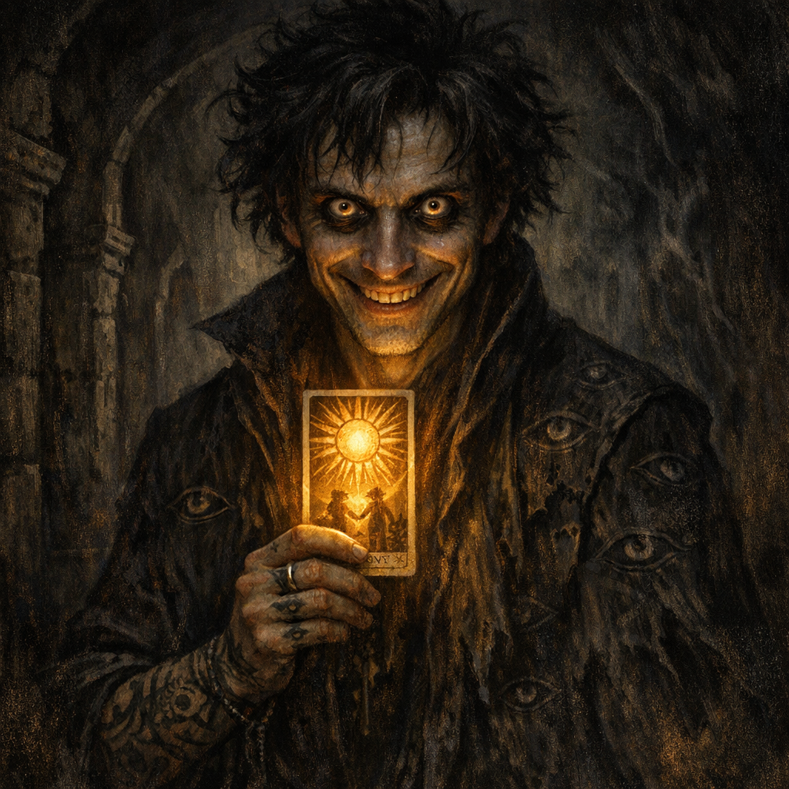

# 2024-11-16 — Back to Palischuk (Warlock Knights, Harpers, Carriage Upgrades)

_Source: imported from `Adventures/Voltaire's Notes/Voltaire's D&D Notes.json` (Dagoth chronicle fragments)._

## Continued From

- **[To verify]** Prior session date/title (notes resume with two tainted rock gnomes bound in the carriage).

## Quick Context

- **Where**: Tunnels near [[Palischuk]] (junction where Palischuk is one direction and the [[Abeil Hive City]] tunnels are behind).
- **Party state**: Two outsider-tainted rock gnomes are bound/gagged in the carriage; the group is debating whether to push into an unexplored rocky incline passage.

## Live Notes (chronological)

- **[Party]** Two rock gnomes (kept alive from a prior ambush) are bound, gagged, and secured in the back of the carriage.
- **[Party]** Dagoth inspects the ambush site and concludes the gnomes did not walk there; they “came from the earth.”
- **[Party]** At the tunnel junction (Palischuk ahead/aside, Hive City behind), Cornholio scouts with his echo; the rocky incline ahead looks too risky for the carriage.
- **[Party]** The party decides to return to [[Palischuk]] to upgrade the carriage using the [[Horseshoes of the Zephyr]] already acquired.
- **[Party]** On the return trip, Dagoth discusses fencing an ornate moonstone chest; Yennefer uses criminal contacts to arrange a buyer.
- **[Party]** Yennefer meets a halfling thieves’ guild contact, who introduces a high-ranking [[Harpers|Harper]] (High Elf).
- **[Party]** The Harper offers 5,000 gp for the ornate chest, but repeatedly prioritizes information exchange (outsider taint, Abeils, tunnel threats).
- **[Party]** The Harper inspects tainted gnome corpses and says he has seen similar taint associated with [[Dagon]].
- **[Party]** The Harper examines [[Outsider Gold]] forging characteristics (via an outsider gold arrow) and suggests it may have been forged in 0-gravity (**[To verify]** certainty).
- **[Party]** The Harper notices a tiny Harper symbol on an elven bone puzzle box and explains these are tests for prospective Harpers (see [[Harper Puzzle Box]]).
- **[Party]** A scroll letter between moon-circle druids warns of a coming upheaval and likely foretells the “second sundering” (**[To verify]** how literal this is at the table).
- **[Party]** The Harper claims Tamrenac’s eye socket resembles a portal the Knights of Myth Drannor closed ~130 years ago; recommends sanctification or “address” redirection methods (**[To verify]** exact list).
- **[Party]** The Harper warns the party that greater powers seem to be surveilling them; the party finds this humorous.
- **[Party]** Yennefer invoices the Harper for information; he pays in bank bonds (large sum).
- **[Party]** The Harper calls Shar’s perfume a “neat poison,” offers to dispose of it for 100 gp, then leaves quickly toward the temple district.
- **[Party]** The party plans and executes carriage upgrades:
  - levitation via the Zephyr horseshoes,
  - contingency for anti-magic zones,
  - roof-mounted repeating crossbow with shielding for gunner/driver,
  - and a steer/brake backup design (**[To verify]** final configuration).
- **[Party]** The party reports tainted gnomes to the [[Warlock Knights of Vaasa]]; barges into a meeting; the Knights are visibly annoyed but engaged.
- **[Party]** One Knight tears into the corpse; maggots burst out (outsider-taint sign).
- **[Party]** The Knights question Yennefer’s necromantic residue and grafted wings; become perturbed at the idea of a massive army (the Abeils) deep under the city.
- **[Party]** The Knights grant Cornholio a [[Warlock's Stone]] (paired; sending + teleportation anchor).

## Open Threads

- **[To verify]** What did the Harper do at the temple district immediately after leaving?
- **[To verify]** What are the bank bonds tied to (issuer, claim conditions, future leverage)?
- **[Party]** What is the “unexplored rocky incline passage,” and why were the gnomes emerging from the earth nearby?
- **[Party]** Are the Warlock’s Stones a gift, a leash, or both?

## Character State

- **[Party]** The party’s carriage is refit/upgraded (levitation + roof weapon plan), but the final configuration and current state need confirmation.
