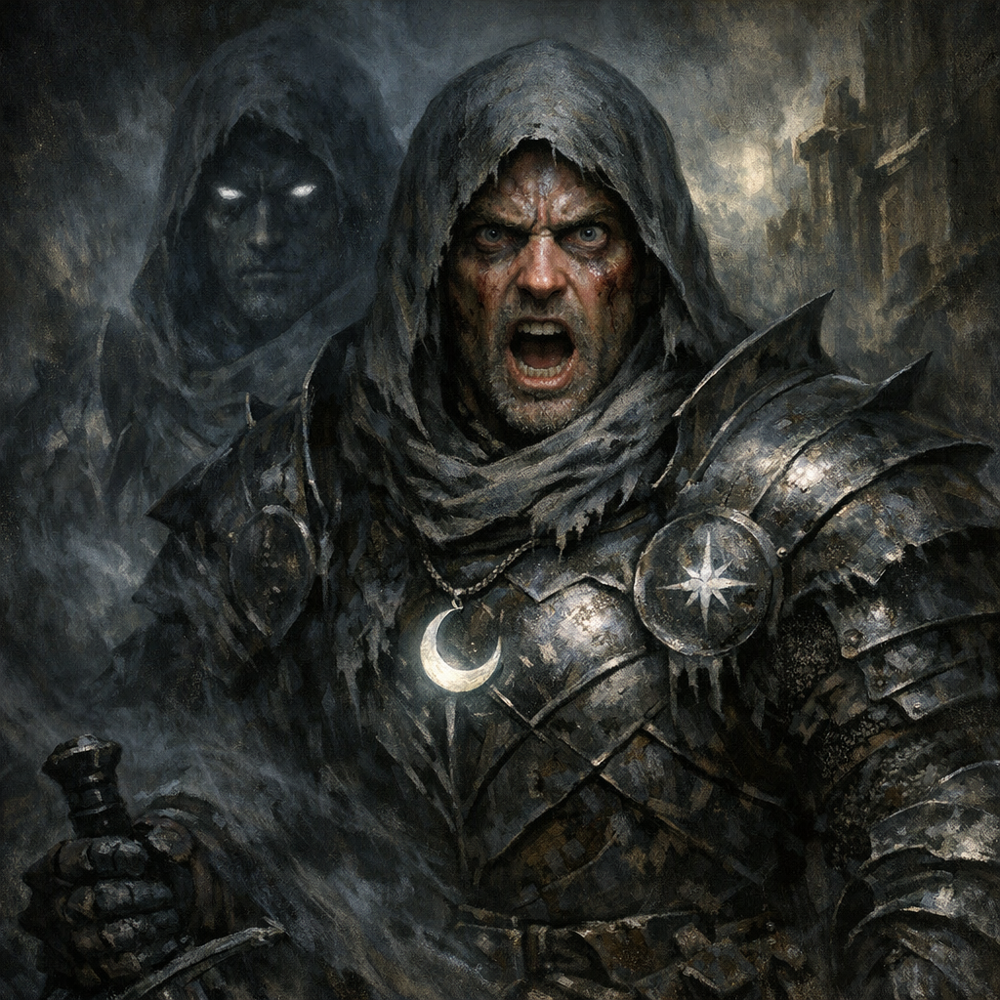

# 2025-03-29 — Glasya in Palischuk, Then the Tiamat Shrine Incident

_Source: imported from `Adventures/Voltaire's Notes/Voltaire's D&D Notes.json` (Dagoth chronicle fragments)._

## Continued From

- [[2024-11-16]] (**[To verify]** missing intermediary sessions; notes jump forward).

## Quick Context

- **Where**: [[Palischuk]] and surrounding waters/tunnels.
- **Major pressures**: Glasya has been summoned to the Prime; Tamrenac’s instability continues; the party’s actions have created overlapping divine/outsider vectors (Shar, Tiamat, Hydra/Dagon).

## Live Notes (chronological)

- **[Party]** Preamble: [[Glasya]] (ruler of the Sixth Hell; daughter of Asmodeus) has been summoned to the Prime via [[Demon Gate]] (components included [[Demon Milk]]; other ingredients unknown).
- **[Party]** Dagoth and Cornholio consider using `arcane lock` to harden carriage security.
- **[Party]** Cromash sends Tamarand a warning about a devil princess under Palischuk; Tamarand brushes it off and implies prior contact with Glasya (see [[Tamarand]]).
- **[Party]** Voltaire continues trying to impress Glasya with calisthenics; exhaustion catches him and he falls asleep mid-burpees.
- **[Party]** Glasya finds Cromash in state records reading a closed gold-covered book; she probes intentions and asks why Voltaire is “curious.”
- **[Party]** Glasya references contracts with local powers (Warlock Knights, Tamarand, Zeppo, a druid circle) and refuses to produce the contracts (**[To verify]** terms).
- **[Party]** Dagoth purchases supplies with party gold (emerald pens, decanter of endless water, Ilmater reliquary, eyes of minute seeing, chalk dust).
- **[Party]** Zeppo appears beside Dagoth with a letter bearing Glasya’s sigil; Glasya’s letter implies surveillance (“many eyes are on you in the city”).
- **[Party]** Tamrenac’s `identify`/`legend lore` interactions with a heretical book cause an epileptic fit and bleeding from the eyes.
- **[Party]** Carriage testing: the party pulls the levitating carriage across water via `water walking` on phantom steeds; friction/physics adjudications ensue (**[To verify]** final movement rule).
- **[Party]** Yennefer and Cromash feel fiendish energy; the party moves toward its source: the temple/tunnel site previously defiled into a Tiamat shrine.
- **[Party]** At the shrine: multiple Warlock Knights are dead/dismembered; one flayed tiefling remains “alive,” kneeling and chanting “Sheogorath.”
- **[Party]** Cornholio probes a containment circle with divine energy, moonstones, and a vial of strange ink/blood; an unseen barrier evaporates.
- **[Party]** Cornholio strikes the containment surface with a shock mace; the field crackles with lightning.
- **[Party]** Glasya reveals urgency: she is visibly casting at full intensity to close the hole.
- **[Party]** Voltaire arrives, recognizes Glasya is closing a gate, and in one rapid sequence draws an outer circle with hellhound ink and seals it with [[Word of Power - Fall]] (**[To verify]** exact mechanical effect).
- **[Party]** The containment fails; a wave of force/light throws nearby creatures back; entities emerge: 2 large Night Gaunts, 2 tomb dwarves, and tainted demi-humans.
- **[Party]** Glasya drops her charming facade and commands the party to handle the threats while she closes the tear.
- **[Party]** Mid-combat: Voltaire attempts to charm threats via Fey Presence; they ignore him.
- **[Party]** The defeated bodies evaporate back “somewhere.”
- **[Party]** A Night Gaunt is sent to Shar as the tear closes; Voltaire misty-steps into the event horizon and appears in the Shadowfell with Shar looking at him (**[Voltaire-only]**: he ends with an A4-sized piece of Night Gaunt skin).
- **[Party]** Post-combat loot includes:
  - [[Soapstone Coins (Sheogorath Sigil)]] (x30)
  - [[Heliodore Gems]] (x4; “outside influence”)
  - [[Defiled Robes]] (from a detained halfling; AC 16? **[To verify]**)
  - [[Potion of Vitality]] and [[Potion of Cloud Giant Strength]]
  - A black-crystal variant of the [[Eldritch Caster]]
  - [[Heart of Lorkan]] (retrieved by Dagoth)
- **[Party]** Cornholio begins preparing to consecrate the temple to Shar.
- **[Party]** Tamrenac antagonizes Glasya; she summons an Erinyes; Tamrenac is left making death saves; player requests not to be revived (see [[Tamerac]]).

## Open Threads

- **[Party]** What is Sheogorath (name, sigil, contagion, patron, code word)?
- **[Party]** What are the Heliodores *for* (warlock altars/spellbooks), and what is their cost?
- **[Voltaire-only]** What exactly did Shar say/do in the moment Voltaire arrived in her realm?
- **[To verify]** Where does the black-crystal Eldritch Caster come from (and what does the crystal change)?

## Character State

- **[Party]** Voltaire was exhausted enough to fall asleep mid-burpees while trying to impress Glasya.
- **[Voltaire-only]** Voltaire possesses an A4-sized piece of [[Nightgaunt Skin]] after the event-horizon misty step.
- **[Party]** Tamrenac is down and not to be revived per player request (corpse/state pending).
