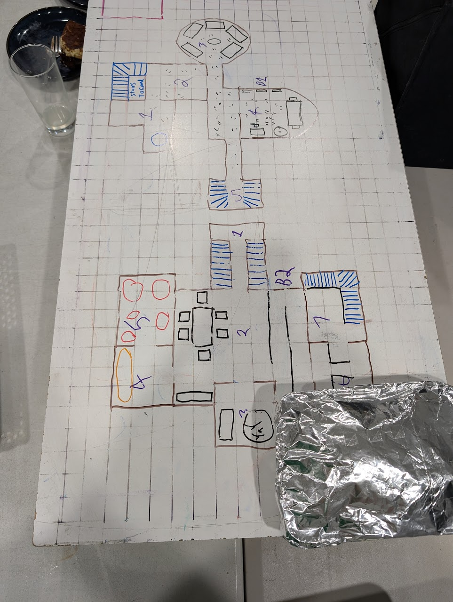

# 2025-07-20

_Source: `2025-07-20.pdf`_

_Generated: 2025-12-14 09:21 UTC_

## Page 1

Norhan may not have written down anything about the 'bank
notes' from the harper who bought the chest found in the
old Abeils tunnels and bought the 'party's story'
Lachlan talked about a locate object bauble the party loved.
Nobody knows what he is talking about.
Lachlan doesn't seem to be a fan of the item rules for
attunement.
Lachlan doesn't seem to be a fan of the sage advice
comments on magical shields granting magic AC bonus
while held but not wielded.
Session begins with the party beginning a long rest.
Cornholio sets up tripe wires and bells on the stairs and
Dagot h sets an alarm spell across the entry to the temple.
The party sets up under the weave fruit tree.
Yennefer approaches Dagoth to ask for help with her
enslaved blink dog. Dagot h lends her a helm of
comprehending languages through which she comes to the
understanding she has enslaved not some simple animal but
a fully sentient fey being who is afraid of her. She discovers
the blink dog is called Jisan and 50 years old . Yennefer
recalls that this is the name of the goddess of fruitfulness2 0 . 7 . 2 0 2 5
P r e a m b l e :
S e s s i o n  2 0 / 0 7 / 2 5  s t a r t

## Page 2

from the land of fate Zakhara and that blink dogs often
'earn' their names.
Dagot h changes up some of his prepared spells and uses
locate object to try get a feel for where they are located. He
tries to locate the closest Evereskaan tomb guardian shield
and gets a bearing. Deciding not to burn too many spells
slots for the day since Lachlan won't let Dagoth abuse Elf 4
hour long rests.
Dagot h spends 2 hours reading 'Codicil of the white' as the
future dreamers in the party wake up the perceptive of
them (aka none of them) notice Dagoth's breathing is such
that we were in a cold environment.
The party breaks camp and all of a sudden Cornholio goes
limp and his body starts floating around slamming into
things. He manages to break a weave fruit tree branch with
his thick half orc neck.
His limp body begins to start talking about humanoid tracks,
bed rolls, fire pit, book cases, small desk, 4 poster bed with
fahogany chests.
Cromash and Dagot h begin to move up behind him and start
investigating the tracks in the dust and a veridian cloak
 G M D i r e c t i o n
Lachlan has not firmed up exactly where we are

## Page 3

draped over a small alter. Dagoth starts looking for traps
and then tries to remove the cloak with mage hand but finds
it 'stuck', but notices the holy symbol of Jennath the
Netherese incarnation of Chauntea on the cloak. Dagoth is
starting to get some confused feelings about this place.
Cromash tries to force the cloak with all his might, Dagoth
hands him a crow bar but to no avail. Cromash stops trying
to force the issue before the cloak breaks.
Yennefer walks down the stairs and starts wondering aloud
to herself about the cloak herself. Yennefer approaches the
problem from a religion point of view and not Indiana Jones.
She uses a 'give and take' approach. She places her pet
raven on the alter and the cloak immediately slides off.
Yennefer asks Dagot h what the cloak is and he is rather non
commital only revealing it is a nice cloak. Yennefer
recognising the exceptional quality inherent in all Elven craft
she wears the cloak.
As she turns to leave she discovers her pet raven is trapped.
She returns to the alter and places a dead outsider gnome
and a live frog onto the alter. Not sensing that offering a
once living thing tainted by the far realm onto an alter of the
earth mother might not be a great idea. The gnome corpse
rag dolls upright and starts cursing her in Abyssal. Nobody
in the party understanding Abyssal knows exactly what was
said, but we all got the vibes. Dagoth is rather unsettled.
Yennefer doubling down decides that maybe if the alter is
removed from the ground, her problem might go away.

## Page 4

Lacking the tools she needs Dagoth transforms his All
purpose tool into masons tools and then hands her a chisel
and hammer. The alter spider webs and shatters apart.
Despite her lack of PPE she suffers no physical damage,
take that safety officer. She is however now concerned
about 'the curse' and who could help with that. What is a
paladin?

## Page 5

i m a g e -2 0 . p n g
B1R1 Hallway with Cloak of Elvenkind
B1R2 Humanoid tracks and real bad smell
B1R3 5 bed rolls made from pelts from the fey owl things. 1

### Images

## Page 6

Bed is a lot larger than the rest.
B1R4 3 bookcases HYPE, 1 small desk (look for hidden
stuff), 1 broken chair, 1 Fount, a 4 poster bed with mattress
and the bed looks 'out of place', 2 fahogany chests attached
to the bed, do not look in these.
Cornholio's echo moves up into B2 and his body is been
dragged around by Cromash and his spectral wolf.
Cornholio sees 4 gnolls and 1 flind and another figure B2R3
on their knees facing an object behind the other gnolls.
The general area of B2R2 is splattered with blood.
The gnolls are wearing outsider gold half plate and wielding
spears and shields. The flind has a 3 headed flail and a
tower shield and some special grey armour. The far figure
appears unarmed and is wearing a simple tunic
Round 1
Dagot h rolls annoyingly high on initiative and hopes to lure
the the gnolls into B1R5/B2R1. Dagoth hands Cornholio
some power thirst (haste) and he then proceeds to rush the
gnolls.
Cornholio gets hit by an attack roll of 28 by the flind and
takes some psychic damage. Cromash displaying even more
personal growth uses a spell called misty step!
Round 2
Cornholio crit fails
Cromash also takes some hits.C o m b a t  b e g i n s

## Page 7

Discussion about magic shields.
Round 3
Lachlan hates Matt Mercer and also Tina.
Some gnoll visits shar courtesy of Cromash.
Tunic guy eats scorching ray and turns to dust 76 HP
Dagot h walks into the room and immediately starts
rummaging around in the spilled open belly of the flind,
while investigating the digestive tract of the flind he
deduces the gnolls have been eating the fey owl things. He
finds 3X50GP gems which he tosses to Cornholio and also
finds a small silver chain of dwarven make with a small
crystalline heart attached.
Cromash moves into B2R3 and finds a small alter to a so
called gnoll 'god'.
Before Cornholio can vibrate out of existence Dagoth hands
him a wand of magic detection and wand of secrets and
makes use of the remaining 40 seconds to search.
Cromash starts rummaging through the 'pile of shit' in B2R4.
The party finds a lot of stuff. Loot written down in the DnD
drawers.
Dagot h begins to prepare an identify ritual, Yennefer
recognising what is happening throws herself into the pile of
items to be identified.
Cromash picks up the flind corpse and hauls it upstairs and
tosses it onto the mythallar. The corpse turns to plasma.C o m b a t  e n d s

## Page 8

The party reaches level 10 and Lachlan calls it.
I d e n t i f y
Results:
Yennefer is a fiend who has been cursed with a plague of
frogs. Frogs will appear around her and make a racket.
When the frogs are 'interacted' with they turn to leaves.
The crystalline heart is an Amulet of Health
A 1 Longbow made from Cambrian bone
More coins in the same style as the ancient Elven coins
found last session.
Make sure to get the copper coins Cornholio igored.
See post it notes for full deatils .

## Page 9

F i n a l  t h o u g h t s
Think about where the necklace in the flind came from.
Why are the gnolls here and where did they come from.
No evidence of them upstairs. Mere meters away the
animals were safe until Yennefer and Voltaire arrived.
Before moving to investigate the rest of the area post a
sentry at the stair well. Use my owl familiar incase muscle
is needed.
Investigate B2R5 and B2R3.
Look in detail at the gnoll alter. Can it be stolen. Is is worth
breaking/descrating. Could that summon a CR20ish fiend
who wants a holy water shower?
Return upstairs to look at the bookcase room.
If Cromash and Dagot h line all the books up and cast
scholar's touch at each end of the line of books can we
read them all in one go. Is this like Elven circle magic? Now
that Cromash has Corellon's favour (totally going to get
reincarnated as an Elf) this would be ok to do.
Under no cicumstances open the fahaogny chests
attached to the creepy bed.
Search the desk for hidden keys.
Suspect B1R4 was the gnoll 'priest' room
Collect all the ancient elven coins. Asses the full
numismatic spread from copper to platinum for more
information about this confusing place.
Lachlan feeding information in the drive home:
The gnolls are fortfiying against something. I had assumed

## Page 10

they had taken over.
