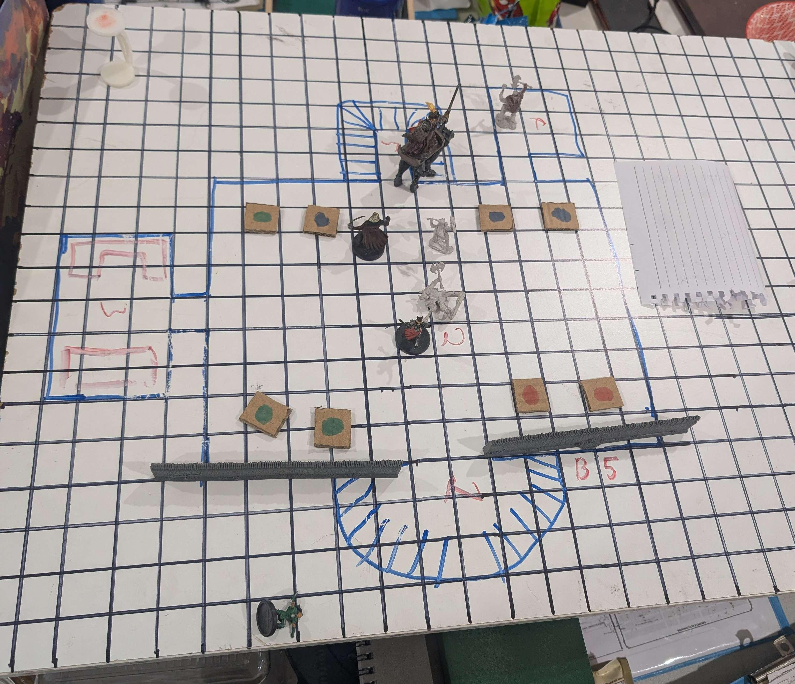

# 2025-11-22

_Source: `2025-11-22.pdf`_

_Generated: 2025-12-14 09:21 UTC_

## Page 1

Session begins with Lachlan's homework
People present
Lachlan, Snow, Tina, Tom, Norhan.
Session begins with some clarification of previous events
regarding the druid (not druidS seen in the moonpool.
Mythallar is confirmed 'dark'
Party long rests ins B4R6 alarm spell and owl familiar is set
watch.
Dagot h studies the runes on the previously trapped chest1 1 . 2 2 . 2 0 2 5
P r e a m b l e :
S e s s i o n  2 2 / 1 1 / 2 5  s t a r t
 D r u i d  A e l r i n d ë
High elf features, dark stained with a viscous black
substance
Hair wild and tangled with a dark glimmer on the silver
hair.
Pale robes degraded covered in symbold of the temple
triumvirate
A cracked crescent moon symbol on her forhead pulsing
Prismatic alien sheen to her eyes. Deep mourning in eyes
Holly trees with traped shades moving around their bases.

## Page 2

and is disappointed that the trap rune was getting 'reset' by
the mythallar.
Cromash feels a fey presence
Dagot h lends Merci his Lorehold primer to study. She learns
find familiar
Long rest complete with no complications.
Cromash smells Shadar-Kai
Cornholio moves to B5 R1,2
3 0 7 d a c 8 5 -d e e f -4 5 d 5 -b a e e -e c 9 0 c 0 8 2 7 c b 8 1 . j p g
The statues/golems depicting Corellon, Elistrae, Chauntea
and Mystra (later find out Mystral because Lachlan things
with words again) are creeping around in a pattern.

### Images

## Page 3

Cornholio using his echo, flies along the roof scouting the
location. The golems are in large room with 8 ornate
moonstone pillars.
The Golems try to chase Cornholio but have some issues
reaching him.
Yennefer flies down and casts globe of invulnerability from
the staff
Cornholio and Cromash start swinging
Dagot h feeds Yennerfer a elixir to buff spell attacks and
gets pushback.
Cromash rolls max fire damage on fire giant strike 3 times.
Golems have a eye beam attack that can slow targets. They
never use it effectively
Cromash takes all the damage this combat.
Yennefer burns a lot of resources.
Mystral golem tries to crit against Cromash but gets silvery
barbed. lawl get fucked Lachlan
Cornholio gets hasted.
Yennefer casts lighting bolt from the staff and zaps
Cromash's wolf.
Akulakhan goes down
Cromash sucks down multiple healing words
Cromash sends the Mystral golem to shar (or does he? he
thinks he did)
Dagot h deals no damage to any of the likeness of the gods
Combat outcome:
2380 EXP
Head of the Chauntea golem is very intact.Co m b a t  b e g i n s

## Page 4

Cornholio moves into B5R3
He finds a bed and a desk. The desk has 15 journals with
the most recent one laid out on the desk.
Merci moves into B5R6
She finds an executive level shrine the the temple
triumvirate
Three platinum effigies each weighing 47,311 pounds
Each has an offering bowl. She instinctively offers a prayer
to the trio and then one to Lathander.
Dagot h is in B5R3 with Cornholio and Dagoth starts reading
the most recent journal entry. He finds 5 note worthy entries
Cornholio rifles through the drawers and finds:
Cornholio (still hasted) leaving the objects behind on the
desk then sprints to B5R6
Seeing the large mass of precious metal before him and
giving no fucks about desecrating the triumvirates shrine heE x p l o r a t i o n
T r e a s u r e
Holy symbol of Eilistraee made from ELF WOOD of such
craftsmanship to be worth many 100's of thousand gold
pieces. Only Cornholio and later Yennefer knows this
exists.
House seal stamp from and ancient house made of
electrum 40 GP

## Page 5

starts trying to stuff the Eilistraee effigy into his bag of
holding.
Finding he is not strong enough to steal it, he urinates in all
three bowls and sets his own bowl in the middle with 3 star
rubies Favoured by Corellon and a few other Elf gods) and
some holy water. Start praying to shar and rolls a 20 on
religion. This thread is left hanging...
Yennefer walk in on this mid urination and then turns on her
heels and walks over to find someone else to annoy. She
finds Dagot h reading the journals, he is making some
concerning noises and does not notice her walk in.
She then looks over Dagot h's shoulder to see what he is
reading but becomes frustrated that she can't read Sylvan
(this elf crap).
After much discussion, (out of character) she decides to
pocket the holy symbol which she believes she could get
300,000 GP for. She fumbles the sleight of hand 7 and
Dagot h turns around to some clanking sounds. Yennefer
makes some overtures to taking the symbol and Dagoth just
comments be careful, don't break it and then tries to go
back to reading the journals.
Yennefer still uncontented, pesters Dagoth about some
invoice for services rendered . Dagoth ends the magical
tinkering value attached to the invoice, knowing full well he
can re do it later.

## Page 6

Cromash has moved up to the stairs down to the next level
and is resummoning his Wolf.
Merci has left the shrine room and also heads over to the
office Dagot h is in and starts reading the journals together.
Despite there been 15 books it turns out there is really only
4 Difference between Lachlan's dice roll and prepared
writings). She starts reading the oldest journal
Merci learns some background facts about the druid that is
beneath us somewhere.
Now that Merci is there, and Dagoth having read enough to
have a sense of urgency he starts lining the books up and
gets Merci to join him in a ritual casting of Scholar's touch to
speed read the rest of the books. Dagoth should have got
guidance cast on him but didn't ask.
Dagot h fails a wis save but Meri passes.
Merci gets an information chill and Dagoth's eyes get that
alien prismatic sheen until Merci shakes his shoulder and he
pops out of 'it' Lachlan - don't worry about it)
Dagot h and Merci understand that the temple they are in fell
beneath the now Anauroch desert as Mystral died and the
temple staff/followers were getting drained by the
phaerimm so the clergy took steps to protect their followers
with necromancy to stash away their souls into the trees of
the grove. The druid is 2000 years old and feels let down by
Corellon's inaction.

## Page 7

Dagot h's thoughts "WHY IS SHE WEARING MY
GAUNTLENT" She has on her left hand Wraithguard)
Dagot h leaves the office to relay the Information he and
Merci have found and that she has known of our presence
here for at the very least 8 hours.
Most of the party is near the stairs down.
Cromash can hear a forest from down the stairwell
Yennefer starts walking away form the stairs as Voltaire (but
not really) walks up the stairs.
Cromash realises this is the most quiet he has seen Voltaire
in a long time. He eyes have the prismatic sheen, Cromash
passes the wis save, he knows this is not Voltaire.
Dagot h near by thinks about the phrase he read in the
journals about 'his thousand masks'
The druid now takes her original shape and speaks to
Cromash 'Do not fear, you will not break, you will bend'
Dagot h concludes she appears to be 18 level caster
Session ends here along with a few checks and statements
after I have packed up

## Page 8

N e x t  s e s s i o n  t h o u g h t s
Could we talk her into knowing/realizing that Corellon
didn't let her down, up until a few days ? ago, the
overgod Ao had forbidden the gods to directedly interact
with the realms, she was not abandoned, there has been
so much divine upheaveal that this was the quickest
action could be taken, in the interest of balance (appeal to
druid's ethos and wors in her diary) we have been sent as
a motley crew of Elv es, fiends (tiefling), goblinoids (orcs)
and a broad range different gods followed. Ao's rule was
broken by shar and Corellon stepped into take advantage
of the situation and was then able to teleport us here to
help you/fix/redeem/rescue you. I read the journals
upstairs about the moonstone you think Corellon sent you,
it was probably a ploy by the outsider gods to corrupt you
and destroy all your hard work maintaining the sacred
balance of the triumvirate.
She is probaly way too tainted at this point to be talked
out of it. Perhaps the above discussion thread the light of
lathander (cleric things) and some bulk holy water could
cleanse her.
Or implent strat 1 or 2 or 3 to negate her high level casting
and make the fight trivial
