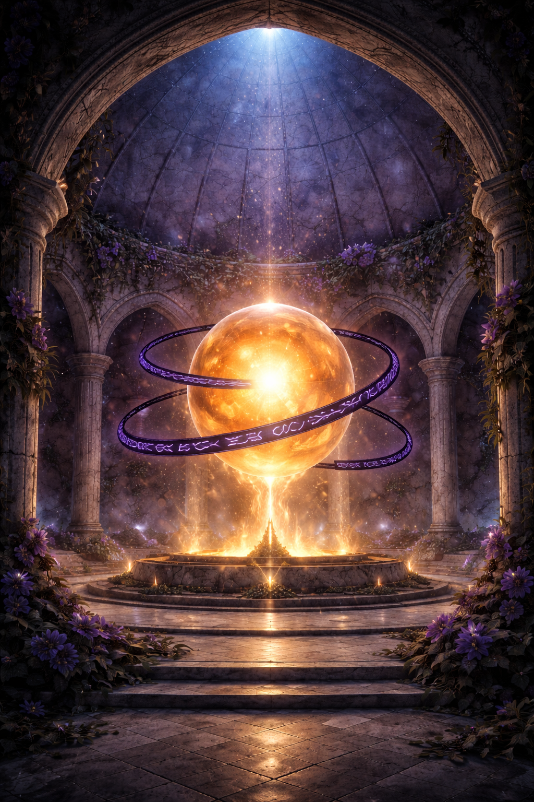
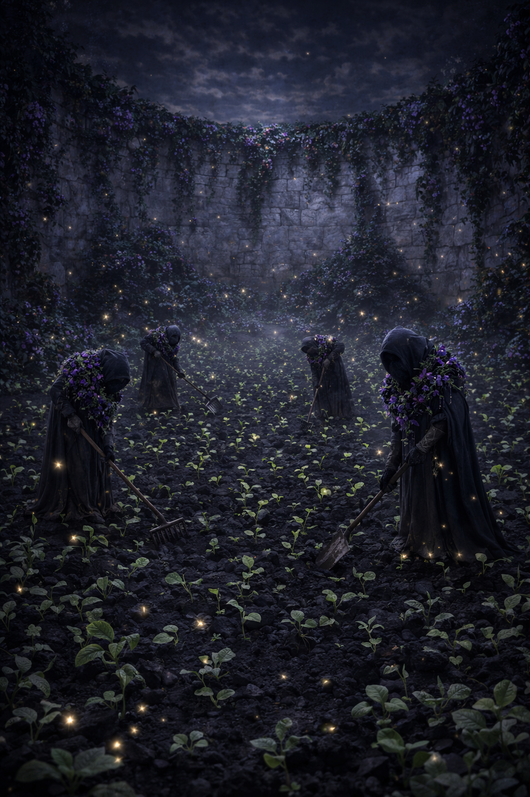
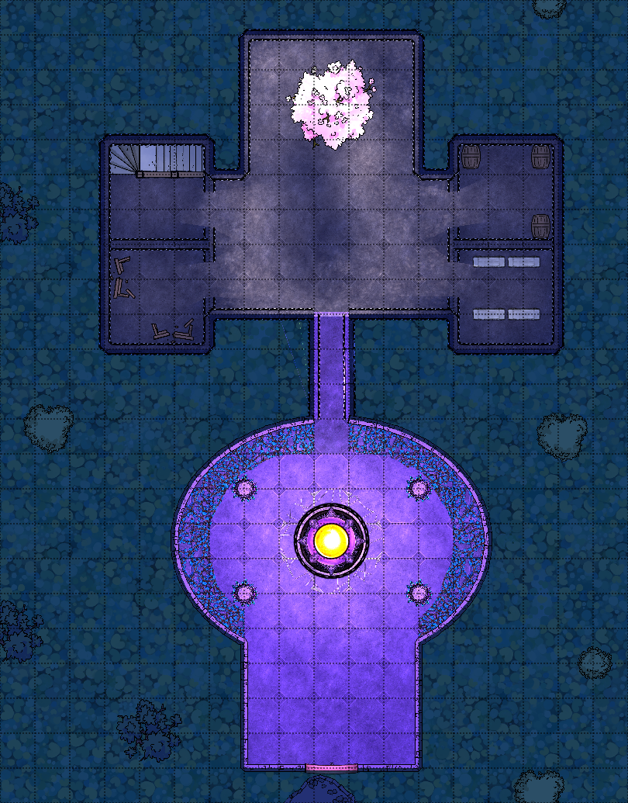
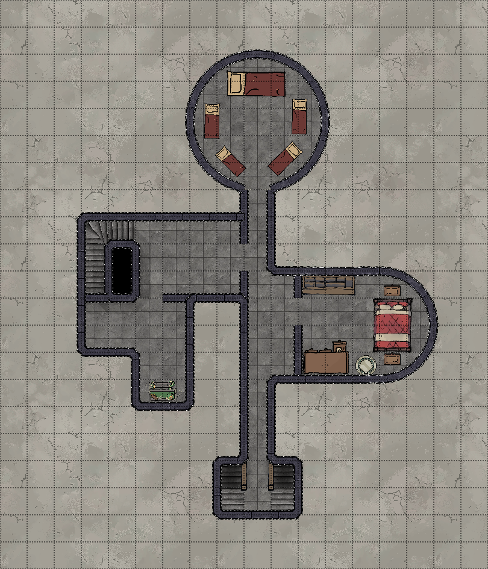
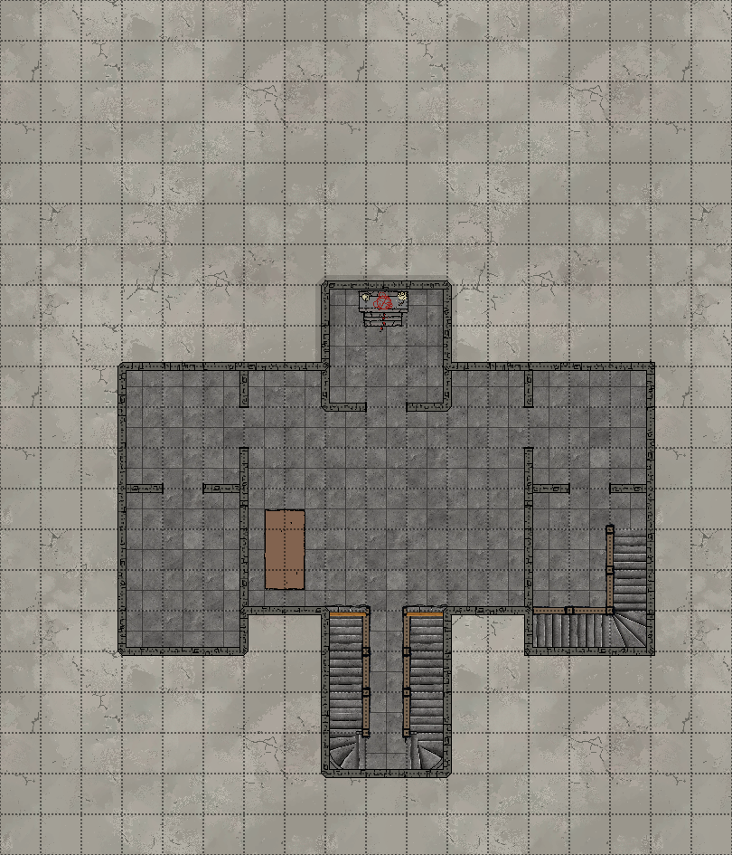
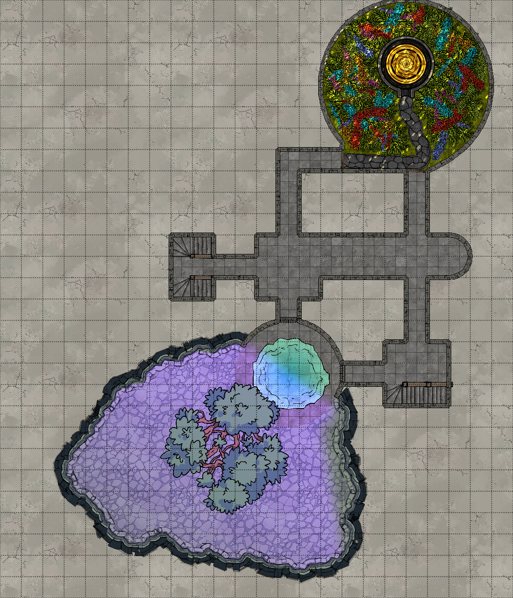
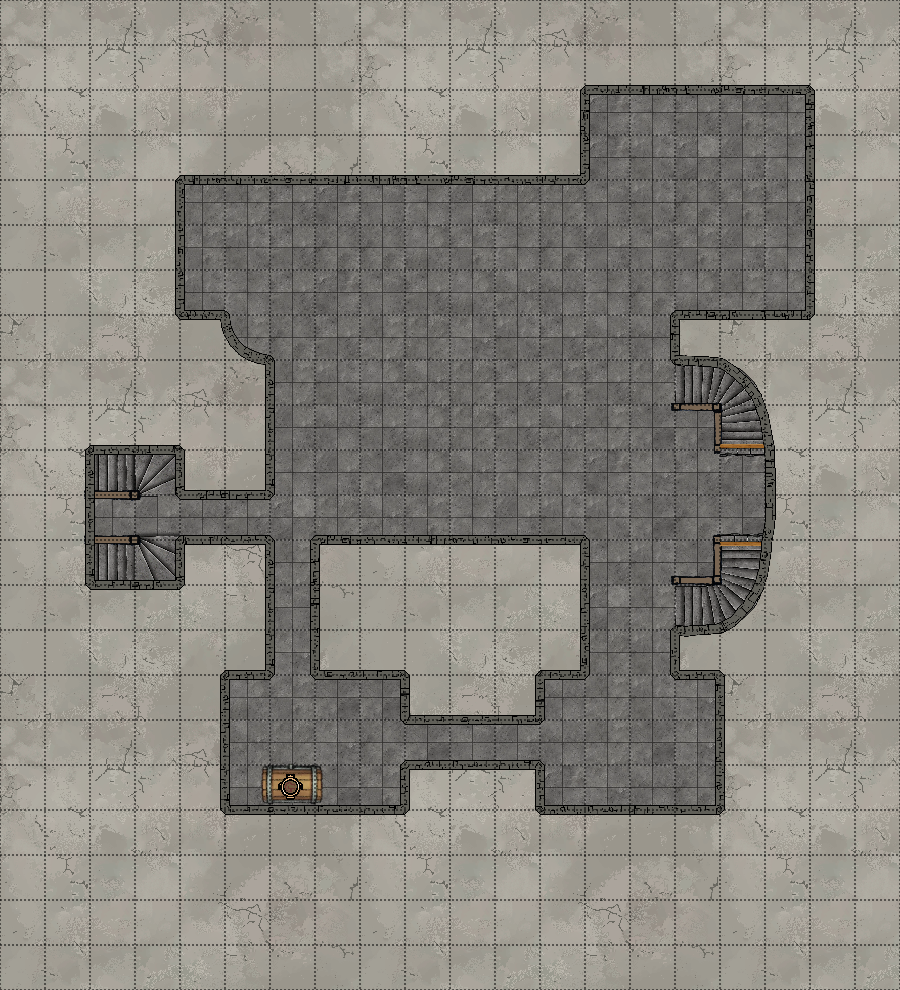
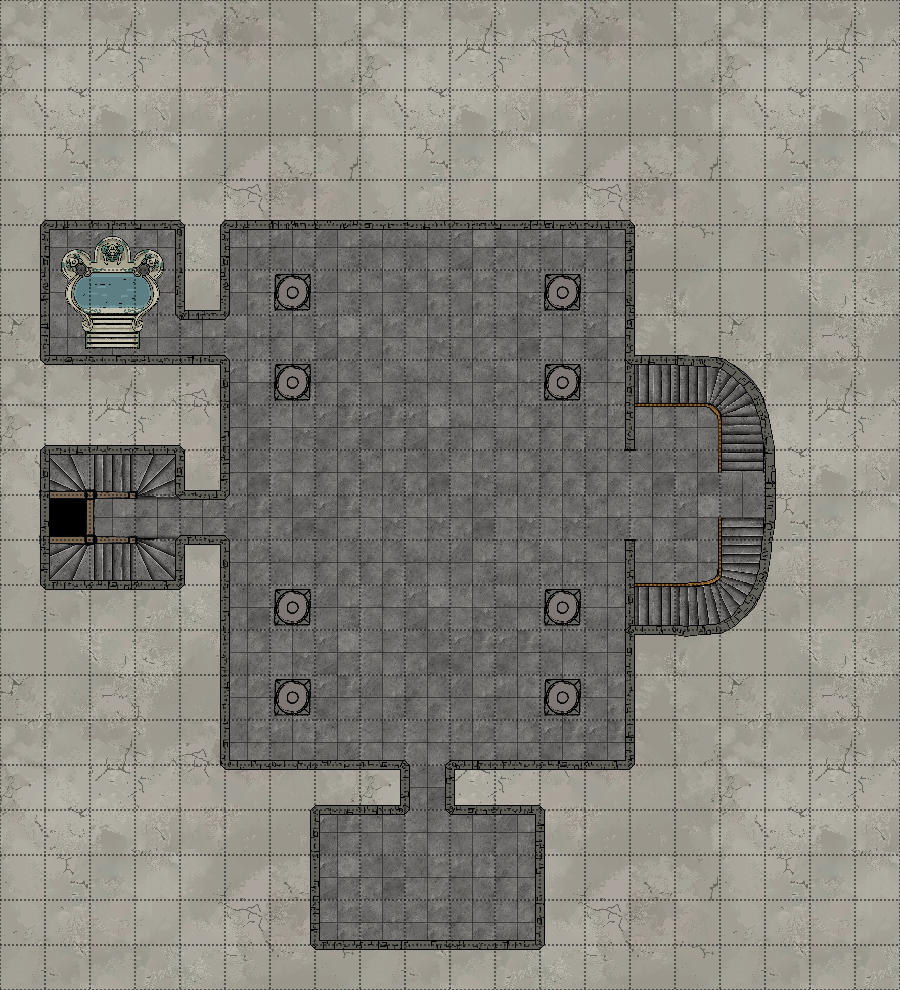
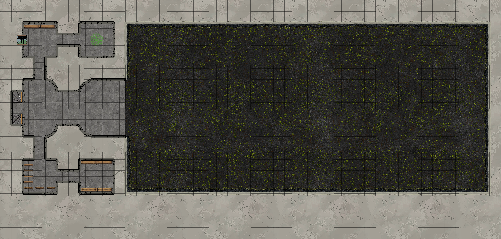

Heil Zeppo,
In Faerun under the Anauroch desert there is a ancient underground temple to a triumvirate of Chauntea, Shar and Elistraee. Sitting in a mosque like dome topped room of moonstone walls, ivy, night shades, night roses and other wall-hanging plants stands a Mythallar. The Mythallar is typically a sun like orange-yellow colour but in this case there is a slight umbral hue over the Mythallar almost not even detectable with out having another to compare it too. in 3 rings that seemingly rotate separated by 120 degrees, these rings are made up of netherise text and there purpose is to establish the area of the mythallars effects and those who are responsible for it's control, the area of effect is the entire temple complex including the 6 basement levels which also have moonstone walls, ivy, night shades, night roses and other wall-hanging plants. Down on the 4th basement level is a gateway to The Shadowfell with a a large 100 ft aspen tree just through the gateway, the aspen tree is heavily effected by the shadowfells shadow weave energy and stands in what once was a divining pool but now a place this great tree stands. The gateway to the Shadowfell that stands as an aperture is 15 foot tall.

On the 4th basement level is a 40 feet by 40 feet with in it is a grand untamed but navigable rose garden, the roses are red, White and yellow. At the center of this garden stands a 15 foot tall bee hive, the builders of this hive are small 1 inch tall fae sprites that on closer inspection appear to be anthropomorphic honey bees wearing garlands and carrying spears. The bee hive itself is built in reverence to Chauntea. Appearing upon the roof of this room is a false afternoon sky that never seems to change.

On the 6th basement floor there is a wide and open field that is 75 foot wide by 160 foot long where there once was a grove of holly trees there now is a field of sprouts and buds pushing through the ash-black soil. Working these fields are 5 creatures known as Dark Creepers wearing grand garlands of nightshades and night orchids, they wield rakes, hoes and shovels. The smooth moonstone walls with; ivy, nightshades, night orchids and other wall-hanging plants appear a little dimmer than other places within the temple.

# Current Area Floor Plans

# Follow Up Comments amongst the Players
Following on from Lachlan's comments at the end of session about coming up with a plan before next session.

This temple which we have claimed as our own has the makings of  a stronghold for us.

There are currently only few methods of entering and exiting the temple.

1) The teleportation circle
2)The shadow fell
3)Planeshift scroll
4) Divine intervention

The teleportation circle presents as the best long term method of entry and exit, currently no active party member has the spell.  Both Yennefer and Voltaire could learn the spell. So long as we can keep the sigil address secret (what is divination and scrying) nobody can follow us back.  It is possible there is some book in Dagoth's bag that might contain a ritual version of the spell.

That leaves us still stuck in the temple with no means to take the carriage with us in the short term.

We could wonder off into the shadow fell to farm some XP for a level or take the divine intervention or plane shift route.

The divine intervention route seems very risky, Cornholio might get stuck with shar, Lathander could be a bit of a wild card and Corellon could teleport us to another place to do some dirty work form him (read Lachlan's train tracks). 

The planeshift scroll gives us the quickest way out, we would just need to choose a location we want to go to, which doesn't have to be on Toril or the prime material plane.  For another plane however one of our characters would need to know the tuning fork details for that plane.

To successfully use the scroll, as I understand LPe's version of spell scrolls (could be wrong) there would be a DC 17 check based on spell casting ability, which gives Yennefer the best chance of casting it successfully. 
As for places to go to back on the surface, any of the major cities seem suitable for going to.  Any of the major cities we should be able to acquire more teleportation circle addresses so we can hop all around Toril and drive Lachlan insane.

Stuart — 7/01/2026 10:43 AM
I think the circle is the best long term solution if we intend on using this place as a base. If we leave we could look into buying the means to lock the place down and returning to install it all
Helkos (Matt)

 — 7/01/2026 11:02 AM
Indeed, getting access to that spell so we can come and go would be really good.  There is some size considerations for magic circles that we would have to solve before we can move the carriage through it. 

In the immediate short term leaves us with the planeshift option, acquire the teleportation spell somehow locally or divine intervention.