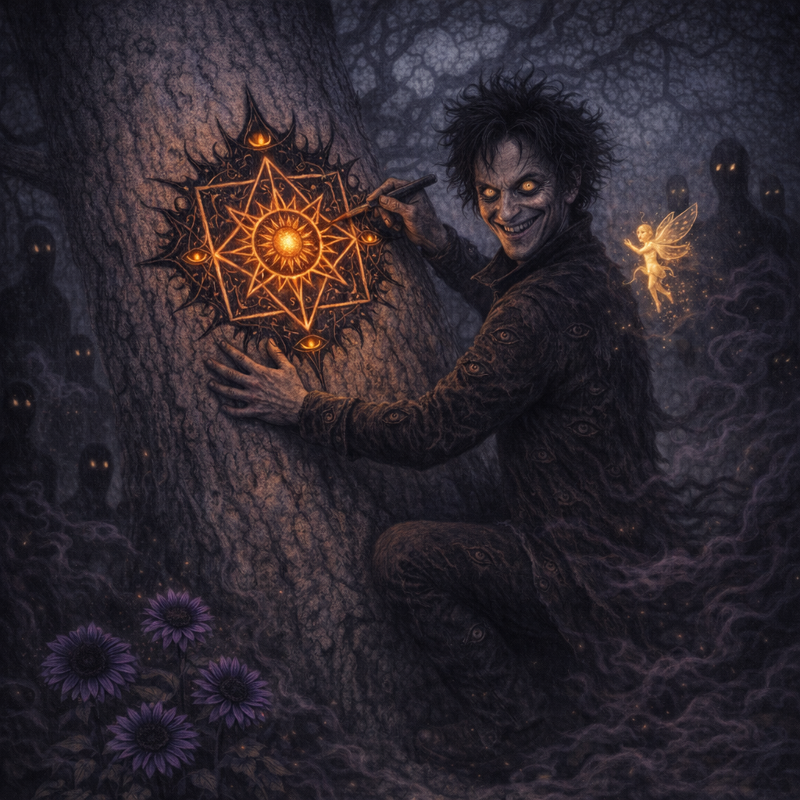
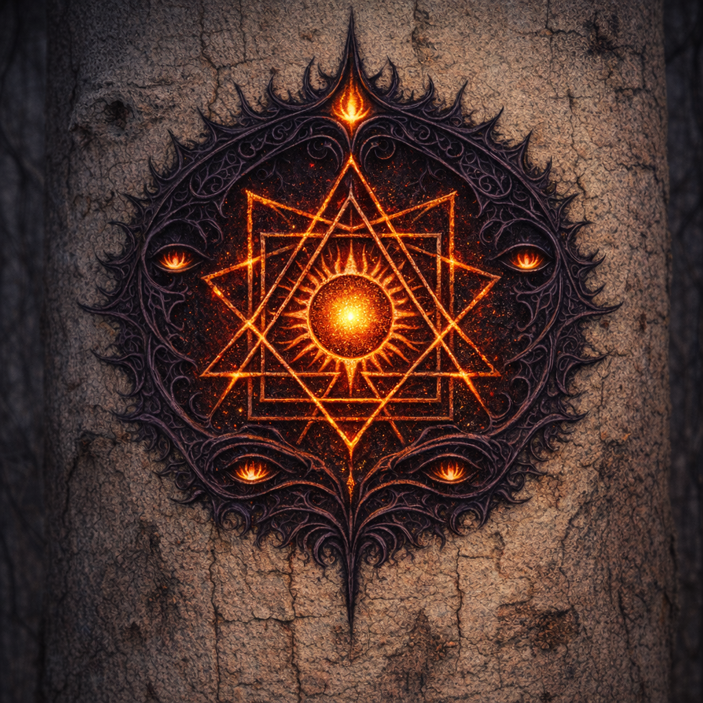

# 2026-01-25

Continuing from: [2026-01-03](./2026-01-03.md) (and [post-session lore notes](./2026-01-03/PostSessionLoreNotes.md))

## Session Metadata

- **Date**: 2026-01-25
- **Codex (Voltaire memory store)**: [Codex Index](../Codex/Index.md)
- **Who’s at the table**:
  - Player: Voltaire
  - DM:
  - Other players/PCs:

## Start-of-Session Snapshot

### Where we are
- Ancient underground temple under the Anauroch desert; moonstone walls; plant growth throughout.
- Mythallar present, “dark”/umbral-tinged compared to normal.
- Known features:
  - Shadowfell gateway (B4) with a large aspen visible beyond.
  - Teleportation circle (B6 area per prior notes).
  - Chauntea-aligned beehive shrine and restored/reshaped spaces.

### Character State (Voltaire)
- **Level / XP**: 13 / 121,983 XP (per `Voltaire.md`; update if changed in-play)
- **Conditions**:
  - Exhaustion:
- **Notable items on-hand**:
  - Crab-book-tail (“Machinations & Actions: 5e - Player’s Handbook”)
  - Sharite ceremonial dagger
  - Headband of Intellect; Robe of Eyes; Ring of Protection; Sun Card

## Open Threads

- Escape/egress plan from the temple (teleportation circle vs Shadowfell vs plane shift vs divine intervention).
- Dagoth’s resurfacing memories and the ancient map/teleportation circle context.
- Shar’s “trial” framework (circle/square/triangle) and what it will demand of Voltaire.
- The Ink of Unbeing / voidbone pen implications.
- What the aspen tree / Shadowfell-side “wind language” is communicating, and what the umbral “sunflowers” signify.

## Party Knowledge

### Live Notes

- (Add events here as they happen.)

### NPCs / Factions Encountered

- (Name — role — what we learned — current attitude)

### Locations / Discoveries

- (Room/area — what changed — why it matters)

### Loot / Resources

- (Item/treasure — who has it — notes/attunement)

## Voltaire-Only Knowledge (incl. `Module/`)

### Live Notes (Voltaire-only)

- 
- 

- Voltaire’s working understanding: because he’s alive (not a construct, not undead), the Shadowfell “shadow beings” are interested in him as well.
- Voltaire invites the shadow beings to sit in silence and “meditate on my grace.”
- Robin (Voltaire’s “Sun Card” turned companion) has a glowing aura that seems to become more contained in the area’s grace.
- Robin quietly comments to Voltaire about the lovely noise the tree makes.
  - Voltaire: “Robin, we’re having a moment of silence in grace.”
- In the silence, the wind through the leaves feels louder; Voltaire attempts to interpret the wind as language.
  - The wind “language” feels like calm, blissful humming; Voltaire hums in the same resonance and invites the shadow people to join.
- Lesser shadows (not even “lesser shades”) melt into the ground around Voltaire; from where they melt, flowers grow — eight-foot-tall sunflower forms, but a deep umbral purple.
- The three lesser shades present gently float up into the branches of the aspen tree; Voltaire can’t see them anymore.
- Voltaire ends the mantra: “Thank you, my children.”
- Voltaire begins climbing the aspen, and as he touches it he can sense the tree **growing/expanding**, widening the local aura of the realm.
  - With tremorsense/truesense, Voltaire senses lesser shades now **habitating within** the tree.
- The branches are too small for Voltaire; he decides the **trunk** is where he belongs.
- Voltaire carves the mark of the followers into the trunk (see `Codex/Factions/Voltaire_followers_sigil.png`):
  - Center motif: **seven-point** light/sun core (4 square corners + 3 triangle points); **triangle** extends beyond the **square**.
  - “Light ink”: glowing mushroom + hellhound blood.
  - “Dark ink”: [[The Ink of Unbeing]].
- DM (private): Selûne’s 7 stars symbolism — the 7-point/square motif could read as “transforming” Shar’s opposition.
- Voltaire watches the sigil sink into the tree and “age” into the bark, as if it was always part of the tree.

### Module-Backed Context (do not assume party knows)

- (Pull in relevant prep/structure from `Module/` only when useful for Voltaire’s planning/choices.)

## Between-Scene Helper

### Quick Questions for the DM (ask in-play)

- (What are the exit constraints? What’s known about the circle’s sigil sequence? What’s the Shadowfell side geography?)

### Voltaire Ideas / Schemes

- (Plans, gambits, social plays, “Voltaire would…” prompts)
