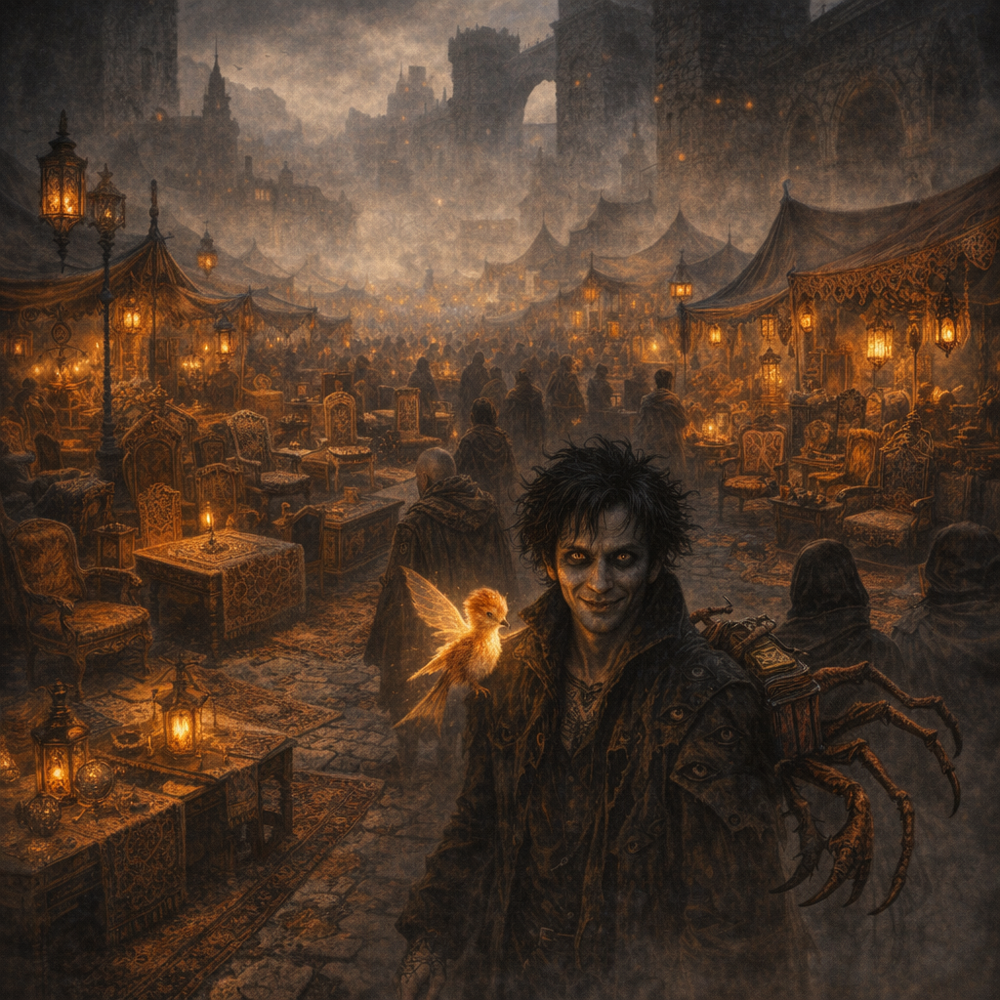
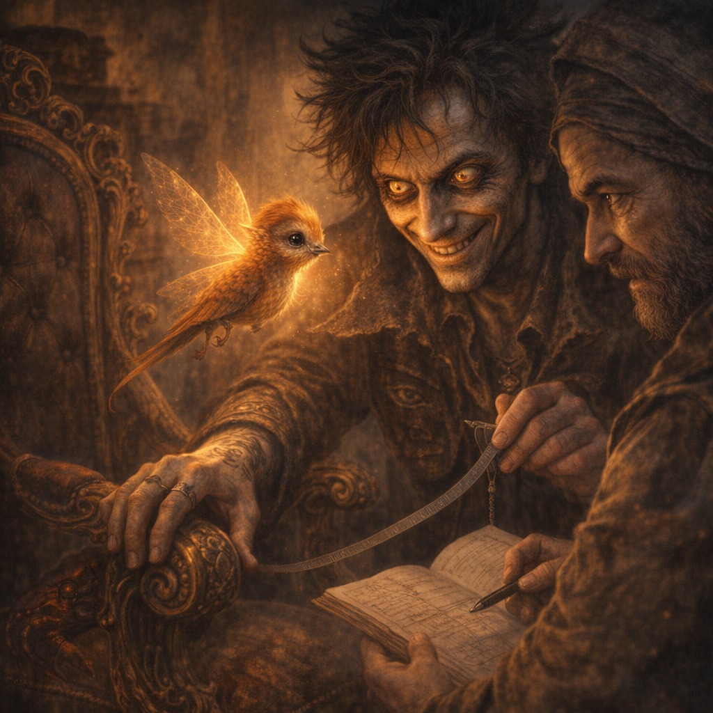

# 2026-02-21

Continuing from: [2026-01-25](./2026-01-25.md) (and [post-session lore notes](./2026-01-25/PostSessionLoreNotes.md))

Post-session lore notes: (create after session) `Adventures/2026-02-21/PostSessionLoreNotes.md`

## Session Metadata

- **Date**: 2026-02-21
- **Codex (Voltaire memory store)**: [Codex Index](../Codex/Index.md)
- **Who’s at the table**:
  - Player: Voltaire
  - DM:
  - Other players/PCs:

## Quick Recap (last session: 2026-01-25)

- **[Voltaire-only]** Voltaire meditates under the Shadowfell-side aspen, treats the wind as language, and invites shadow beings into silence and grace.
- **[Voltaire-only]** Umbral sunflower-forms grow where lesser shadows “melt” into the ground; Voltaire carves the sigil of [[Voltaire's Followers]] into the aspen using light ink + [[The Ink of Unbeing]].
- **[Party]** A “Zeppo-sent” quasit attacks Cromash; Cromash deletes it instantly. The blood mostly vaporizes, but some remains on the war pick blade.
- **[Party]** **House rule (DM, 2026-01-25)**: spend **1 Inspiration** to reroll **any** dice outcome after seeing it (incl. full damage pools). See `Codex/Lore/Inspiration (House Rule).md`.
- **[Party]** Teleportation destination chosen: [[Vasa]] (not near Baldur’s Gate). The group encounters a pristine statue of [[Titania]]; druids aim to spread its “ethereal attributes” across the fae world; a lazy [[Halfling (Golden Sickle)]] is spotted asleep in a tree.
- **[Party | To verify]** After spawning in [[Dellhalls]], the party rides ~60 miles northeast to a swamp with [[Explosive Swamp Frogs]].
- **[Party]** Frog experiments + attempted parley via [[Robin]] → frog-memory lore: a [[Green Dragon (Swamp Lake)]] was killed by a [[Gold Dragon (Westward Slayer)]] that flew west.
- **[Party]** Cromash detonates frogs → the swamp drops into **dead silence**.
- **[Voltaire-only | Inferred]** Voltaire “listens” to that silence and concludes: no local god/magic presence—only nature.
- **[Party]** The party heads to [[Palashaey|Palashae]] for a procurement run (furniture + operations) to furnish the [[Anauroch Triumvirate Temple — Mythallar Complex]].

## Start-of-Session Snapshot

### Where we are
- On the road into [[Palashaey|Palashae]]; procurement day.
- The party’s immediate objective: furnish / operationalize the [[Anauroch Triumvirate Temple — Mythallar Complex]] (beds, tables, storage, shrine goods, wards, lab kit, etc. — list TBD in-play).

### Character State (Voltaire)
- **Level / XP**: 13 / 121,983 XP (per `Codex/Characters/Party/Voltaire.md`; update if changed in-play)
- **Conditions**:
  - Exhaustion:
- **Notable items on-hand**:
  - Crab-book-tail (“Machinations & Actions: 5e - Player’s Handbook”)
  - Sharite ceremonial dagger
  - Headband of Intellect; Robe of Eyes; Ring of Protection; Sun Card

## Open Threads

- Palashaey procurement: scope, budget, list, and what “operations” means (staff? wards? supply chain? political cover?).
- Frog lore follow-up: timing of the dragon-slaying, corpse/hoard location, and what caused the swamp’s dead silence.
- Shar’s “trial” framework (circle/square/triangle) and what it will demand of Voltaire.
- The Ink of Unbeing / voidbone pen implications.
- What the Shadowfell aspen “wind language” is actually saying (and what the umbral sunflowers signify).
- Dellhalls directionality mismatch vs Voltaire’s remembered swamp (continuity check).

## Live Notes (chronological)

- Tag legend:
  - **[Party]**: what the party reasonably knows in-world.
  - **[Voltaire-only]**: what Voltaire knows/experiences that others likely do not (incl. anything from `Module/`).
  - **[DM-private]**: table/DM-only note; do not assume any PC knows it.
  - **[To verify]**: continuity/details to confirm in play.

- **[Party]** (Start here — what happens as you arrive in Palashaey?)

