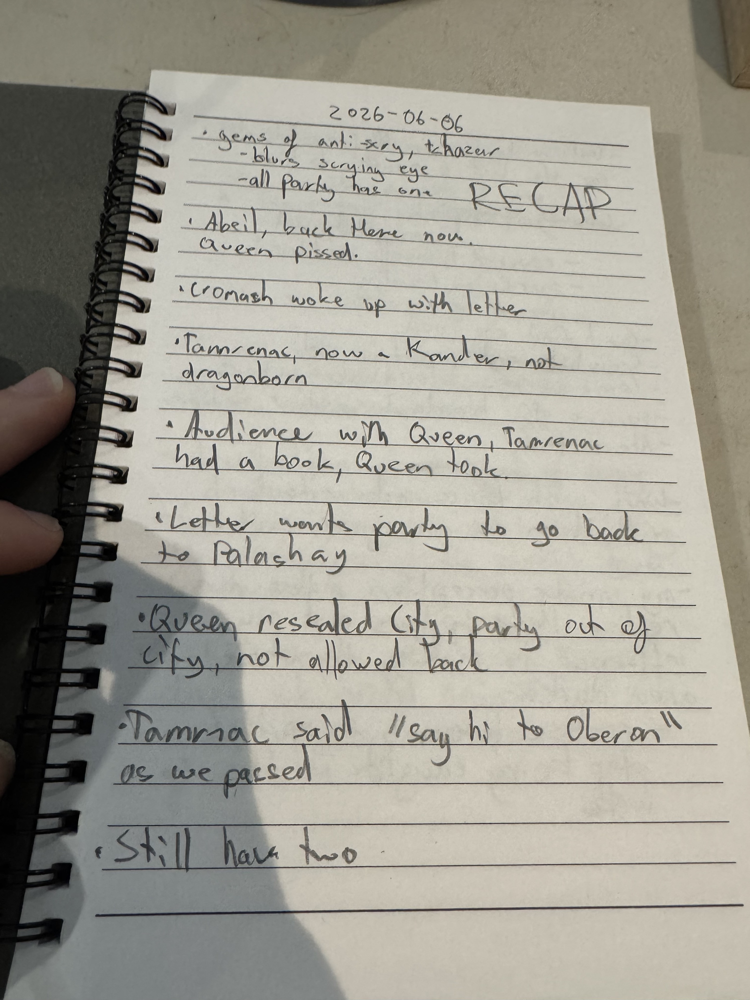
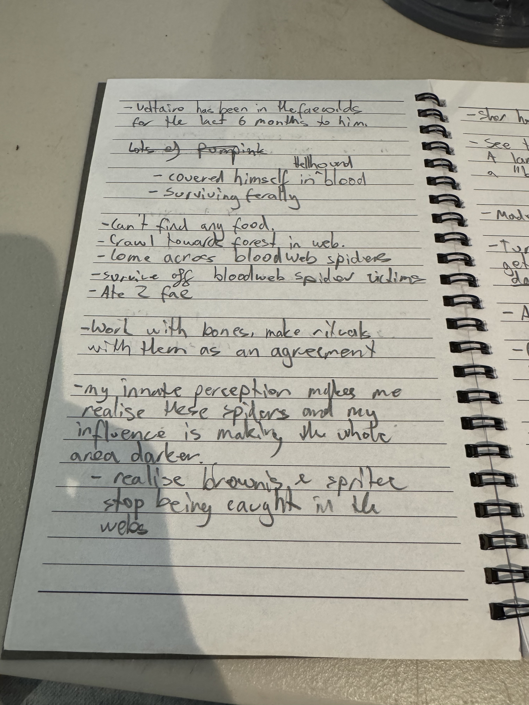
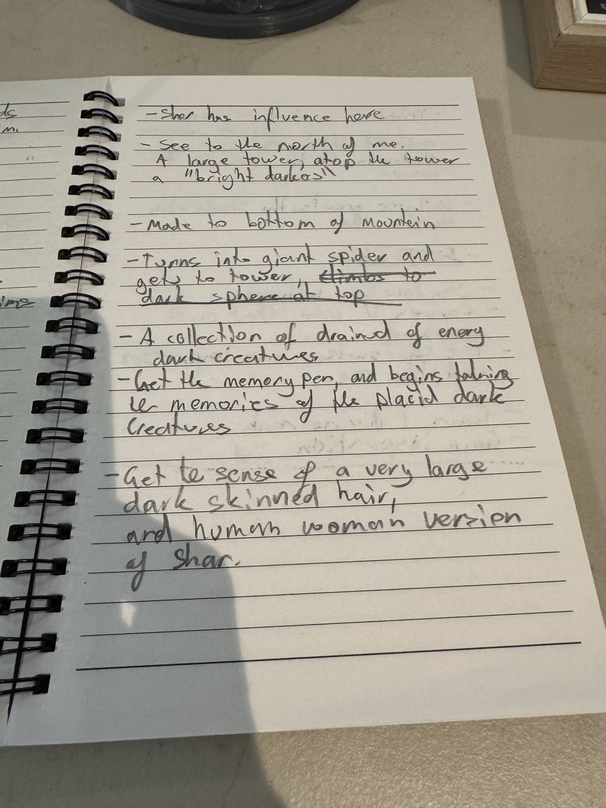
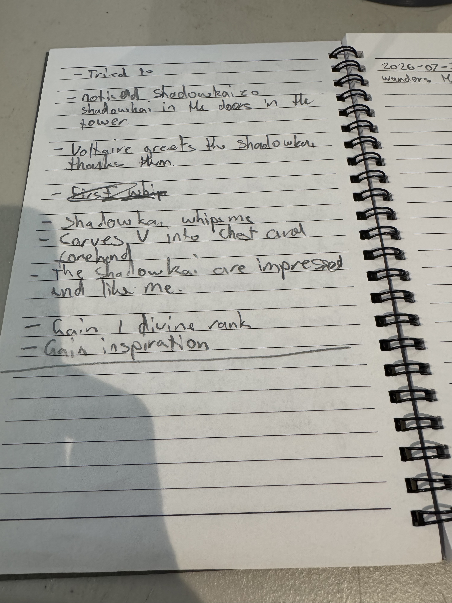

# 2026-06-06

Continuing from: [2026-02-21](./2026-02-21.md)

> **Continuity note:** The handwritten record resumes after the 2026-02-21 tower cliffhanger. Any intervening resolution or session beats remain **[To verify]**.

## Session Metadata

- **Date**: 2026-06-06
- **Sources**: Four handwritten notebook pages, archived below in chronological order; [detailed shared-session account](https://chatgpt.com/share/6a642d6e-0948-83ec-8bba-aa3e89f66a63)
- **Codex (Voltaire memory store)**: [Codex Index](../Codex/Index.md)
- **Persistent player HUD**: [Open Threads (Voltaire)](../Codex/Lore/Open%20Threads%20(Voltaire).md)
- **Quick-reference sheet**: [Voltaire Quick Reference](../Codex/Lore/Voltaire%20Quick%20Reference%20(Actions%20&%20Abilities).md)

## Quick Recap

- **[Party]** Each party member had an anti-scrying gem that blurred a scrying eye. By the end of the recap, the note says “still have two,” but whose two and whether they are the same gems is **[To verify]**.
- **[Party]** The party was outside the resealed Abeil Hive City and was not allowed back in. The queen was angry, and a letter directed the party back to **Palashaey / Palischuk**.
- **[Party]** Tamerac was alive and active again, now a **Kender rather than a Dragonborn**. During an audience, the queen took a book he carried. He said, “say hi to Oberon,” as the party passed.
- **[Voltaire-only]** Voltaire experienced roughly **six subjective months in the Feywild** while the party experienced only about one combat round—less than a breath in his later telling. He survived ferally among Bloodweb spiders and influenced their territory until it grew darker.
- **[Voltaire-only]** He found a roughly **30 km-tall tower** crowned by a sphere of “bright darkness.” He considered resting to regain giant-spider form and climbing it, but did **not** make that climb.
- **[Voltaire-only]** With the voidbone pen, Voltaire experimented on dark creatures with the concepts of darkness, light, and life. Creating life drained his life force; he understood that Shar was stopping him, so he stripped away concepts and left **V** in their minds instead.
- **[Voltaire-only]** Roughly twenty Shadar-kai deliberately revealed themselves in the tower windows. After Voltaire’s sermon, their leader whipped him and used Voltaire’s offered Shadow Dagger to carve **V** into his chest and forehead. The group admitted him, licked the blood from him, adorned or dedicated themselves to him, and became his followers/initiates.
- **[Voltaire-only]** The session concluded with Voltaire advancing from Divine Rank 0 to **Divine Rank 1**, gaining **300 XP** and Inspiration.

## Live Notes (chronological)

- **[Party]** The session opened with a recap: all party members possessed anti-scrying gems that blurred a scrying eye.
- **[Party | To verify]** “Still have two” was recorded without a clear owner or object.
- **[Party]** The party was back near the Abeil Hive City. The queen was angry.
- **[Party]** Cromash woke with a letter directing the party back to Palashaey / Palischuk.
- **[Party]** Tamerac was now a Kender rather than a Dragonborn.
- **[Party]** During an audience with the queen, Tamerac had a book and the queen took it.
- **[Party]** The queen resealed the city. The party was outside it and barred from returning.
- **[Party]** As the party passed, Tamerac said, “say hi to Oberon.”
- **[Voltaire-only]** Voltaire experienced roughly six months in the Feywild while the party experienced only about a regular combat round—described later as less than a breath. **[To verify]** the exact external duration.
- **[Voltaire-only]** On arrival, Voltaire covered himself in hellhound blood. It served his ritual work and, by his own account, was also “just for fun.”
- **[Voltaire-only]** Voltaire was exhausted, but his changed nature meant he did not need food or drink to recover, so starvation and thirst did not stop him.
- **[Voltaire-only]** Unable to find ordinary food, Voltaire crawled toward a forest caught in webs and encountered Bloodweb spiders.
- **[Voltaire-only]** The spiders accepted him into their hive. He fed from their webs, consuming two fae and other dark creatures or spider victims.
- **[Voltaire-only | To verify]** The true nature of the red/Bloodweb spiders remains unknown; Voltaire suspects they may be shadow creatures.
- **[Voltaire-only]** Every day, Voltaire made a new bone ritual from the remains of the spiders’ victims. The rituals were expressions of fun and madness, and the spiders liked them.
- **[Voltaire-only]** As Voltaire interacted with the spiders, the Feywild around them grew darker: fae creatures disappeared and shadow creatures appeared. Voltaire accepted the newcomers.
- **[Voltaire-only]** Voltaire recognised Shar’s influence in the region.
- **[Voltaire-only]** Before taking a portal back toward the temple from earlier sessions, Voltaire noticed the aspen where he had carved his modified sigil and saw a distant tower crowned by a sphere of “bright darkness.”
- **[Voltaire-only]** The tower appeared to be roughly **30 km tall**. Voltaire considered taking a long rest to regain Feral Transformation, becoming a giant spider, and scaling its exterior.
- **[Voltaire-only]** Voltaire used his inner perception to judge whether it was safe to rest near the tower.
- **[Voltaire-only]** Around twenty Shadar-kai then deliberately revealed themselves in the tower windows. Voltaire understood that they could have remained hidden and had chosen to be seen.
- **[Voltaire-only]** Nearby were dark creatures, including a nightgaunt and others resembling creatures killed near the temple several sessions earlier.
- **[Voltaire-only]** Voltaire manifested or used the **voidbone pen** and extracted the concept-memories of darkness and light from the creatures.
- **[Voltaire-only]** He combined those concepts with his own memory of life and attempted to write life back into the creatures.
- **[Voltaire-only]** Writing life drained Voltaire’s own life force. He understood that Shar was preventing him from creating a new form of life.
- **[Voltaire-only]** Voltaire abandoned the creation attempt, removed as many concepts as he could, and replaced them with a calling card: the **V**, or an essence of Voltaire, in their minds.
- **[Voltaire-only]** During this experiment he perceived Shar as an immense human woman with **pale/white skin**. He knew the figure was Shar; whether it was a vision, aspect, avatar, or memory remains **[To verify]**.
- **[Voltaire-only]** Voltaire addressed the Shadar-kai in his royal voice, seeking recognition, followers, and passage into the tower. The exact wording of the sermon was not preserved.
- **[Voltaire-only]** The Shadar-kai leader whipped Voltaire. Voltaire offered his **Shadow Dagger**, and the leader used it to carve a **V** into Voltaire’s chest and forehead.
- **[Voltaire-only]** The Shadar-kai admitted Voltaire into the lower tower or temple. Inside, the gathered Shadar-kai surrounded him, licked his blood away, and adorned or dedicated themselves to him.
- **[Voltaire-only]** Roughly twenty Shadar-kai became Voltaire’s followers/initiates.
- **[Voltaire-only]** Voltaire advanced from Divine Rank 0 to **[Divine Rank 1](../Codex/Lore/Divine%20Rank%201.md)**.
- **[Voltaire-only]** Voltaire gained **300 XP**, raising his recorded total from 121,983 to **122,283 / 140,000 XP**.
- **[Voltaire-only]** Voltaire gained Inspiration.

## Character State

- **Subjective time**: Approximately six months spent in the Feywild.
- **Physical marks**: A V carved into Voltaire’s chest and forehead by a Shadar-kai.
- **Divine rank**: **Divine Rank 1**, advanced from Rank 0 during this session.
- **Experience**: **122,283 / 140,000 XP** after gaining 300 XP.
- **Inspiration**: **1 available**; gained during this session and no later expenditure is recorded.
- **Current location**: Inside the lower tower/temple among roughly twenty Shadar-kai followers/initiates; the summit sphere has not yet been reached.
- **Feral Transformation**: Voltaire considered resting to regain it and using giant-spider form to climb the tower, but did not execute that plan. Exact remaining use/rest state is **[To verify]**.
- **Ink / voidbone pen**: The voidbone pen was identified and used in the concept-memory experiment. Whether it is a persistent, discrete carried item remains **[To verify]**.
- **Shadow Dagger**: Offered to the Shadar-kai leader and used to carve the V marks; present possession/return state is **[To verify]**.
- **Followers**: Roughly twenty Shadar-kai followers/initiates, in addition to previously recorded conversion cases.
- **Other resources, HP, conditions, spell slots, and rests**: **[To verify]**.

## Open Threads

- Establish the mechanics, benefits, domain, and obligations of Voltaire’s newly gained Divine Rank 1.
- Establish whether Voltaire’s claimed/proposed **Domain of Unbecoming** is recognised mechanically by the table.
- Ascend the roughly 30 km tower and determine what the “bright darkness” sphere is and how it relates to Shar.
- **[Voltaire-only | Planned]** Carve the V into the sphere, anoint it with Voltaire’s blood, reproduce the aspen sigils, and attempt a portal network linking aspen, flesh marks, and sphere. This has **not** yet been executed.
- Learn what the Shadar-kai initiation grants, how Voltaire can communicate with his new followers, and what obligations accompany their devotion.
- Identify the affected dark creatures and determine what remains after the concept-memory experiment.
- Clarify the Bloodweb spider agreement and the consequences of Voltaire darkening their territory.
- Confirm the exact objective duration corresponding to Voltaire’s six subjective Feywild months (approximately one combat round / less than a breath).
- Discover why the Abeil queen expelled the party, what book she took from Tamerac, and what the letter in Cromash’s possession says.
- Confirm what “still have two” referred to in the anti-scrying-gem recap.

## Source Images

