# 2026-07-25

Continuing from: [2026-06-06](./2026-06-06.md)

## Session Metadata

- **Date**: 2026-07-25
- **Detailed prior-session source**: [Shared ChatGPT session account](https://chatgpt.com/share/6a642d6e-0948-83ec-8bba-aa3e89f66a63)
- **Codex (Voltaire memory store)**: [Codex Index](../Codex/Index.md)
- **Persistent player HUD**: [Open Threads (Voltaire)](../Codex/Lore/Open%20Threads%20(Voltaire).md)
- **Quick-reference sheet**: [Voltaire Quick Reference](../Codex/Lore/Voltaire%20Quick%20Reference%20(Actions%20&%20Abilities).md)
- **Who’s at the table**: **[To verify]**

## Quick Recap (last recorded session: 2026-06-06)

- **[Party]** The Abeil queen resealed the Hive City and barred the party from returning. Cromash had a letter directing the party back toward **Palashaey / Palischuk**.
- **[Party]** Tamerac was active again and had become a Kender. The queen took a book from him during an audience; as the party passed, he said, “say hi to Oberon.”
- **[Voltaire-only]** Voltaire experienced roughly six subjective months in the Feywild while the party experienced only about one combat round. Bloodweb spiders accepted him into their hive, liked his daily bone rituals, and shared a territory that grew darker under his influence.
- **[Voltaire-only]** Voltaire reached a roughly 30 km tower crowned by “bright darkness.” He considered resting and climbing it in giant-spider form, but did not make the climb.
- **[Voltaire-only]** Using the voidbone pen, he experimented with the concepts of darkness, light, and life in dark creatures. Creating life drained him until he understood Shar was stopping him; he then stripped concepts away and left V in their minds.
- **[Voltaire-only]** He perceived Shar as an immense, **pale/white-skinned** human woman.
- **[Voltaire-only]** After Voltaire addressed roughly twenty Shadar-kai, their leader whipped him and used his offered Shadow Dagger to carve V into his chest and forehead. They admitted him, licked his blood from him, adorned/dedicated themselves to him, and became followers/initiates.
- **[Voltaire-only]** The session ended with Voltaire advancing to **Divine Rank 1**, gaining **300 XP** and Inspiration.

## Start-of-Session Snapshot

### Where we are

- **[Voltaire-only]** Voltaire is inside the lower tower/temple among roughly twenty Shadar-kai followers/initiates. He has not yet reached the sphere at the summit.
- **[Party]** Voltaire remains separated from the rest of the party.
- **[Party]** The party is fighting an unidentified dragon-like creature covered in independently tracking, peacock-like eyes, impossible vistas, shifting iridescent colours, and lingering afterimages.
- **[To verify]** Whether Voltaire knows of the party’s current enemy in-world or has any current means to perceive or assist them.

### Character State (Voltaire)

- **Level / XP**: 13 / **122,783 / 140,000 XP** per the 2026-07-25 D&D Beyond export; the source of the 500 XP increase from the last logged total is **[To verify]**.
- **AC / Max HP**: 19 / 100
- **Alignment**: **Chaotic Neutral**
- **Performance**: **+10** (**[user-confirmed]**; this overrides any inconsistent export/parser value).
- **Divine rank**: **Divine Rank 1**.
- **Inspiration**: **1 available**, gained on 2026-06-06 with no later expenditure recorded.
- **Physical marks**: V carved into chest and forehead by a Shadar-kai.
- **Subjective time**: Approximately six months in the Feywild.
- **Current HP, conditions, spell slots, Lucky, rest resources, and Feral Transformation use**: **[To verify]**.
- **Followers**: Roughly twenty Shadar-kai followers/initiates, in addition to previously recorded conversion cases.
- **Notable carried or manifested item**: The voidbone pen was identified and used during the last session; whether it persists as a discrete carried item remains **[To verify]**.
- **Shadow Dagger**: Offered and used to carve the V marks; current return/possession state is **[To verify]**.

## Open Threads

- Persistent list: [Open Threads (Voltaire)](../Codex/Lore/Open%20Threads%20(Voltaire).md)
- **Divine-rank mechanics**: establish what Rank 1 grants and whether Voltaire’s claimed/proposed **Domain of Unbecoming** is recognised by the table.
- **Tower ascent — underway**: Voltaire has assumed giant-spider form and begun sprinting up the roughly 30 km tower toward the anti-light sphere.
- **Portal-network ritual — planned, not performed**: carve and blood-anoint the sphere with V, reproduce the aspen sigils, and attempt to link the aspen, Voltaire’s flesh marks, and the sphere.
- **Shadar-kai followers**: their statue-room rite advanced Voltaire’s initiation; learn their order’s identity, what the rite granted, and what they expect next.
- **Concept-memory experiment**: identify the affected creatures, the limits and cost of creating life, and the meaning of Shar’s intervention.
- **Bloodweb pact**: establish what Voltaire promised and what his spreading darkness is doing to the Feywild.
- **Timeline split**: confirm the exact objective duration corresponding to Voltaire’s six subjective months (approximately one round).
- **Party crisis**: discover whether Voltaire can learn about or assist with the party’s many-eyed, iridescent dragon-like enemy.
- **Abeil exile**: learn why the queen expelled the party, what book she seized, and what the Palashaey letter requires.
- **Anti-scrying gems**: confirm who holds them and what “still have two” meant.

## Live Notes (chronological)

- Tag legend:
  - **[Party]**: what the party reasonably knows in-world.
  - **[Voltaire-only]**: what Voltaire knows or experiences that others likely do not.
  - **[DM-private]**: table/DM-only note; do not assume any PC knows it.
  - **[To verify]**: continuity or details to confirm in play.

- **[Source]** Three handwritten notebook photographs supplied by the user are archived below.
- **[Voltaire-only]** The Shadar-kai took Voltaire into a room containing statues of [[Shar]], [[Loviatar]], and [[Mask]]. The figures were understood to be gods.
- **[Voltaire-only]** Mask’s statue wore a velvet-black mask with red eyes. The notes identify Mask as dethroned.
- **[Voltaire-only]** Voltaire told the Shadar-kai who had carved the V into his chest: “I think I understand why you’ve brought me in here. And I accept.”
- **[Voltaire-only]** Voltaire stripped off his Robe of Eyes, revealed the V carved into his chest, struck a pose, and said, “Begin.”
- **[Voltaire-only]** The chamber began to pulsate. Voltaire endured or “fought” the overwhelming room for **twenty-four seconds**.

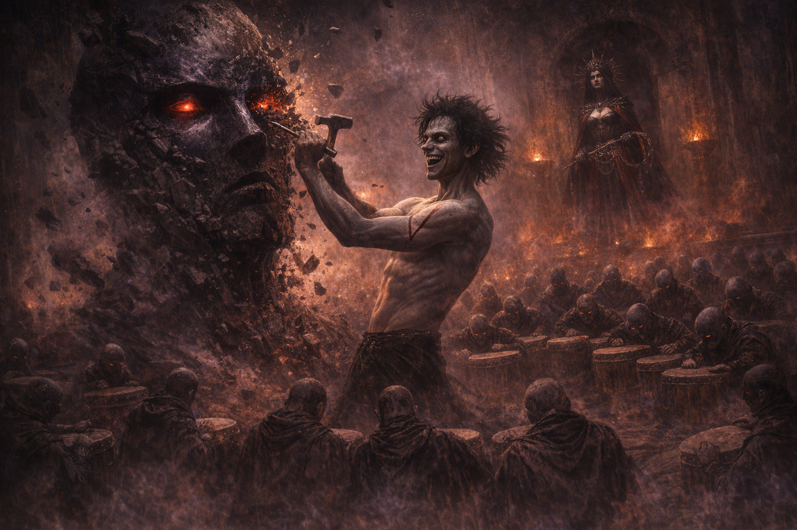

- **[Voltaire-only]** Everyone fell to their knees except Voltaire.
- **[Voltaire-only]** Voltaire commanded, “Rise.”
- **[Voltaire-only]** Voltaire chiselled Mask’s statue down toward its face in rhythm while the Shadar-kai beat a ritual or tribal rhythm with him.
- **[Voltaire-only]** When Voltaire reached the face, the statue crumbled. It was hollow.
- **[Voltaire-only | Inferred]** Voltaire considered the hollow statue emblematic, possibly of Mask’s dethronement or absent divinity.
- **[Voltaire-only]** Voltaire placed the remaining rubble onto his Robe of Eyes and stood in the place where Mask’s statue had been for **six subjective months**.
- **[Voltaire-only]** After some time, Voltaire cast `Disguise Self` so that he looked more like a statue.
- **[Voltaire-only]** Voltaire repeated the mantra: “As above, so below.”
- **[Voltaire-only]** Robin suddenly appeared, apparently summoned.
- **[Voltaire-only]** Voltaire told Robin, “As a token of appreciation for your divine loyalty, I give you the **Blessing of V**.”

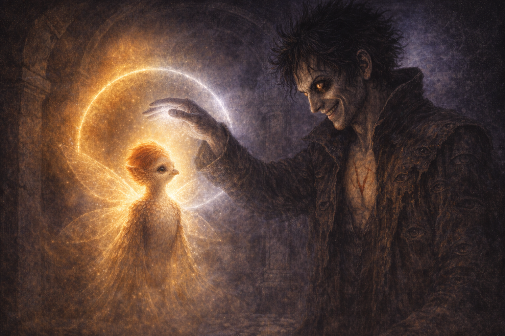

- **[Voltaire-only]** Voltaire told Robin about his divine plan: to enter Arvandor and confront the ancient divine fracture represented by Corellon.
- **[Voltaire-only]** Robin declared that she was with Voltaire and would be his guiding light in the dark—his sun.
- **[Voltaire-only]** Voltaire replied that he would be her moonlight.
- **[Voltaire-only]** Voltaire used Feral Transformation to become a giant spider and began sprinting up the tower toward the anti-light at its summit.


- **[Prompt]**

```text
My plan now is essentially to perform Voltaires first divine rite, acknowledging his divinity for the first time infront of all the gods. He prays to Shar and thanks her for her part. He then stabs him self in the Shar geometry, and allows his blood to fall upon the towers top point. He forms the blood into the followers sigil , encapsulating the void of darkness. then he finally puts the V through the followers sigil, and calls forth the connection of sigils he has placed, in order to:
1 claim the tower, and form it into my realm, essentially creating a middle ground between the faewilds and Shars realm
2 create a teleportation system between all the sigils
```

- **[Voltaire-only | Declared intent, not yet resolved]** Voltaire plans to perform his **first divine rite** at the tower summit, openly acknowledging his own divinity before the gods for the first time.
- **[Voltaire-only | Declared intent]** He will begin by praying to [[Shar]] and thanking her for her part in his becoming.
- **[Voltaire-only | Declared intent]** Voltaire will make Shar’s **circle / square / triangle** geometry in his own flesh, allowing his blood to fall upon the tower’s highest point.
- **[Voltaire-only | Declared intent]** He will shape that blood into the sigil of [[Voltaire's Followers]], using it to encircle or encapsulate the summit anti-light.
- **[Voltaire-only | Declared intent]** He will then drive or inscribe **V** through the followers’ sigil as the final claim and call to every connected sigil he has placed.
- **[Voltaire-only | Intended petition]** The first purpose is to **claim the tower and transform it into Voltaire’s realm**: a middle ground or threshold between the Feywild and Shar’s realm.
- **[Voltaire-only | Intended petition]** The second purpose is to **awaken a teleportation network between Voltaire’s sigils**.
- **[To verify]** The rite has been declared but its execution, divine witnesses, required checks, blood cost, success, side effects, network membership, and Shar’s response remain unresolved in play.

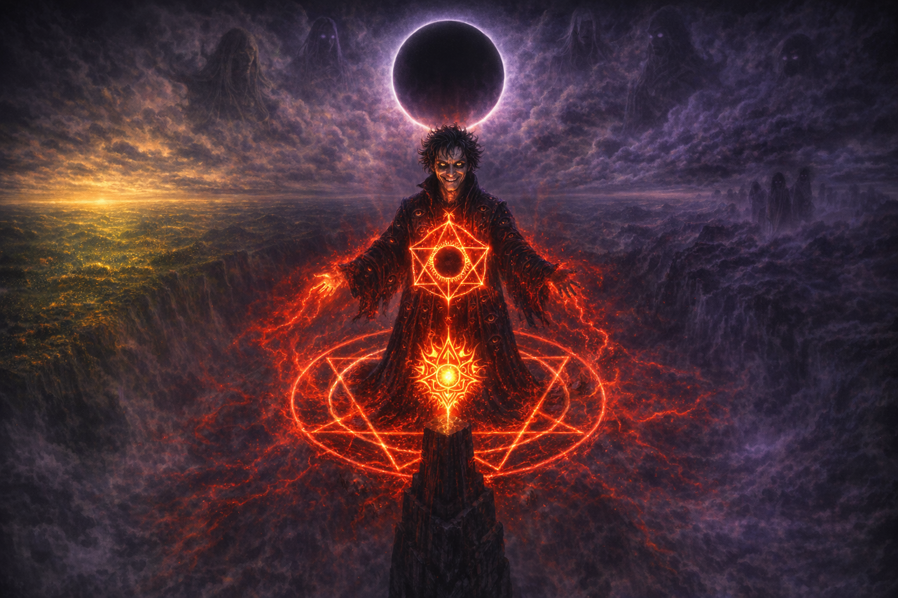

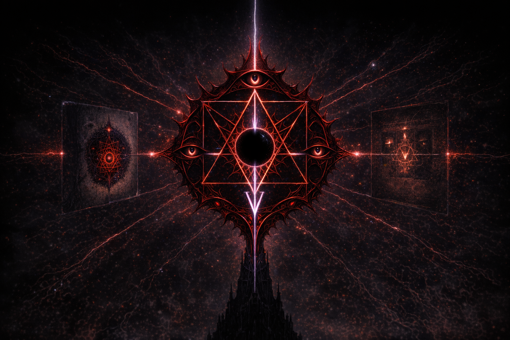

- **[Prompt]**

```text
The rite hasn’t happened yet but meanwhile with the party..
```

- **[Continuity correction]** Voltaire’s planned summit rite has **not happened or begun**. The two preceding ritual panels are visualisations of Voltaire’s intent, not depictions of a completed event.
- **[Party]** Meanwhile, the party is at the [[Temple of Blood]] and is planning to convert it to [[Shar]].
- **[Voltaire-only]** While ascending the distant tower, Voltaire suddenly sees through Cornholio/Tom’s eye **“in reverse.”**
- **[Party | To verify mechanism]** Voltaire appears able to influence Cornholio/Tom. The notes connect this to Cornholio/Tom having signed the visitor book that Voltaire filled with “Voltaire is divine” using [[The Ink of Unbeing]] at the Warlock Knights’ tower.

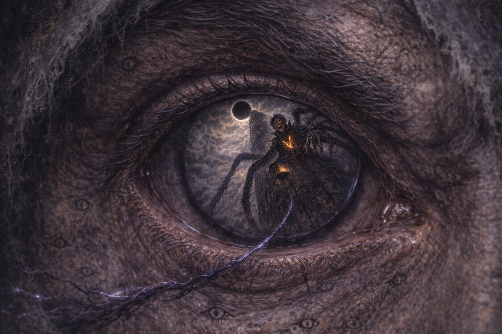

- **[Party]** The Temple of Blood suddenly turns black.
- **[Party]** Voltaire’s voice echoes through its halls: **“Machinations.”**
- **[Party]** Manifestations of Voltaire’s many eyes form around the walls and coalesce into **V**.
- **[Party]** The temple is described as **cleansed in the name of Voltaire**, and its oppressive atmosphere diminishes.


- **[To verify]** This is a spontaneous remote manifestation, not the execution of the planned summit rite. Establish whether the visitor-book signature, Cornholio’s relationship with Shar, Divine Rank 1, the Robe of Eyes, or another force enabled it.

- **[Source]** Two additional notebook photographs and one tabletop combat photograph supplied by the user continue the party-side chronology.
- **[Party]** After the Blood Temple manifestation, the party moves one more room deeper to investigate.
- **[Party]** The next chamber is filled with **sundews**, and the party begins burning the plants.
- **[Party]** A large creature described as **half lizard and half scorpion** suddenly emerges and attacks.
- **[Party]** Its scorpion-like tail drips **black ooze**.

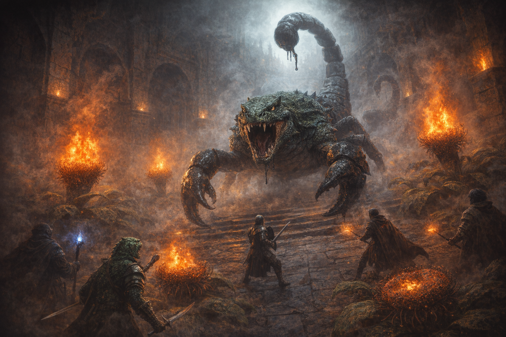

- **[Party]** Norhan’s character begins blasting the beast and deals **150 damage**.
- **[Party]** One of the creature’s legs is blasted off, but it remains active and appears to retain substantial health.

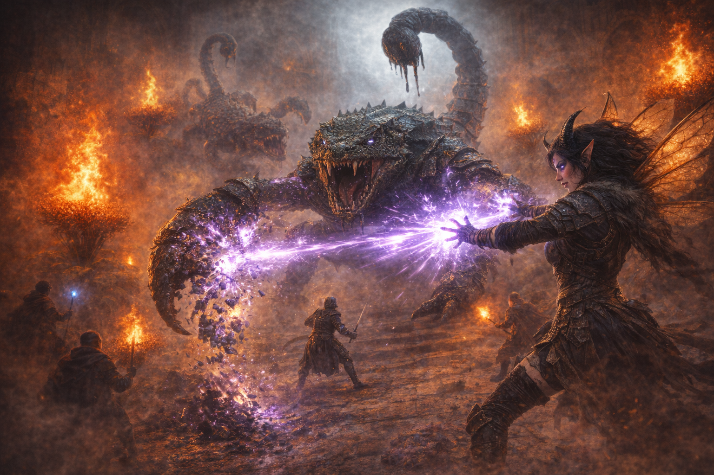

- **[Party]** A second [[Lizard-Scorpion Beasts (Blood Temple)|lizard-scorpion beast]] emerges while stalking toward a party member whose name is unclear in the handwritten notes.
- **[Party | To verify]** The second creature fills the room with a pheromone effect; the exact handwritten adjective and the effect’s mechanics are unclear.
- **[Party]** Combat remains underway.

## Character State (current)

- **Latest character-sheet source**: D&D Beyond export dated 2026-07-25.
- **Level / XP**: Level 13; **122,783 / 140,000 XP**. The source of the additional 500 XP since the last recorded reward is **[To verify]**.
- **Alignment / Performance**: Chaotic Neutral; Performance **+10** (**[user-confirmed]**).
- **Current location**: Ascending the exterior of the [[Shadar-kai Tower of Bright Darkness]] in giant-spider form toward the summit anti-light.
- **Subjective time**: Approximately six earlier Feywild months plus a further six-month statue vigil—roughly **twelve subjective months total** across the two recorded distortions.
- **Feral Transformation**: Used to assume giant-spider form for the ascent; current use is expended until the applicable recovery.
- **Robe of Eyes**: Mask-statue rubble was placed onto the robe; exact physical or magical effect is **[To verify]**.
- **Robin**: Present with Voltaire and granted the **Blessing of V**; its mechanical effect remains **[To verify]**.
- **Divine plan**: Enter Arvandor and confront the fracture represented by Corellon.
- **Immediate intent**: Complete Voltaire’s first openly acknowledged divine rite at the summit, using self-bloodletting, Shar’s geometry, the followers’ sigil, and V to claim the tower and awaken a sigil-linked teleportation system.
- **Ritual blood loss / wounds**: Planned but not yet resolved; damage, conditions, scars, and healing requirements remain **[To verify]**.
- **New remote manifestation**: Voltaire perceived the Blood Temple through Cornholio/Tom’s eye “in reverse”; his voice and many-eye/V imagery manifested there while he remained physically separated. Range, duration, control, resource cost, and repeatability are **[To verify]**.

## Open Threads (updated)

- What office, title, domain, or vacancy did Mask’s hollow statue represent?
- What did the twenty-four-second pulsation test, and why did everyone except Voltaire kneel?
- What effect does Mask’s rubble have on the Robe of Eyes?
- What does the blessing of V grant Robin?
- Reach and investigate the summit anti-light.
- Perform the first divine rite: thank Shar, blood-inscribe her geometry and the followers’ sigil, place V through it, claim the tower as a Feywild–Shar threshold realm, and awaken the sigil network.
- Establish which marks qualify as teleportation anchors, who may use them, and what cost or danger accompanies transit.
- Determine whether Cornholio/Tom’s visitor-book signature created a persistent conduit for sight, voice, influence, or divine manifestation.
- Determine what was removed when the Blood Temple was “cleansed,” whether V remains there as a persistent mark, and whether the temple now belongs to Voltaire.
- Survive the sundew-chamber battle; identify the lizard-scorpion beasts, black ooze, pheromone effect, and whether severing limbs meaningfully weakens them.
- Establish whether the six-month statue vigil consumed measurable time outside the chamber.

## Source Images

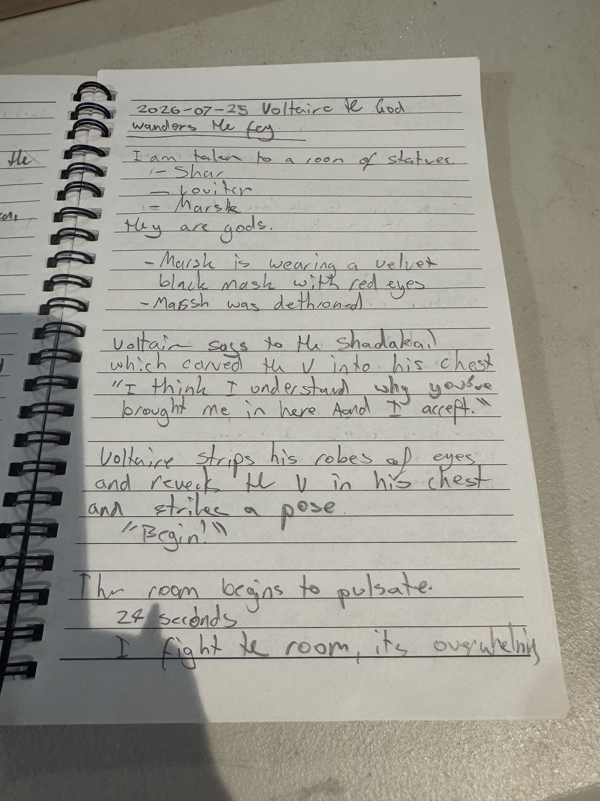

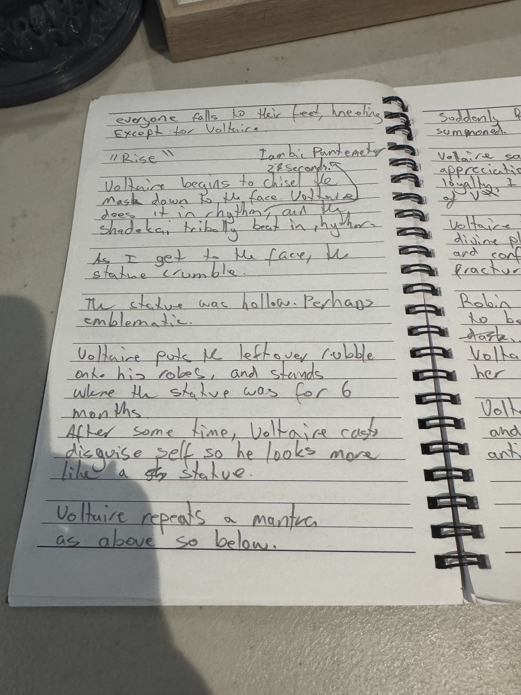

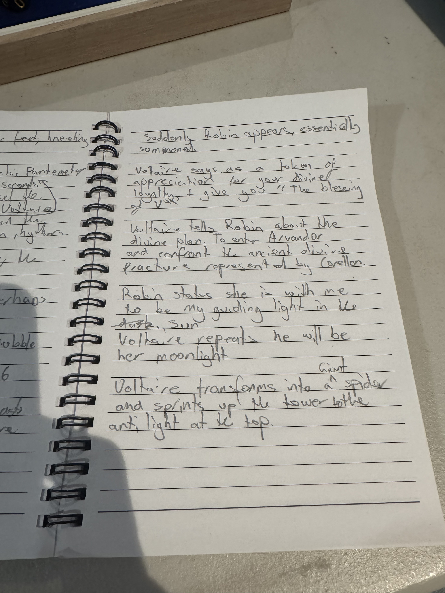

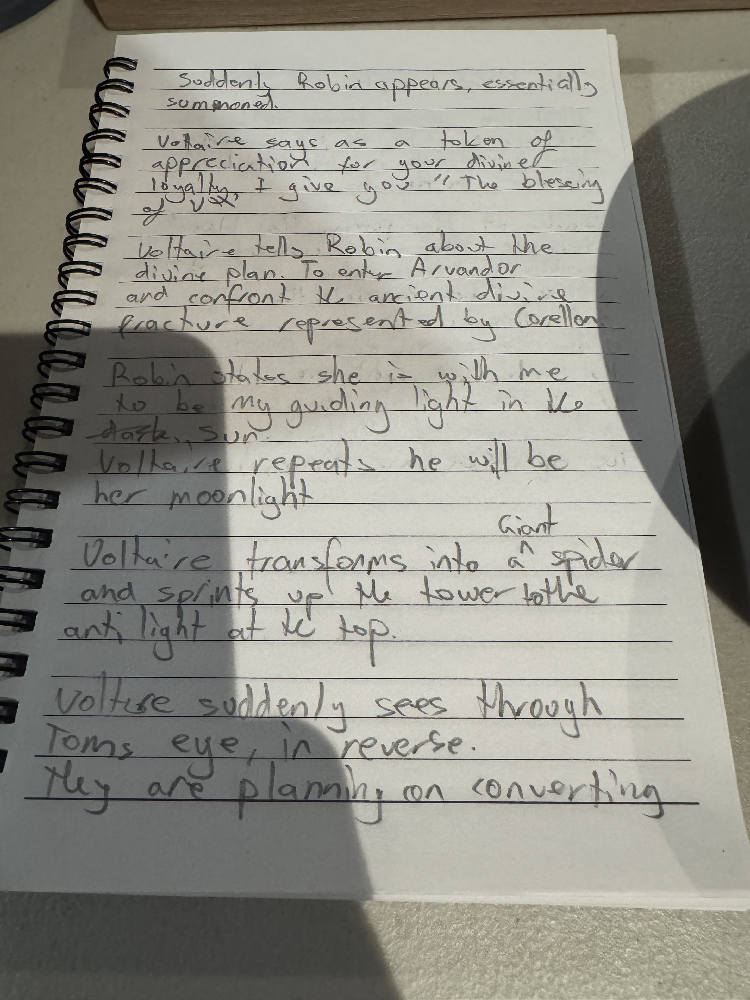

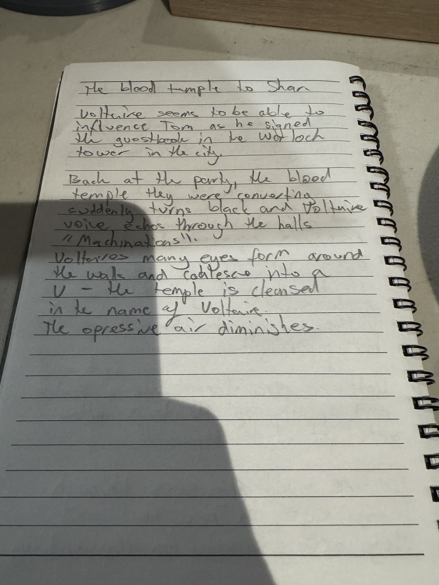

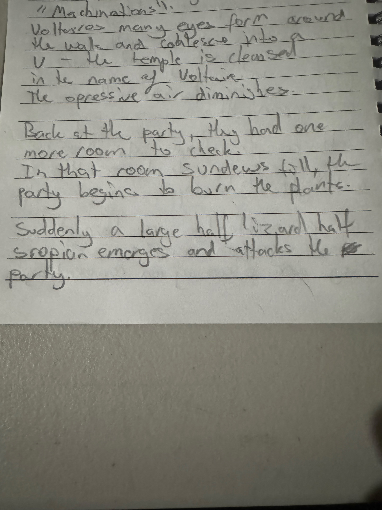

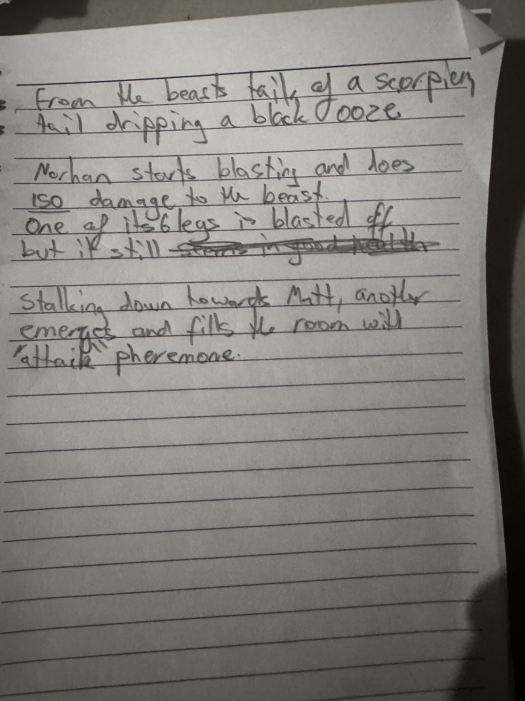

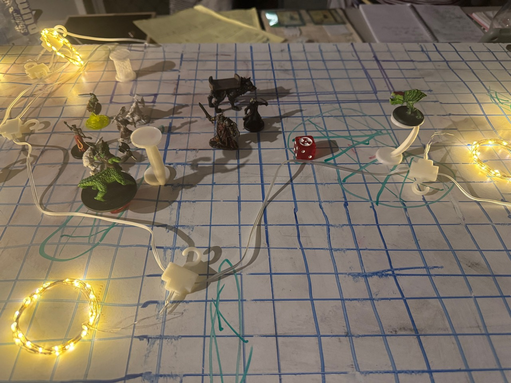
