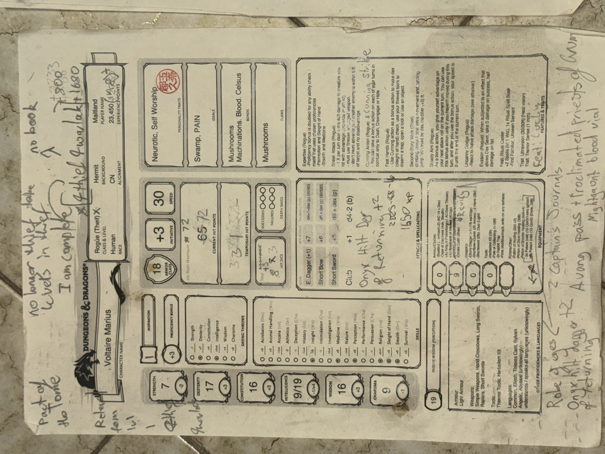
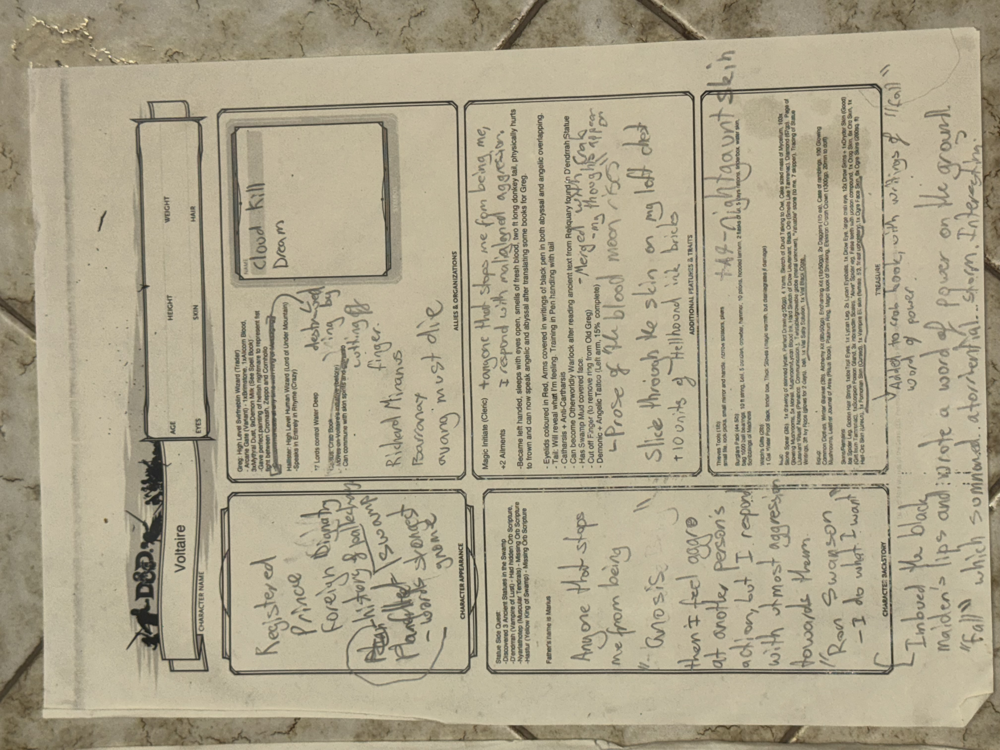

# Voltaire — Paper Character Sheet (extract)

## Source Images

- `Adventures/Voltaire's Notes/Character Sheet D&D Beyond/Imports/Voltaire_paper_sheet_stats.jpeg`
- `Adventures/Voltaire's Notes/Character Sheet D&D Beyond/Imports/Voltaire_paper_sheet_notes.jpeg`
- Originals: `Adventures/Voltaire's Notes/Character Sheet Paper/`

## Quick Snapshot (historical)

**Confirmed (paper sheet)**

- **Name**: Voltaire Marius
- **Race**: Human
- **Background**: Hermit
- **Alignment**: CN
- **AC / Speed / Init**: 18 / 30 ft / +3
- **HP**: 72 max (noted 65/72 at time of writing)
- **Proficiency Bonus**: +3
- **Ability Scores**:
  - STR 7 (-2)
  - DEX 17 (+3)
  - CON 16 (+3)
  - INT 9 (see note below)
  - WIS 16 (+3)
  - CHA 9 (-1)
- **Notes on personality**:
  - Trait: “Neurotic, Self Worship”
  - Ideal: “Swamp, PAIN.”
  - Bond: “Mushrooms. Machinations. Blood. [[Celsus]].”
  - Flaw: “Mushrooms.”

**Inferred (from sheet totals; verify)**

- **Level**: 8 (XP 23,450; hit dice 8d8; Sneak Attack 4d6)
- **Expertise**: Perception + Sleight of Hand (Passive Perception noted as 19; consistent with WIS 16 + expertise)
- **INT**: “9/19” suggests a temporary/set value (likely [[Headband of Intellect]]; verify)

## Extracted Notes (paper sheet)

### Identity / Status

- “Registered Prince”
- “Foreign Dignity”
- “History & politics”
- **[Unclear]** “... Swamp ... word stones ... gnome” (see [[Word Stones]]; to verify wording/context)

### Side Quest — Swamp Statues / Orb Scripture

See [[Swamp Statues - Orb Scripture]].

### Allies / Organizations / Rivals

- [[Greg]] (wizard; transcription patron/mentor per other notes)
- [[Hallister]] (high-level human wizard; “Lord of Undermountain”; “speaks entirely in rhyme”)
- [[Celsus]] (the [[Crab Book]]’s apparent identity/name; “moves on Voltaire’s initiative”; “can commune with skin spirits” — to verify exact text)
- Names written as hostile intent: [[Richard Miranus]], [[Barranay]], [[Avang]] (“must die”)
- Symbol/name: “cloud kill / Dream” (**[Unclear]** what this refers to; to verify)

### Traits / Transformations / Body Notes

**Printed on sheet (confirm in play log vs sheet era)**

- Became left-handed
- Sleeps with eyes open; smells of fresh blood
- 2 ft long donkey tail
- Physically hurts to frown
- Can now speak angelic and abyssal (after translating books for Greg)
- Eyelids colored red; arms covered in black-pen writings (abyssal + angelic overlapping)
- Tail can “reveal what I’m feeling”; training in pen handling with tail
- “Catharsis + Anti-Catharsis” (**[Unclear]** meaning/mechanics)
- “Can become Otherworldly Warlock after reading ancient text from Reliquary found in [[D'endrrrah]] statue”
- Swamp mud covered face
- Cut off finger (to remove ring from “Old Greg”) (**[Unclear]** referent; to verify)
- Demonic + Angelic tattoo (left arm, “15% complete”)

**Handwritten**

- “Anyone that stops me from being ‘[[Gnosis (State)|Gnosis]]’, I respond with malaligned aggression.”
- “Merged with crab — my thoughts appear ...” (**[Unclear]** where/how; likely [[Crab Book]] behavior)
- “Prose of the blood moon rises” (**[Unclear]** quote/prophecy; to verify)
- “Slice through the skin on my left chest” (**[Unclear]** ritual/ink application; to verify)
- “+10 units of [[Hellhound Ink Bricks]]”
- “... nightgaunt skin” (see [[Nightgaunt Skin]]; to verify)

### Word of Power

- “Added to crab book, with writings of ‘fall’ word of power.”
- “Imbued the black maiden’s lips and wrote a word of power on the ground ‘Fall’ which summoned a torrential storm. Interesting.”
  - See [[Word of Power - Fall]].

## Extracted Items / Documents (paper sheet)

- [[Robe of Eyes]]
- [[Ring of Protection]] (**[Inferred]** mentioned elsewhere in repo; paper sheet has a “cut off finger to remove ring” note)
- [[Headband of Intellect]] (**[Inferred]** from “INT 9/19”)
- [[Onyx Hit Dagger of Returning +2]] (written as “Onyx Hit Dgr of Returning +2”; spelling to verify)
- [[Nightgaunt Blood Vial]]
- [[Captain's Journals]] (x2)
- [[Hellhound Ink Bricks]] (“10 units”)
- [[Word Stones]]

## To Verify (continuity questions)

- Is “Old Greg” a nickname for [[Greg]], or a different entity/ring-bound influence?
- Does “cloud kill / Dream” refer to a spell, omen, enemy, or a planned event?
- Did “Fall” summon a storm via [[The Ink of Unbeing]], the [[Crab Book]], a spell scroll, or a one-time table ruling?
