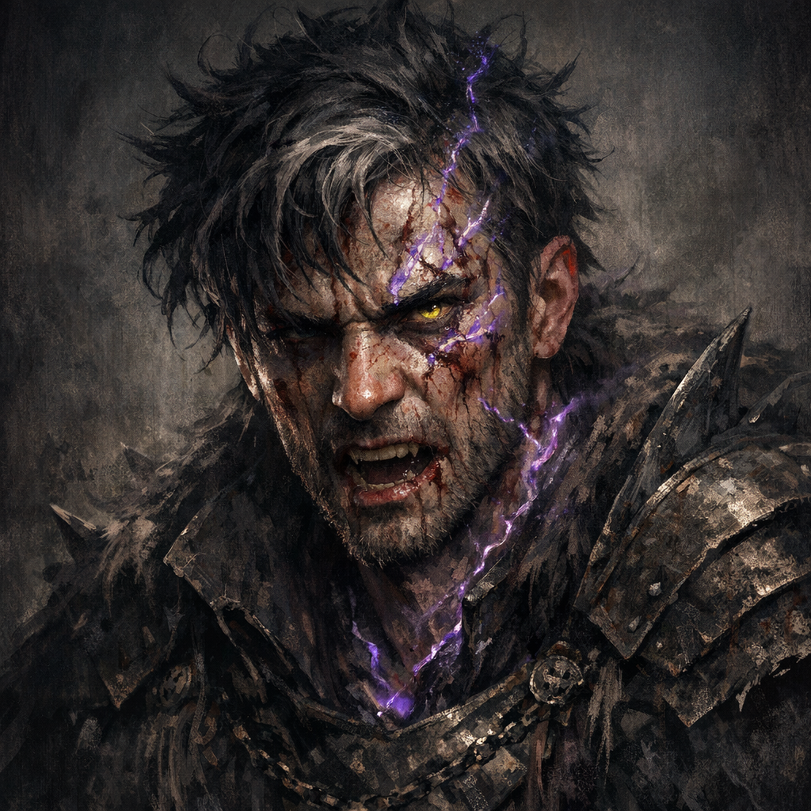

# Akulakhan

#character #companion? #to-verify

## Summary

Akulakhan is referenced in session notes as an ally/party-adjacent entity affected by wild magic and later “going down” during the Tiamat-shrine incident.

## What the Party Knows (in-play)

- During a gnome ambush, Tamrenac’s spellcasting error triggered a wild magic effect that attacked Akulakhan.
- In the Tiamat-shrine incident, “Akulakhan goes down” is recorded.

## Open Questions

- What is Akulakhan (PC, NPC, summon, companion creature)?
- What is Akulakhan’s relationship to the party, and does Voltaire’s [[Crab Book]] have any memory tie to it?
