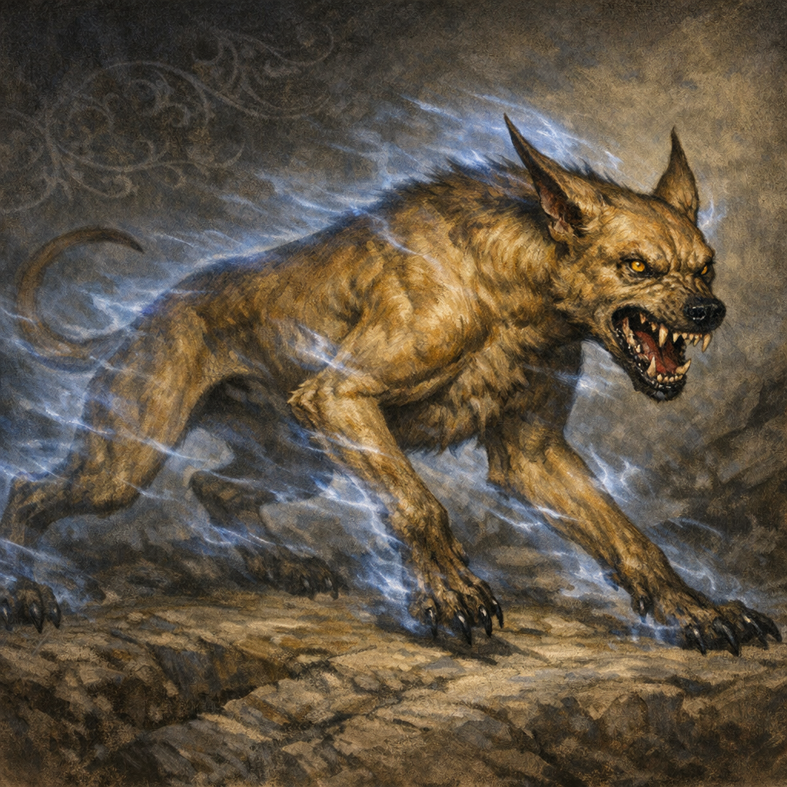

# Blink Dog (Norhan’s)

#npc #companion #follower

## Summary

A blink dog associated with Norhan. At Yennefer’s request, Voltaire made the dog a **local** follower/companion of Norhan, but altered the dog’s **spiritual belief** so it worships Voltaire as a god (fine print faith clause).

## Party Knowledge

- The blink dog is (at least nominally) a follower/companion of Norhan in the practical, day-to-day sense.

## Voltaire-Only Knowledge

- The conversion included a “fine print” clause: the dog’s spiritual beliefs now worship Voltaire as a god.

## Open Questions

- Is the worship split (Norhan as handler / Voltaire as god) or does the fine print dominate behavior over time?
- What is the blink dog’s current behavior when Voltaire and Norhan give conflicting guidance?
