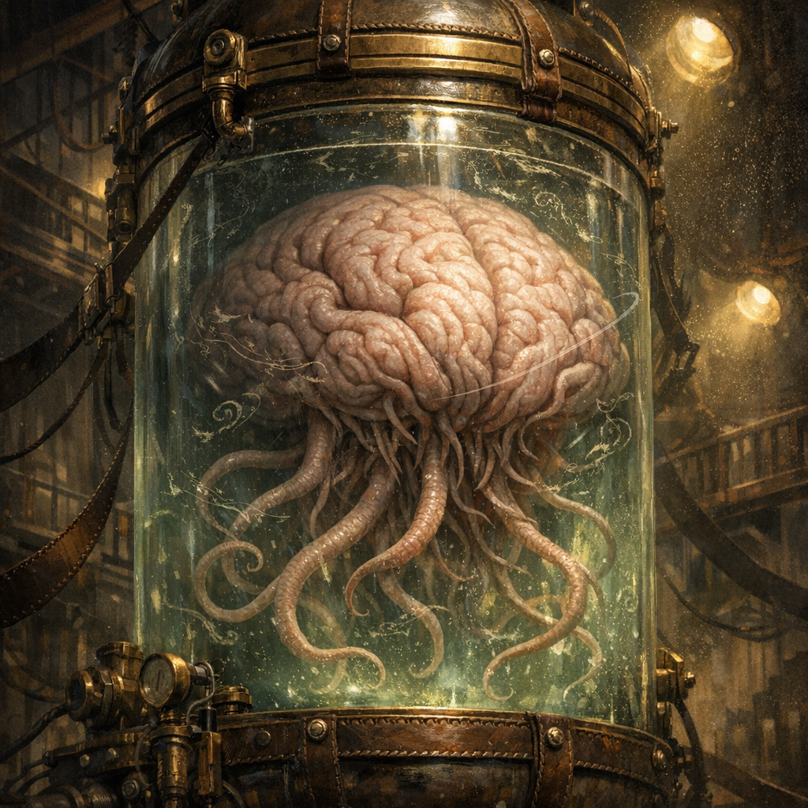

# Elder Brain (Tina’s)

#character #npc #aberration #psionic #ludus #to-verify

## Summary

An Elder Brain deployed into the Ludus via Tina’s “heaven box” lever-controls. It descends into the arena space like a living stage-prop and (for now) responds to Tina’s commands.

## Knowledge Boundaries

- **[Party]** The party can see the Elder Brain descend when the lever is pulled.
- **[To verify]** Whether Tina’s control is absolute, limited to simple commands, or requires concentration/lever contact.
- **[DM-private]** Decide if this is a true Elder Brain, a mindspace copy, or a sponsor-provided construct.

---

## Stat Sheet (Module Elder Brain)

This is a **table-usable** Elder Brain for your Voltaire Head-Space™ bouts: scary, controllable, and bounded. It is **not** a verbatim reproduction of any published stat block.

*Huge aberration, unaligned (or as appropriate)*

**Armor Class** 15 (psionic ward)  
**Hit Points** 180 (bounded boss-ally)  
**Speed** 5 ft., hover 20 ft. (inside the Ludus only)

STR 7 (-2) DEX 10 (+0) CON 18 (+4) INT 20 (+5) WIS 16 (+3) CHA 18 (+4)

**Saving Throws** Int +9, Wis +7, Cha +8  
**Skills** Insight +7, Perception +7  
**Damage Resistances** psychic; bludgeoning/piercing/slashing from nonmagical attacks  
**Condition Immunities** charmed, frightened, prone  
**Senses** blindsight 60 ft., passive Perception 17  
**Languages** telepathy 120 ft.  

### Traits

**Psionic Node (Controller).** While Tina is “on the lever” (or otherwise linked), the Elder Brain treats Tina as its controller:
- It acts on **Tina’s initiative** (immediately after Tina), or on initiative 20 if you prefer.
- It won’t willingly target Tina or Tina’s declared allies.

**Mindspace Nonlethal Clause.** If it reduces a creature to 0 HP, the target falls **stable** (unless you want lethal stakes).

**Psychic Feedback (1/round).** The first time each round the Elder Brain takes damage, the attacker takes **1d6 psychic** (save DC 15 for half).

---

## Actions

**Multiattack.** The Elder Brain uses **Tentacle Lash** twice, or uses **Tentacle Lash** once and **Thought Spike** once.

**Tentacle Lash.** *Melee Weapon Attack:* +8 to hit, reach 15 ft., one target. *Hit:* 2d8 + 4 bludgeoning plus 1d8 psychic. The target must succeed on a **DC 15 Strength** save or be pulled up to 10 ft. toward the Elder Brain.

**Thought Spike.** *Ranged Spell Attack:* +9 to hit, range 90 ft., one target. *Hit:* 4d8 psychic, and the target can’t take reactions until the start of its next turn.

**Mind Break (Recharge 5–6).** Creatures of the Elder Brain’s choice within 60 ft. must make a **DC 15 Wisdom** save or take 6d8 psychic and be **staggered** (speed halved; can’t take bonus actions) until the end of their next turn. Half damage on a success and no stagger.

---

## Bonus Actions

**Command: Focus Fire (1/bout).** Choose one creature the Elder Brain can sense. Until the start of Tina’s next turn, the Elder Brain has advantage on attack rolls against that creature.

---

## Reactions

**Synaptic Screen (1/round).** When a creature the Elder Brain can sense hits it with an attack, reduce the damage by **1d10 + 5**.

---

## “Costs” (if you want Tina’s control to matter)

Pick one dial:

- **Soft:** Each round Tina controls it, she loses **1 Favor** (the crowd dislikes “remote control”).
- **Medium:** Each round, Tina must spend **1 bonus action** to maintain control; otherwise it becomes “neutral” for 1 round.
- **Hard:** Each time it uses Mind Break, Tina takes **2d6 psychic** (feedback through the lever).

