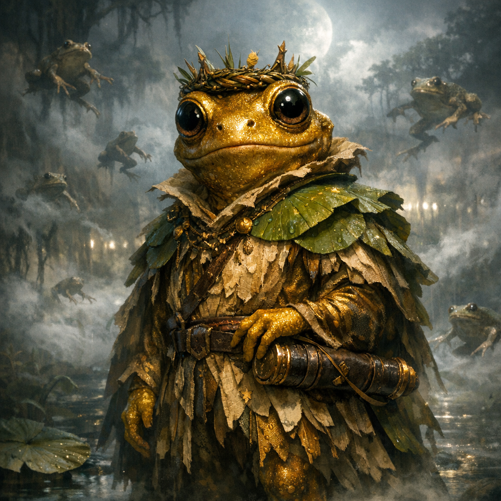

# Gold Grung (Norhan’s Frog Husband)

#character #npc #grung #frog #swamp #to-verify

## Summary

A gold-skinned grung who presents himself as Norhan’s (Yadonk’s) “frog husband” inside the frog-bag swamp realm. He recognizes Norhan/Yadonk and speaks as if they’ve met before (“hey don’t you recognize me”).

## Knowledge Boundaries

- **[Party | To verify]** Whether anyone besides Norhan/Yadonk can see or interact with him when she uses the frog-bag.
- **[DM-private]** Decide if he is:
  - a real extraplanar person,
  - a mindspace construct / stage-prop NPC,
  - or an entity hitchhiking in the bag-link (paired mouth-space).

---

## Stat Block (Level 11 “module NPC”)

Use this as a fast, table-ready sheet. Treat him as a **Grung** with **11 levels of Bard (College of Glamour)**.

*Small humanoid (grung), chaotic neutral*

**Armor Class** 17 (Frog Robes of Armor, if equipped)  
**Hit Points** 93 (11d8 + 44)  
**Speed** 25 ft., climb 25 ft.

STR 10 (+0) DEX 18 (+4) CON 18 (+4) INT 12 (+1) WIS 12 (+1) CHA 18 (+4)

**Saving Throws** Dex +8, Con +8, Cha +8  
**Skills** Performance +10, Persuasion +8, Insight +5, Stealth +8, Acrobatics +8  
**Senses** passive Perception 11  
**Languages** Common, Grung, “Croakspeech” (counts as Thieves’ Cant in the Ludus)

### Grung Traits (core)

**Amphibious.** Can breathe air and water.  
**Poisonous Skin.** Any creature that grapples him or touches him with bare skin must succeed on a **DC 16 Con** save or be **poisoned** for 1 minute (repeat save end of each turn).  
**Poison Weapons.** As a bonus action, he can apply poison to a piercing/slashing weapon; next hit forces **DC 16 Con** save or take **2d6 poison** and be poisoned 1 minute (repeat save end of each turn). (Use sparingly if PvP table.)  
**Standing Leap.** Long jump 25 ft; high jump 15 ft (with/without running start).  

### Bard Features (bounded)

**Bardic Inspiration (d10, 5/long rest).** Bonus action, 60 ft.  
**Mantle of Inspiration (Glamour, 3/long rest).** Bonus action: choose up to 5 creatures who gain 8 temp HP and can move up to their speed without provoking.  
**Enthralling Performance (1/short rest).** After 1 minute performing, charm 1–3 humanoids (Wis save DC 16) for 1 hour (non-combat lever).  

**Spellcasting.** Spell save DC **16**, +8 to hit with spell attacks.

### Suggested Spells (pick what you need)

**Cantrips:** `vicious mockery`, `minor illusion`, `mage hand`, `friends`  
**1st:** `charm person`, `disguise self`, `healing word`  
**2nd:** `suggestion`, `mirror image`  
**3rd:** `hypnotic pattern`, `dispel magic`  
**4th:** `greater invisibility`, `dimension door`  
**5th:** `hold monster`, `modify memory`  
**6th (1 slot):** `mass suggestion`

---

## Actions (combat-fast)

**Ink-Frog Dagger.** *Melee Weapon Attack:* +8 to hit, reach 5 ft., one target. *Hit:* 1d4 + 4 piercing plus 2d6 poison (DC 16 Con half poison; no poison condition on a success).

**Scroll Courtesan (1/bout).** He produces **one** “really good scroll” if the fiction supports it (your call), but it always comes with a clause:
- either costs **1 Favor** immediately,
- or imposes **disadvantage** on his next saving throw,
- or paints a visible “heading” over him that makes attacks against him at **advantage** for 1 round.

---

## Role in Scene 1

- If you need a Norhan hook: he is the face of the frog-bag realm and can answer “where do the frogs go?”
- If you need a Favor engine: he can lead a frog-dance number to spike the crowd.
- If you need a complication: he can demand recognition, vows, or “marital” leverage in exchange for help.

