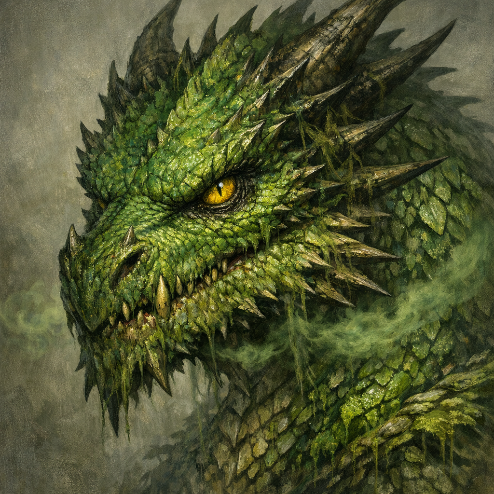

# Green Dragon (Swamp Lake)

#npc #dragon #swamp

## Summary

An unnamed green dragon that, per frog-gossip relayed by [[Robin]] on **2026-01-25**, “used to be” in the local lake within/near the [[Dellhalls Northeast Swamp]]—until it was slain by a **[[Gold Dragon (Westward Slayer)]]**.

## What the Party Knows (in-play)

- A green dragon once occupied the lake.
- It was killed by a giant gold dragon that then flew off **west**.

## Open Questions

- How long ago did the slaying occur?
- Is the corpse (or bones) still in/near the lake?
- Was the dragon’s lair/hoard underwater, buried, or relocated?
