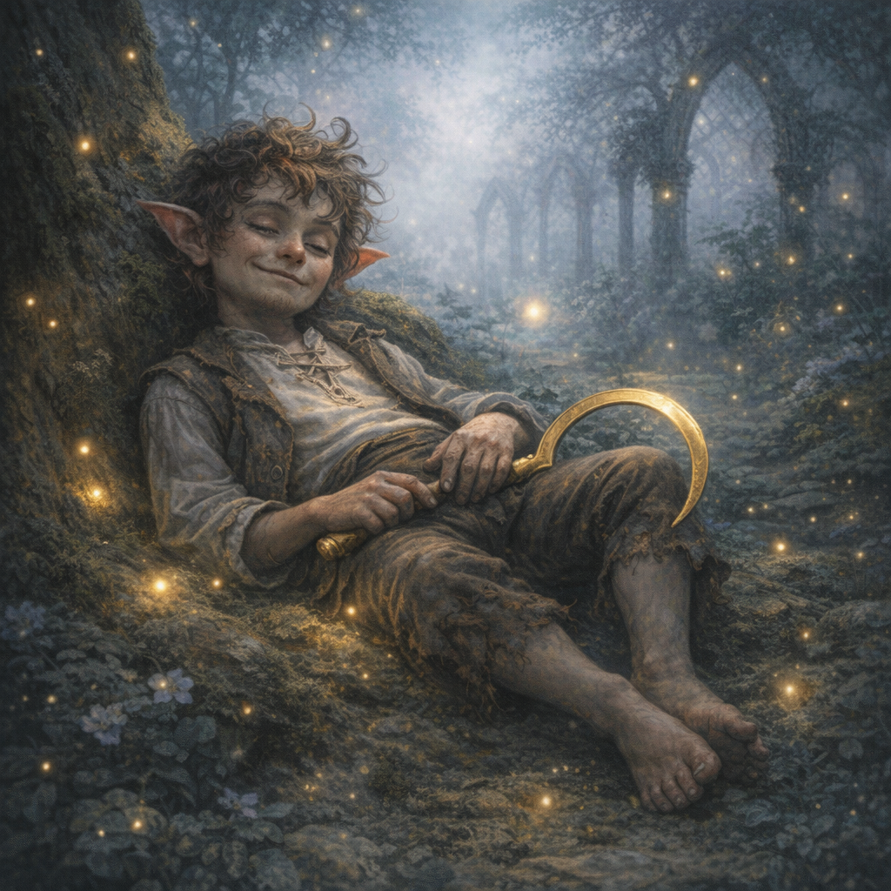

# Halfling (Golden Sickle)

#npc #mystery

## Summary

A lazy-looking halfling spotted **sleeping up in the trees** near the suspected [[Circle of Dreams]] area on **2026-01-25**, carrying a **golden sickle**.

## Confirmed

- Halfling.
- Seen sleeping/lounging in a tree.
- Carries a golden sickle.

## Open Questions

- Name and allegiance?
- Is the sickle ceremonial, magical, or a druidic/archfey token?
- Is the halfling guarding the Circle of Dreams, spying, or simply unconcerned?

## Appears In

- `Adventures/2026-01-25.md`
