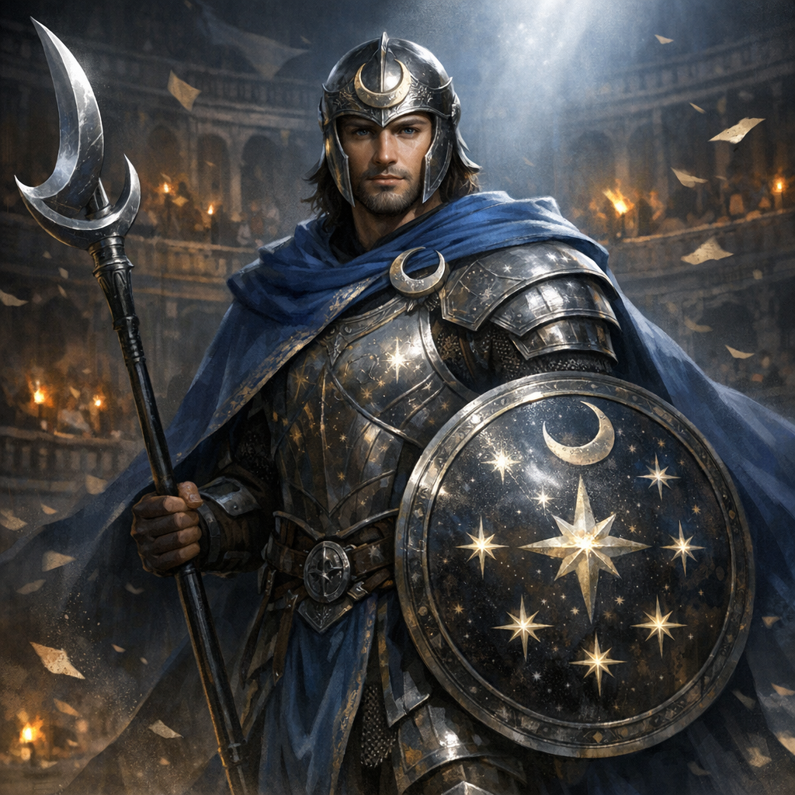

# Jeff (Gladiator of Selûne)

#character #npc #gladiator #selune #ludus #to-verify

## Summary

Jeff is one of Tina’s drafted gladiators in Voltaire’s Head-Space™ ludus. He presents as a Selûnite-aligned champion: protective, theatrical, and “moonlit” in his miracles.

## Knowledge Boundaries

- **[Party | To verify]** Whether Jeff existed in the main campaign before the module, or is a mindspace stage-prop.
- **[DM-private]** Decide whether Selûne’s influence here is genuine, a “heresy” echo, or Voltaire’s misprint.

---

## Stat Sheet (Module Gladiator, Selûne-flavored)

This is a bounded, table-usable sheet meant to be fast in-play (not a verbatim published stat block).

*Medium humanoid, any alignment*

**Armor Class** 18 (moonsteel shield + arena plate)  
**Hit Points** 136 (16d8 + 64)  
**Speed** 30 ft.

STR 18 (+4) DEX 14 (+2) CON 18 (+4) INT 10 (+0) WIS 14 (+2) CHA 16 (+3)

**Saving Throws** Str +8, Con +8, Wis +6  
**Skills** Athletics +8, Insight +6, Perception +6, Intimidation +7  
**Damage Resistances** radiant (optional; if it’s too much, make it 1/round half damage)  
**Senses** passive Perception 16  
**Languages** Common, Celestial (if you want the vibe)

### Traits

**Nonlethal Arena Clause.** Jeff defaults to nonlethal damage unless the table opts into lethal stakes.

**Moonlit Discipline.** Jeff has advantage on saves against being charmed or frightened.

**Shield of the Moon (1/round).** The first time each round Jeff takes damage, reduce it by **1d8 + 2** (glimmering ward).

---

## Actions

**Multiattack.** Jeff makes two attacks with his Moon-Spear.

**Moon-Spear.** *Melee Weapon Attack:* +8 to hit, reach 10 ft., one target. *Hit:* 1d10 + 4 piercing plus 1d6 radiant.

**Shield Bash.** *Melee Weapon Attack:* +8 to hit, reach 5 ft., one target. *Hit:* 1d6 + 4 bludgeoning, and the target must succeed on a **DC 15 Strength** save or be knocked prone.

**Lunar Flare (Recharge 5–6).** 15-ft cone; creatures in the area make **DC 15 Con** save or take **4d8 radiant** and are **outlined** (can’t benefit from invisibility) until the end of their next turn; half damage on success, no outline.

---

## Bonus Actions

**Rally Under Moonlight (1/bout).** Choose up to 3 allies Jeff can see within 30 ft. Each gains **10 temp HP** and can immediately move **10 ft** without provoking opportunity attacks.

---

## Reactions

**Interpose Shield.** When a creature within 5 ft of Jeff is hit by an attack, Jeff can impose disadvantage on that attack roll (must declare before the roll is resolved).

---

## Running Jeff (quick script)

- **Opener:** Rally Under Moonlight if Tina’s side needs stability.
- **Pressure:** Spear + spear, keep reach, shove prone with Shield Bash when someone enters spotlight.
- **Moment:** Lunar Flare when invisibility/stealth/crowd focus matters.

