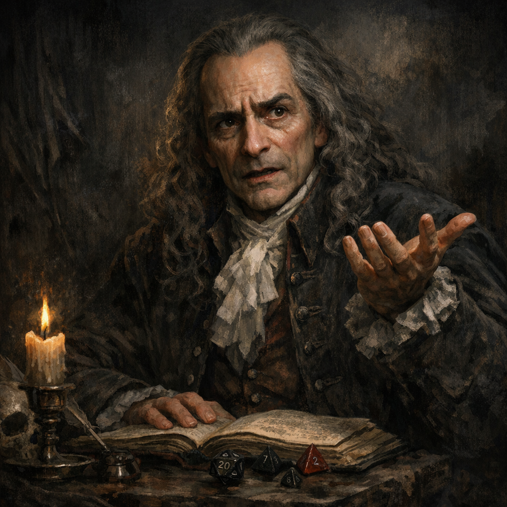

# Voltaire — DM Questionnaire (Unanswered)

#voltaire #dm #questionnaire #roleplay

_Source: `Adventures/Voltaire's Notes/Voltaire's D&D Notes pt2.json` (chunk 97)._

These prompts were captured in Voltaire’s notes as questions to answer for the DM. They are preserved here as a fillable reference.

## Questions (A–D)

### 1) How do you most often interpret signs and omens in the world around you?

- **A**: A black cat crosses my path? Bad luck, plain and simple. The world speaks in straightforward ways.
- **B**: Omens usually mean something, though I focus on what’s right in front of me before guessing at hidden meaning.
- **C**: I believe symbols carry messages — sometimes unclear, but worth pondering. The gods and Weave whisper in subtleties.
- **D**: Every shadow and pattern sings of deeper truths — I see meaning woven into all things, even dreams and coincidence.

**Suggested (inferred)**: D — Voltaire treats reality like a system full of hidden rules and symbolic hooks, even when his judgment misfires.

### 2) When you gaze upon ancient ruins in the wilds of Faerûn, what captures your attention first?

- **A**: The stones themselves — their make, wear, and the craftsmanship. I think of who built them and how.
- **B**: I note the structure’s form and layout, wondering what stories it could tell — but mostly I admire its endurance.
- **C**: The carvings and designs stir questions of faith and purpose. I sense symbols waiting to be understood.
- **D**: The ruins are a whisper from another age, a metaphor for the rise and fall of dreams — I feel their echoes in my soul.

**Suggested (inferred)**: C — Voltaire is irresistibly pulled toward inscriptions, meaning-bearing patterns, and “the message behind the object.”

### 3) You hear a bard sing of a dragon’s fall in Silverymoon. What do you take from the tale?

- **A**: A good story, well sung — proof that even dragons can be slain.
- **B**: A reminder that courage wins the day, though the details may be stretched for drama.
- **C**: A story layered with meaning — perhaps the dragon represents our inner greed or the struggle for wisdom.
- **D**: A mythic truth veiled in melody — the dragon’s death a symbol of transformation, not defeat.

**Suggested (inferred)**: D — Voltaire tends to inflate events into mythic frameworks (domains, symbols, “trials”), even when the table just fought something big.

### 4) A seer tells you your path will ‘cross the moon’s shadow.’ How do you interpret it?

- **A**: Probably means I’ll be traveling at night — or during an eclipse. Simple enough.
- **B**: Could be a warning or a sign from Selûne. I’ll keep my eyes open and see what happens.
- **C**: Sounds symbolic — perhaps it hints at a moral choice or a test of faith under Selûne’s gaze.
- **D**: It speaks of destiny’s hidden weave — a convergence of light and shadow that will define who I become.

**Suggested (inferred)**: D — Voltaire’s default setting is “this is prophecy about my arc,” especially with Shar-adjacent shadow language.

### 5) You come across a strange object of unknown purpose while traveling — what draws your attention most?

- **A**: Its weight, texture, and make. I try to figure out what it does or how it’s used.
- **B**: I study its craftsmanship — who made it, and for what reason. Every tool has a story.
- **C**: Its design feels symbolic — I wonder what meaning or history it carries beyond its use.
- **D**: It feels like a message from the unseen — something meant to be understood, not merely used.

**Suggested (inferred)**: C — Voltaire fixates on meaning-bearing design (symbols, language, “rules”) over practical caution.

### 6) When setting out on a long journey, how do you prepare?

- **A**: I plan my route, pack what’s needed, and set a firm goal — best to be ready for anything.
- **B**: I gather what I can and see where the road takes me. The world rewards those who stay open.
- **C**: I think about who’s coming with me — I want everyone safe and in good spirits before we leave.
- **D**: I calculate the fastest, most efficient path and ensure we’re not wasting effort.

**Suggested (inferred)**: B — Voltaire follows impulses and “threads,” even when his INT could support better planning.

### 7) You find a wounded traveller on the roadside — what do you do first?

- **A**: Take charge and make a plan — stop the bleeding, secure the area, and decide what’s next.
- **B**: Assess the scene quickly; if help’s needed, I’ll improvise with what’s at hand.
- **C**: I kneel beside them and offer comfort, speaking gently before doing anything else.
- **D**: I check their condition, look for causes, and decide the most logical course of action.

**Suggested (inferred)**: B — Voltaire improvises fast, often prioritizing the “experiment” (or the bit) over bedside manner.

### 8) A heated dispute breaks out in your adventuring party — how do you handle it?

- **A**: I step in to restore order and lay down fair rules before things get worse.
- **B**: I let them argue a bit — people calm faster when they’re heard. I’ll act when it’s clear what’s needed.
- **C**: I listen to both sides, trying to understand how each person feels — peace matters more than pride.
- **D**: I analyze the problem and point out what makes the most sense, regardless of who’s upset.

**Suggested (inferred)**: D — Voltaire is more likely to “solve” a dispute than soothe it.

### 9) You’ve been offered a share in a risky but profitable venture. What’s your response?

- **A**: I want clear terms, written agreements, and a timeline before I commit.
- **B**: Sounds interesting — I’ll try it and adjust if things change.
- **C**: I’ll consider it if it doesn’t hurt anyone and keeps trust with my companions.
- **D**: I’ll join if the math works — high risk can mean high reward, and I’ll make sure it’s worth it.

**Suggested (inferred)**: B — Voltaire’s default is “yes,” especially if it smells like power, novelty, or narrative leverage.

### 10) When facing a moral dilemma, how do you find your answer?

- **A**: By consulting my code or beliefs — some things are right or wrong, no matter the cost.
- **B**: By watching how events unfold; sometimes the right path shows itself in time.
- **C**: By asking what choice causes the least harm and keeps my conscience at peace.
- **D**: By weighing outcomes and logic — emotion clouds good judgment.

**Suggested (inferred)**: D — High INT / Low WIS tends to “optimize,” even when the optimization target is questionable.

### 11) When your party reaches a fork in the road and must choose a direction, how do you speak up?

- **A**: Both paths have their charm — I share what I’ve noticed and let the group feel it out together.
- **B**: I offer my thoughts and point out the pros and cons — the choice should feel right to everyone.
- **C**: I make a recommendation based on what seems smartest — someone has to nudge the group forward.
- **D**: I tell them which road we’re taking and why — hesitation gets us nowhere.

**Suggested (inferred)**: C — Voltaire nudges with “systems logic,” but rarely holds stable authority long enough to command.

### 12) When you notice a companion acting recklessly, how do you respond?

- **A**: I share what I’ve seen and hope they take the hint — I trust people to learn their own lessons.
- **B**: I warn them plainly, then help cover their mistake if things go wrong.
- **C**: I confront them and try to stop them — some risks aren’t worth it.
- **D**: I let them do it, but I prepare for the fallout — lessons are best learned the hard way.

**Suggested (inferred)**: D — Voltaire often allows chaos to unfold and then studies the result (or weaponizes it).

### 13) During a council meeting in a small village, the locals ask your advice about defending against raiders. How do you answer?

- **A**: I share practical tactics and encourage them to stand strong — courage is contagious.
- **B**: I offer sensible guidance, but make it clear I can’t solve everything for them.
- **C**: I ask questions first — what do they have, who are the raiders, what’s their fear?
- **D**: I propose an efficient defensive plan and assign tasks — structure prevents panic.

**Suggested (inferred)**: D — Voltaire likes “systems” and would treat defense as a rules problem.

### 14) When your group is planning a heist against a corrupt noble, how do you handle the discussion?

- **A**: I’m excited — I throw out bold ideas and keep everyone’s spirits high.
- **B**: I contribute ideas, but I let others lead the plan if they want.
- **C**: I focus on who might get hurt and how to avoid unnecessary suffering.
- **D**: I analyze the target, propose a plan, and focus on efficiency and contingencies.

**Suggested (inferred)**: D — Voltaire builds plans like “modules”: rooms, triggers, rules, and outcomes.

### 15) In the middle of a tense battle, how do you coordinate with your allies?

- **A**: I call out what I see — quick updates and warnings, trusting them to act on instinct.
- **B**: I offer short cues like ‘cover left’ or ‘watch the flank,’ guiding but not commanding.
- **C**: I give quick orders when needed, especially if someone hesitates.
- **D**: I take full control — shouting commands, setting the rhythm, making sure every move follows my call.

**Suggested (inferred)**: A — Voltaire is loud with observations, but not consistently commanding.

### 16) Around a campfire after a long day’s travel, how do you spend the evening?

- **A**: I tell stories, sing if the mood strikes, and fill the night with laughter — warmth keeps the dark away.
- **B**: I share a few thoughts or jokes when the moment feels right, keeping spirits high but balanced.
- **C**: I listen to the others’ tales, speaking up now and then — I enjoy the company more than the spotlight.
- **D**: I sit quietly, tending the fire or my gear — I find peace in silence and watching others unwind.

**Suggested (inferred)**: B — Voltaire oscillates between performance and observation; he rarely stays fully silent.

### 17) You’re introduced to a new adventuring party for the first time. How do you make your impression?

- **A**: With a hearty greeting and a grin — people should know who they’re traveling with!
- **B**: I chat easily and share a bit of my past, but I don’t overtake the room.
- **C**: I wait and watch, gauging everyone’s temperament before opening up.
- **D**: I nod, offer a polite word, and let my actions speak for me in time.

**Suggested (inferred)**: A — Voltaire tends to announce himself (and his ideas) quickly.

### 18) During a celebration in a friendly town, how do you take part?

- **A**: I’m at the center of the feast — dancing, laughing, and pulling others into the joy.
- **B**: I join the games and raise a glass, though I prefer small groups to the crowd.
- **C**: I mingle a little, then retreat to watch the festivities unfold with quiet satisfaction.
- **D**: I find a quiet corner or balcony to enjoy the music and lights from afar.

**Suggested (inferred)**: B — Voltaire likes people, but on his terms; he’ll drift between groups collecting “material.”

### 19) When you need help from a stranger, how do you go about it?

- **A**: I speak plainly, with warmth and confidence — most folk respond to a friendly tone.
- **B**: I ask earnestly but keep it short — polite, but not too forward.
- **C**: I choose my words carefully, testing their mood before asking outright.
- **D**: I approach quietly, letting my need or sincerity show without many words.

**Suggested (inferred)**: A — Voltaire pushes confidence even when the situation is cosmic-level dangerous.

### 20) When someone shares a personal story or pain with you, how do you respond?

- **A**: I speak from the heart — empathy should be felt, not hidden.
- **B**: I respond with kind words, though I try not to overstep or make it about me.
- **C**: I listen carefully, asking a few questions to help them open up further if they wish.
- **D**: I mostly stay silent, offering presence instead of words — comfort doesn’t always need sound.

**Suggested (inferred)**: B — Voltaire can be kind, but he often redirects into systems, plans, and “what does this mean.”

