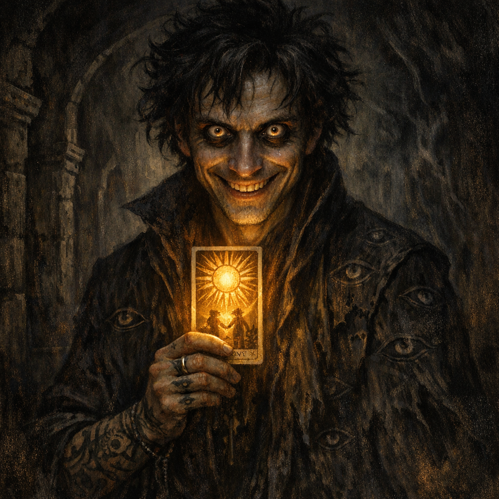
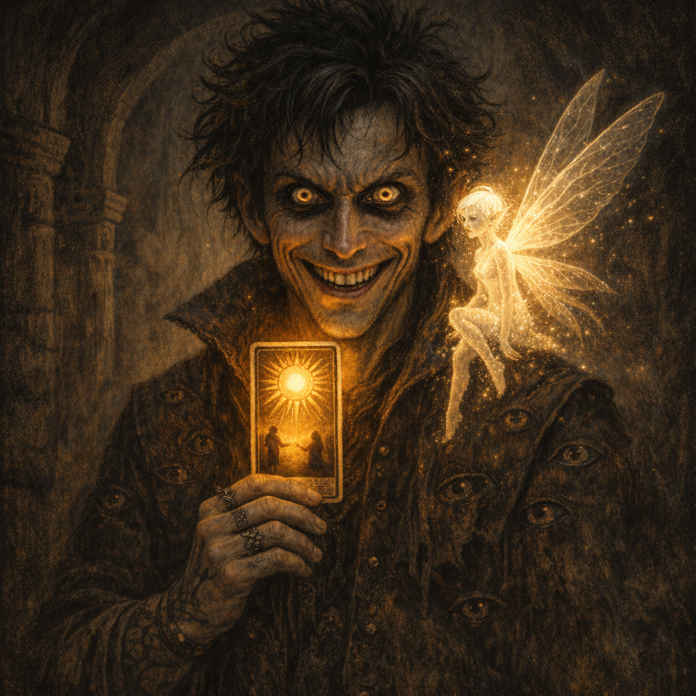

#voltaire #player/maitland

_Prince-Emeritus of Swampy Repute, The Inephemeral Scribe_

## Latest Character Sheet (D&D Beyond)

- PDF: `Adventures/Voltaire's Notes/Character Sheet D&D Beyond/Dicfuc_131028470_2026-07-25.pdf`
- Extracted fields + page renders: `Adventures/Voltaire's Notes/Character Sheet D&D Beyond/Dicfuc_131028470_2026-07-25.md`
- Inventory snapshot: `Codex/Items/Voltaire Inventory (D&D Beyond 2026-07-25).md`
- Spell list snapshot: `Codex/Powers/Voltaire Spell List (D&D Beyond 2026-07-25).md`
- Legacy paper notes extract: `Adventures/Voltaire's Notes/Character Sheet D&D Beyond/Imports/Voltaire Paper Character Sheet (extract).md`

## Core Identity

**Current Form**: Variant Human (formerly Fae Prince)  
**Class**: Rogue 5 (Thief) / Warlock 8 (Archfey)  
**Background**: Hermit  
**Alignment**: Chaotic Neutral (self-proclaimed god unto himself) 
**Level**: 13  
**Experience**: 122,783 / 140,000 XP

## Backstory

### The Fall from Grace

Once the Prince of the Swamp, Voltaire ruled from a throne of curved wood and mud in a dense swamp kingdom where light barely penetrated to the muddy floor. His life changed forever during a fateful card game with visiting bards who bore gifts, wine, and song.

Unbeknownst to Voltaire, they were playing with the **Deck of Many Things**. Drawing two cards - the King of Spades and the Ace of Clubs - he was instantly transported to the Michaca desert, losing his Fae nature, his kingdom, and his memories of home. For months he wandered the desert in confusion, transformed from Fae royalty into something resembling humanity.

### The Transcription

A powerful wizard named Greg later used Voltaire (under the influence of a potion of haste) to transcribe both the **[[Book of Vile Darkness]]** and the **[[Book of Exalted Deeds]]**. Voltaire survived reading both tomes, creating a new unified text for Greg. This process left him with:

- The ability to unconsciously understand, read, and write **every language** in existence
- Deep, hidden knowledge of both ultimate good and ultimate evil
- Further transformation of his already fractured psyche

## Physical Description

**Age**: 30  
**Height**: 185 cm (6'1")  
**Weight**: 185 lbs  
**Eyes**: Brown, perpetually open (never blink)  
**Hair**: Dark  
**Distinctive Features**:

- Body covered in intricate tattoos
- Constant involuntary smile (it physically hurts to frown)
- Donkey tail grafted with a living crab-soul book
- Unblinking stare that sees red eyes everywhere

## Abilities & Powers

### Core Attributes

- **STR**: 7 (-2)
- **DEX**: 19 (+4)
- **CON**: 16 (+3)
- **INT**: 19 (+4) [Enhanced by Headband of Intellect]
- **WIS**: 9 (-1)
- **CHA**: 20 (+5)

### Combat Snapshot (from latest sheet)

- **AC**: 19
- **Max HP**: 100
- **Speed**: 30 ft. (Walking)
- **Proficiency Bonus**: +5
- **Senses**: Darkvision 120 ft.
- **Performance**: +10 (**[user-confirmed]**; use this value even if an export/parser displays otherwise)

### Unique Abilities

- **Universal Language**: Can read, write, and understand ALL languages (unconscious ability)
- **Sun Card Power**: 6d8 radiant damage blast from the Deck of Many Things
- **Divine Rank**: **[[Divine Rank 1]]**, advanced from [[Divine Rank 0]] on 2026-06-06. See also [[Voltaire's Followers]].
- **Divine Symbol**: **V**
- **Claimed Domain**: **Domain of Unbecoming** **[player intent; table mechanics to verify]**
- **Self-Patronage**: Acts as his own Warlock patron
- **Book-Scent Synesthesia**: Can smell books and sense the author’s first-person experience at the time of writing (see [[Book-Scent Synesthesia (Author-Sense)]]).
- **Exhaustion recovery change**: No longer requires food/drink intake to reduce exhaustion; a long rest is sufficient (as observed in notes).
- **Book of Rituals**: Living crab-book bound to his tail that:
    - Consumes skin to absorb memories
    - Contains spells written in various creature bloods
    - Can write prophecies or "make things up"
    - Serves as both spellbook and companion

### Class Features

- **Sneak Attack**: 3d6
- **Cunning Action**: Dash, Disengage, or Hide as bonus action
- **Steady Aim**: Gain advantage on next attack (bonus action; speed 0 for the turn)
- **Uncanny Dodge**: Reaction to halve damage from an attacker you can see
- **Pact Magic**: 2 spell slots (4th level); **Spell Save DC 18**, **Spell Attack +10**
- **Eldritch Invocations**: Agonizing Blast, Aspect of the Moon, Mask of Many Faces, [[Feral Transformation]]
- **Fey Presence**: Charm or frighten in 10ft cube (1/rest)
- **Misty Escape**: Turn invisible and teleport 60ft when damaged (1/rest)

## The [[Crab Book]] Tail

A horrific yet fascinating merger of multiple elements:

- **Origin**: Book of ritual spellcasting imbued with a crab's soul
- **Physical Form**: Different types of skin from mythical creatures bound together
- **Writing**: Various blood inks including:
    - Glow-in-the-dark mushroom extract
    - Hellhound blood mixed with luminescent fungi
    - Other exotic creature essences
- **Abilities**:
    - Gains memories from consumed skin
    - Prophetic writing
    - Recently titled: "Machinations & Actions: 5e - Player's Handbook"

## Connections & Relationships

### Allies & Associates

- **Greg**: The wizard who used him for transcription
- **Glasya**: Archdevil of the Sixth Hell whom he tries to impress with burpees
- **Cornholio**: Party member, Echo Knight, married to Shar
- **Cromash**: Paladin party member
- **Yennefer**: Party member with grafted wings
- **Dagoth**: Party member, ritualist
- **The Party**: Various other adventurers trapped in his schemes

### Complicated Relationships

- **Shar**: Goddess of Darkness and Loss; recently negotiated a "game/trial" with her
- **The Demon**: Vaporized after refusing to honor a soul coin bet

## Notable Possessions

### Magic Items

- **[[Headband of Intellect]]** (INT set to 19)
- **[[Ring of Protection]]** (+1 AC and saves)
- **[[Robe of Eyes]]** (enhanced perception in darkness)
- **[[Studded Leather, +2]]**
- **[[Shadow Dagger+2]]** (Finesse; **[To verify]** can reappear in hand / returns)
- **[[Cape of Darkness]]**
- **[[Chakram +6 (magical)]]**
- **[[Sun Card]]** (From Deck of Many Things)
- **[[Sharite Ceremonial Dagger]]** (Mysterious connection to Shar)
- **Anti-scrying gem** — each party member had one; the gem blurs a scrying eye. Current ownership/count is **[To verify]**.

### The Ink of Unbeing

Potentially connected to the role of "The Inephemeral Scribe":

- Can draw forth memories and inscribe them as "fleshless truth"
- Can tattoo memories onto others to grant forgetfulness or eternal recall
- Requires a pen carved from "voidbone of his former self"

## Personality & Quirks

### Mental State

- **High Intelligence, Low Wisdom**: Brilliantly understands complex systems but applies knowledge with catastrophically poor judgment
- **Self-Worship**: Considers himself his own patron deity
- **Chaotic Good (per latest sheet)**: Driven by whim and intellectual curiosity rather than morality
- **Memory Issues**: Has forgotten much of his past, particularly his Fae heritage

### Behavioral Patterns

- Performs calisthenics (burpees, push-ups) to impress powerful beings
- Treats cosmic entities as potential gaming partners
- Makes high-stakes bets based on past trauma (lost bet = desert wandering)
- Writes obsessively in his crab-book
- Sees everything through the lens of games, rules, and systems

### Speech Patterns

- Uses overly complex terminology for simple concepts
- Casual about existential dangers
- Treats reality-altering artifacts as curiosities
- References his "important work" frequently

## Current Status

Latest recorded state (2026-06-06):

- **[Voltaire-only]** Experienced roughly six subjective months in the Feywild while the party experienced approximately one combat round.
- Bloodweb spiders accepted him into their hive. They liked his daily bone rituals, and their territory grew darker as fae disappeared and shadow creatures appeared.
- Reached a roughly 30 km tower crowned by “bright darkness.” He considered resting and climbing it in giant-spider form, but did not execute that plan.
- Used the voidbone pen to combine the concepts of darkness, light, and life in dark creatures. Creating life drained his life force until he understood Shar was stopping him; he stripped concepts away and left V in their minds.
- Perceived Shar as an immense, pale/white-skinned human woman.
- Addressed roughly twenty Shadar-kai. Their leader whipped him and used his offered Shadow Dagger to carve V into his chest and forehead.
- The Shadar-kai admitted Voltaire into the lower tower/temple, licked his blood from him, adorned/dedicated themselves to him, and became his followers/initiates.
- Advanced to **[[Divine Rank 1]]**, gained **300 XP** (total **122,283 / 140,000**), and gained Inspiration.
- **Position at the end of 2026-06-06**: inside the lower tower/temple among the Shadar-kai initiates, still separated from the party and not yet at the summit sphere.
- **[Voltaire-only | Planned, not executed]** Ascend to the sphere, carve and blood-anoint it with V, reproduce the aspen sigils, and attempt a portal network linking aspen, flesh marks, and sphere.
- **[To verify]** Current HP, conditions, spell slots, Feral Transformation availability, Shadow Dagger possession/return state, and whether the earlier Level 1 Exhaustion remains.

### 2026-07-25 Advancement

- Accepted the Shadar-kai’s statue-room rite before statues of Shar, Loviatar, and dethroned Mask.
- Endured the chamber’s overwhelming pulsation for twenty-four seconds while everyone else fell to their knees.
- Destroyed Mask’s hollow statue in ritual rhythm with the Shadar-kai and occupied its place for six subjective months.
- Placed Mask-statue rubble onto the Robe of Eyes, disguised himself as a statue, and repeated “As above, so below.”
- Granted Robin the **Blessing of V**; its mechanical effect remains **[To verify]**.
- Told Robin of the plan to enter Arvandor and confront the divine fracture represented by Corellon.
- Robin pledged to be Voltaire’s guiding sunlight in the dark; Voltaire pledged to be her moonlight.
- Used Feral Transformation to become a giant spider and began ascending the tower toward its summit anti-light.
- Before the planned summit rite occurred, perceived the [[Temple of Blood]] through Cornholio/Tom’s eye “in reverse.” Voltaire’s voice echoed “Machinations” there; many eyes manifested and coalesced into V; the temple was described as cleansed in his name and its oppressive atmosphere diminished.
- **[To verify]** Whether this remote manifestation was controlled by Voltaire, triggered by Cornholio/Tom signing the Ink-laden visitor book, or emerged automatically from Divine Rank 1.
- **Current position**: climbing the [[Shadar-kai Tower of Bright Darkness]] in giant-spider form.
- **Subjective time**: approximately twelve months total across the two recorded Feywild/tower distortions.
- **Latest D&D Beyond snapshot (2026-07-25)**: **122,783 / 140,000 XP**, Chaotic Neutral, Performance **+10**, and Divine Rank 1 recorded in Additional Notes.
- **[To verify]** The source of the additional 500 XP between the last logged total (122,283) and the latest sheet total (122,783).

## Mysteries & Hooks

1. **The Sharite Dagger**: Why does he carry it? What's its significance?
2. **Lost Fae Nature**: Can it be recovered? Does he want it back?
3. **The Voidbone Pen**: Missing component for the Ink of Unbeing?
4. **True Patron**: Is he really his own patron, or is something else at work?
5. **The Books' Knowledge**: How does the Vile/Exalted knowledge manifest?
6. **Universal Language**: When will he discover this ability consciously?

## Quote Collection

> "One minnut I'm playing cards, drinking wine and havin a good time.. next minnut I'm in the desert?"

> "I'M PRINCE OF THE SWAMP NOT THE FUCKING DESERT"

> "You wanna play a game with me?"

> "I remember the last bet I lost! hahahahahahha! Walked in a desert for months!!!!"

> "All perfectly sensible."
