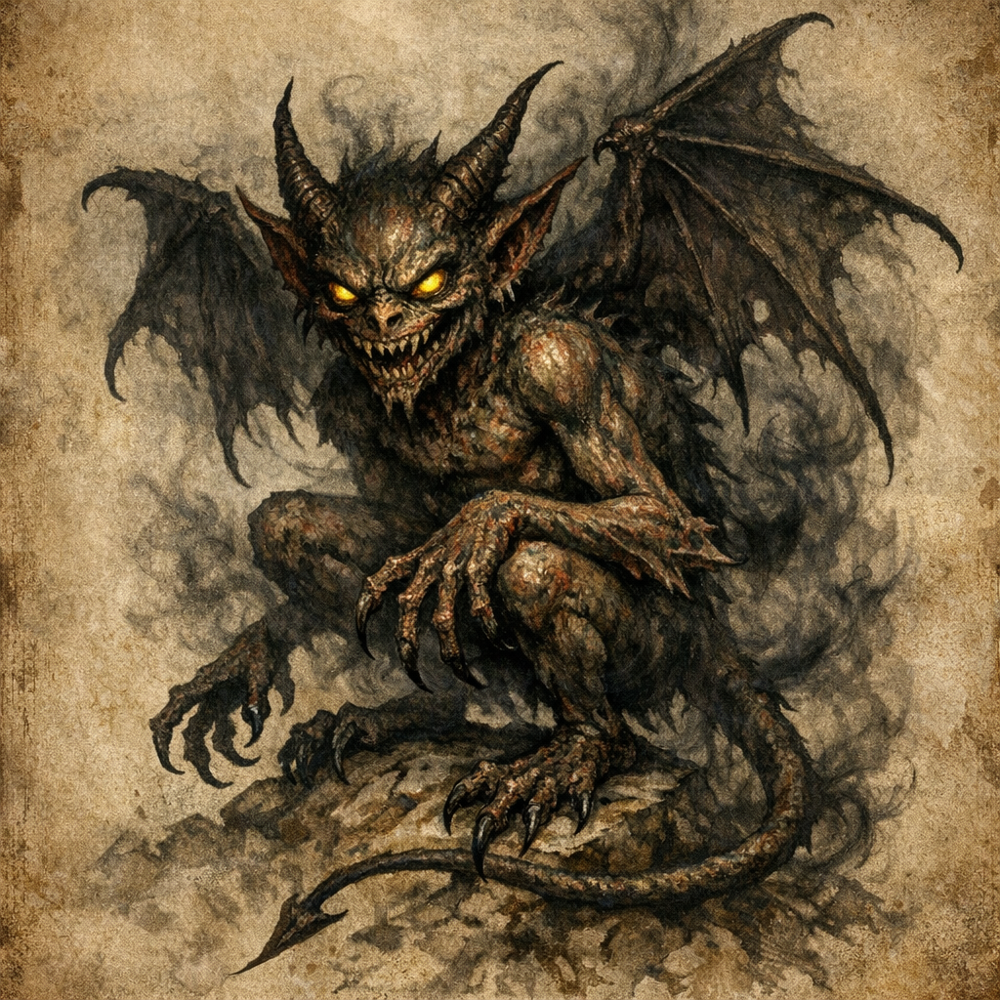
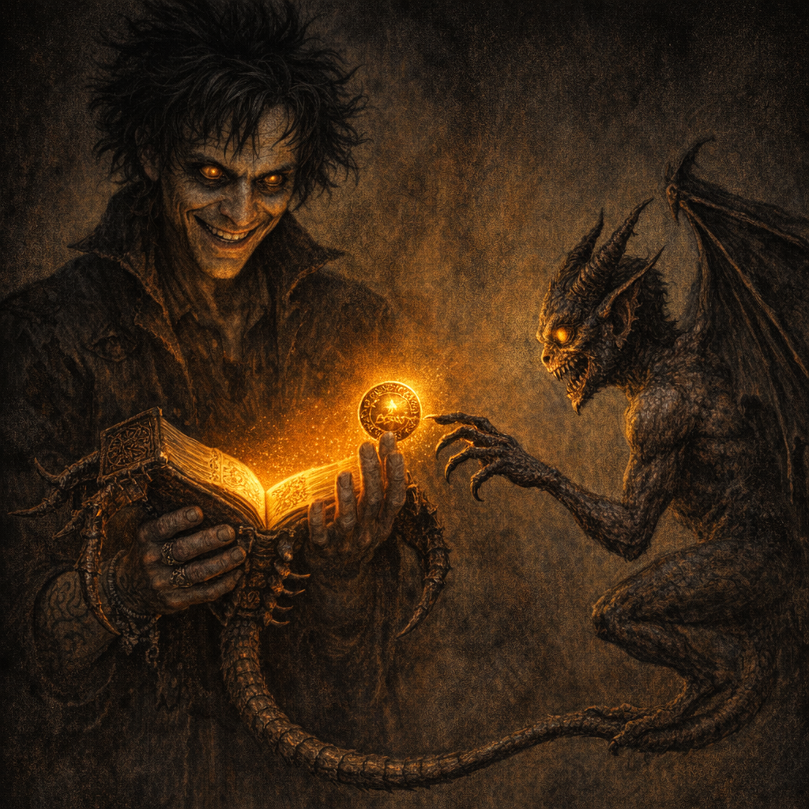

# Quasit (Zeppo’s Claim)

#npc #demon #quasit

## Summary

A quasit summoned by Voltaire (with an attempted request to [[Glasya]] to “bind” it) which appeared before [[Cromash]] and attacked, claiming it had been sent by “Zeppo.”

## Party Knowledge

- A quasit appeared and attacked Cromash, claiming it was sent by Zeppo.

## Voltaire-Only Knowledge

- Voltaire attempted to have the demon take Zeppo’s form; it stated it couldn’t transform into things and “would make do.”
- Unknown whether Glasya heard or responded to Voltaire’s request.

## Open Questions

- Was “Zeppo” a lie from the quasit, a misunderstanding, or an actual external influence?
- Was the quasit actually bound in any way, or did it behave normally for the summoning?
