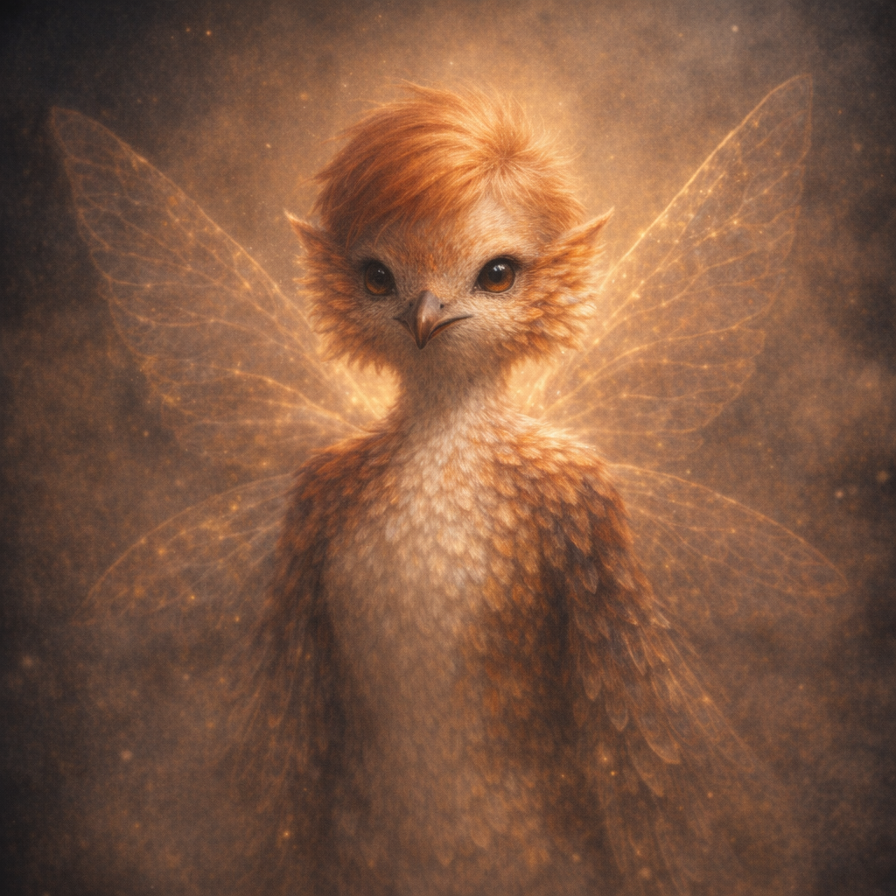

# Robin

#npc #companion

## Summary

Robin is Voltaire’s “Sun Card” turned disciple: a luminous, Tinkerbell-like companion created when Voltaire fed the Sun Card to a frog/toad and the two **merged** (Natural 20).

## Party Knowledge

- Robin exists and accompanies Voltaire.
- Robin is explicitly treated by Voltaire as a **follower/disciple**.
- **[Party] (2026-02-21)** Mircy attempted a `Find Familiar` ritual on/for Robin; Robin objected: “I’m not an animal. What did you think I am?” (**[To verify]** mechanical outcome/effects, if any.)

## Voltaire-Only Knowledge

- **Origin event**: A frog/toad had been following Voltaire. Voltaire flourished the [[Sun Card]] and stuffed it into the creature’s mouth; the amphibian shimmered with beautiful white light as it fused with the artifact and reformed into Robin.
- **Void realm test**: Robin followed Voltaire into a “void realm” where hordes of monsters were visible approaching; Robin retreated with Voltaire.
- Robin speaks quietly to Voltaire (e.g., commenting on the aspen tree’s “lovely noise” on the Shadowfell side of the gateway).
- Robin’s glow can change in response to the local “grace”/ambience (observed becoming more contained during Voltaire’s silent meditation under the Shadowfell aspen).
- Robin bows to [[Titania]]’s statue and speaks of the **Circle of Dreams** area as if it has layered counterparts.
  - Robin claims this area looks the same as the [[Prime Material Plane]], while its version in the Faerealm is **much grander**.
  - Robin claims the Faerealm version is still abandoned, but **not as desolate** as it was in the Material realm, and that the Faerealm is **cyclic**—people may return.
- **2026-07-25 [Voltaire-only]**: Robin suddenly appeared in the Shadar-kai tower after Voltaire’s six-month vigil in the place of Mask’s destroyed statue, apparently summoned.
- **2026-07-25 [Voltaire-only]**: Voltaire granted Robin the **Blessing of V** as a token of appreciation for her divine loyalty.
- Voltaire told Robin of his plan to enter Arvandor and confront the ancient divine fracture represented by Corellon.
- Robin pledged to be Voltaire’s guiding light in the dark—his **sun**. Voltaire pledged to be her **moonlight**.

## Open Questions

- Is Robin an awakened manifestation of the Sun Card, a summoned entity, or a new being “born” from the card’s solar radiance?
- What can Robin do mechanically (actions, senses, limitations)?
- What does the **Blessing of V** grant Robin mechanically, and did it change her appearance, abilities, bond, or status?
  - **[To verify]** Can `Find Familiar` succeed on/with Robin at all, or does this confirm she is not a familiar/beast-type entity?
