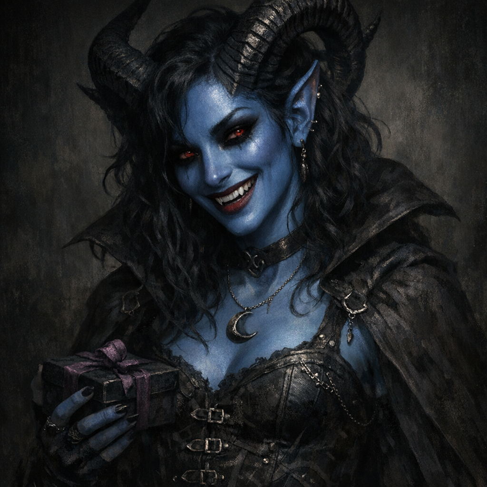

# Sharias

#character #npc #tiefling #shar #sigil

## Summary

Sharias is a blue-skinned tiefling from [[Sigil]] (as recorded in notes) who appears devoted to [[Shar]] and treats conflict as a “fun game.” She served as both a rival and an (unwilling) courier for Yennefer’s Sharran gifts.

## What the Party Knows (in-play)

- Sharias introduced herself to Dagoth; she “grew up in Sigil.”
- She clashed with [[Yennefer]] over Cornholio and over “sweat-scented” Sharran gifts.
- She cast `sending` while standing over Yennefer’s pet frog, saying “For you Lady Shar,” after which the frog vanished.
- She later used `sending` again to transmit Yennefer’s prepared gifts (candles/soap/perfume) to Shar.

## Notes / Implications

- Sharias’s affect (“what a fun game!”) suggests she interprets pain/jealousy through a Sharran lens: intimacy-as-suffering, devotion-as-harm.
- Her access to reliable long-distance delivery to Shar implies either:
  - direct Sharran favor,
  - Sigil-based connections,
  - or an artifact/ritual method (**[To verify]** which).

## Open Questions

- Is Sharias a recurring Sharran agent, or a one-off enthusiast?
- Why was she in Palischuk’s tavern scene at all—mission, pilgrimage, or coincidence?
