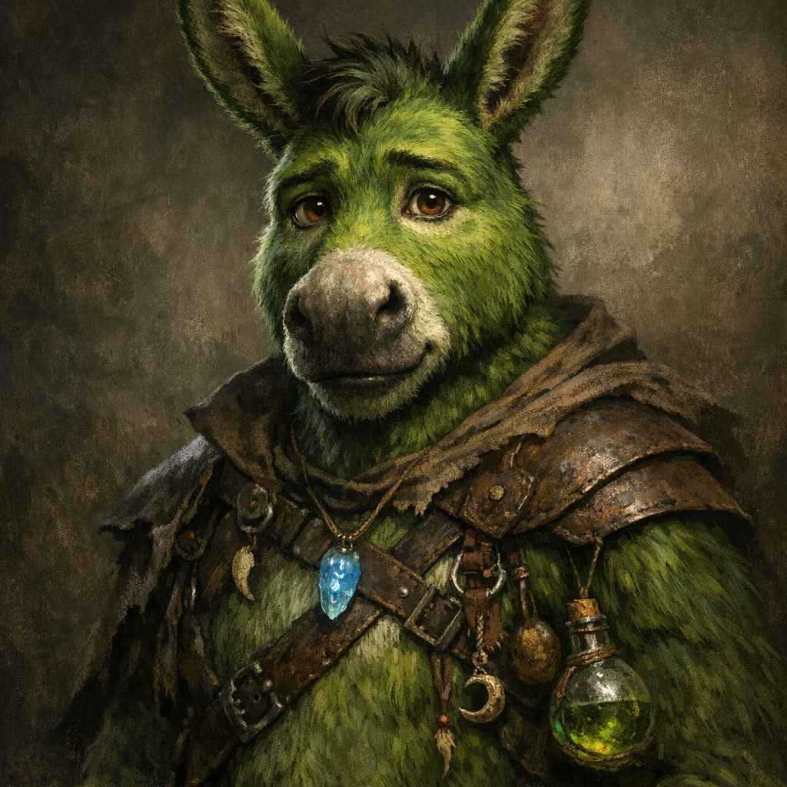

# Shrek

#npc #companion #follower

## Summary

Shrek is Cornholio’s donkey, made anthropomorphic via magic/items, with **green fur** (hence the name). Voltaire “converted” Shrek into a follower via [[The Ink of Unbeing]] using a note that carried useful knowledge with hidden fine print: accepting the knowledge also bound belief in Voltaire.

## Party Knowledge

- Shrek is associated with [[Cornholio]] as a companion/retainer.
- Shrek accepted a note created with [[The Ink of Unbeing]] that transferred knowledge (e.g., treasure/location info).

## Voltaire-Only Knowledge

- The note’s transfer included a hidden clause that rewrote Shrek’s belief/faith toward Voltaire (“fine print of faith”).

## Open Questions

- How much of the conversion is conscious for Shrek vs. implanted/subconscious belief?
- What is Shrek’s current form and capabilities (stat block, gear, intelligence, speech)?
