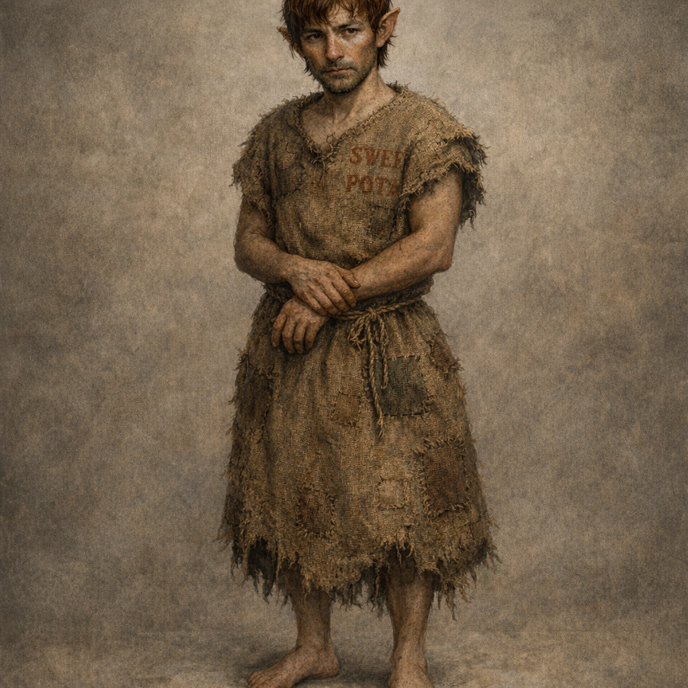

# Unclaimed Slave (Palashaey)

#character #palashaey #to-verify

## Summary

An unnamed “unclaimed slave” encountered just inside Palashaey’s gate on **2026-02-21**, who picked up the gold Voltaire (disguised as [[Titania]]) threw down and agreed to follow.

## What the Party Knows (in-play)

- An unclaimed slave approached “Titania” and offered to return the dropped gold.
- “Titania” asked them to pick it up and follow; they agreed and followed.
- **(2026-02-21)** Near the **Order of Embers**, “Titania” ordered them to throw a **gold piece** at [[Shrek]]; it hit (**natural 20**) for **2 non-lethal** damage.

## Description (Observed)

- **Clothing**: repurposed **sweet potato sack dress**
- **Feet**: **no shoes**
- **Hair**: **brownish-red**
- **Heritage**: **elven-blood**; other half is **halfling** (**half-elf (halfling)** at this table). **[To verify]** how Palashaey records this (still “elven-blood” in census/ownership rolls, or split category).

## What Voltaire Knows / Thinks

- **[Voltaire-only]** Voltaire (as “Titania”) intentionally used the gold drop as bait to acquire a follower/attendant.
- **[Voltaire-only | To verify]** Voltaire recalls a local custom/law: if you take charge of an unclaimed slave, you are expected to **take care of them** (legal responsibility / obligations TBD).

## Open Questions (To Verify)

- Name, age, and appearance details.
- Is this person now legally bound to Voltaire (or “Titania”), or does “unclaimed” imply a different status?
- What does “take care of them” mean in Palashaey (food/shelter, registration, taxes, liability for crimes, manumission rules)?

## Stat Sheet (Provided / To Verify)

> Note: “Com” appears to mean **Comeliness** (non-standard in 5e); confirm with Lachlan whether it matters mechanically.

### Ability Scores

- **STR** 12 (+1)
- **DEX** 12 (+1)
- **CON** 11 (+0)
- **INT** 13 (+1)
- **WIS** 12 (+1)
- **CHA** 15 (+2)
- **COM** 12 (+1) **[To verify]**

### Screenshot Note (To Verify)

- A screenshot was provided showing six values: **14 11 11 13 14 15**. **[To verify]** whether that’s the same stat line (and which ability maps to which value) or a different/older roll.
