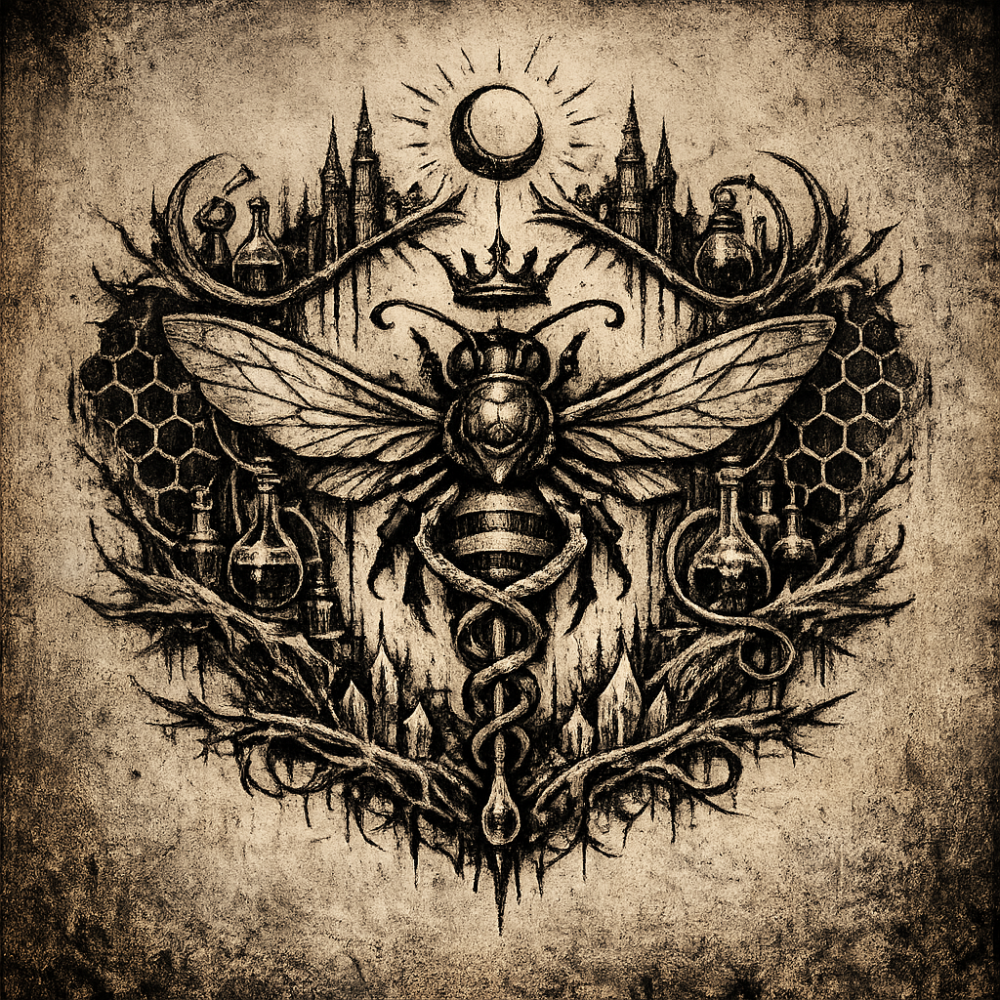

# Abeils

#faction #people #fey #hive

## Summary

The Abeils are a fey, bee-like people organized around hive-city structures, rigorous certifications, and highly competent magical “biotech” (surgeons/healers capable of fluid manipulation and grafting). The party encountered them through the **[[Abeil Hive City]]** and the older mine tunnels beneath [[Palischuk]].

## What the Party Knows (in-play)

- Abeil society includes:
  - **A disciplined army** and strict internal protocols.
  - **Institutional knowledge** (library access, certifications).
  - **Advanced magical medicine** (e.g., grafting wings onto [[Yennefer]]).
- The Abeils claim minimal/no surface contact in roughly the last millennium (**[To verify]** exact claim and whether it’s true).

## Internal Fracture: The Heretics (as observed)

- In older tunnels, the party fought Abeils with different coloration (noted as “tan-green”) and different religious alignment.
- Their equipment included **[[Outsider Gold]]** arms/armor and artifacts identified as the **[[Implements of Mother Hydra]]**.
- The party captured an Abeil priestess and recovered multiple Hydra-aligned implements.

## World-Building Notes (grounded in table details)

- Abeil “craft-industrial complex” includes:
  - Masterwork base production (sources queried by Dagoth).
  - Enchantment pipelines (e.g., use of `magic weapon` on masterwork polearms).
  - Materials science (silver/mithral alloys; later, “lunar silver” through Shar’s transmutation).
- The city’s “hum” reads like more than ambiance—possibly a civic signal layer, ward network, or psychoacoustic magic (**[To verify]**).

## Open Questions

- Are the Abeils primarily fey, or fey-adjacent Underdark inhabitants at this table?
- What is their relationship to “outsider” materials and gods (trade, salvage, worship, infection)?
- Who benefits if knowledge of the Hive City spreads to surface factions?
