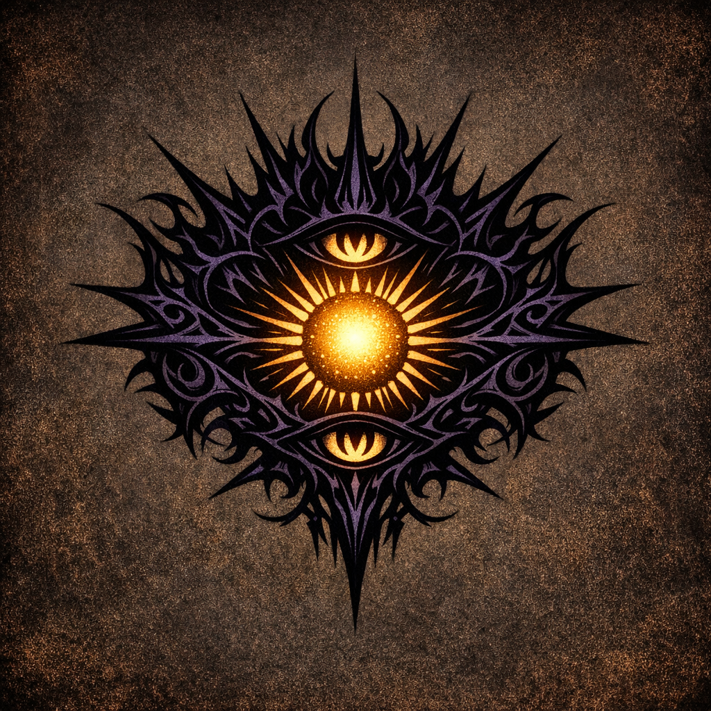

# Voltaire's Followers

#faction #cult #voltaire

## Summary

Voltaire’s growing “pantheon” of followers acquired via experiments with [[The Ink of Unbeing]] and the [[Sun Card]].

## Known Followers (confirmed in notes)

- **Two fae specimens**: had their memories of their gods replaced with memories of Voltaire (direct conversion via [[The Ink of Unbeing]]).
- **[[Shrek]]**: Cornholio’s green-furred anthropomorphic donkey; converted via “fine print” knowledge-transfer note (Ink of Unbeing).
- **[[Robin]]**: created when Voltaire fed the Sun Card to a frog/toad and the two merged (disciple).

## Unverified / To Confirm

- “An additional follower prevailed with me” (unclear identity; requires confirmation).

## Notes

- Voltaire’s follower count has been recorded as **four** after the Sun Card disciple event.
