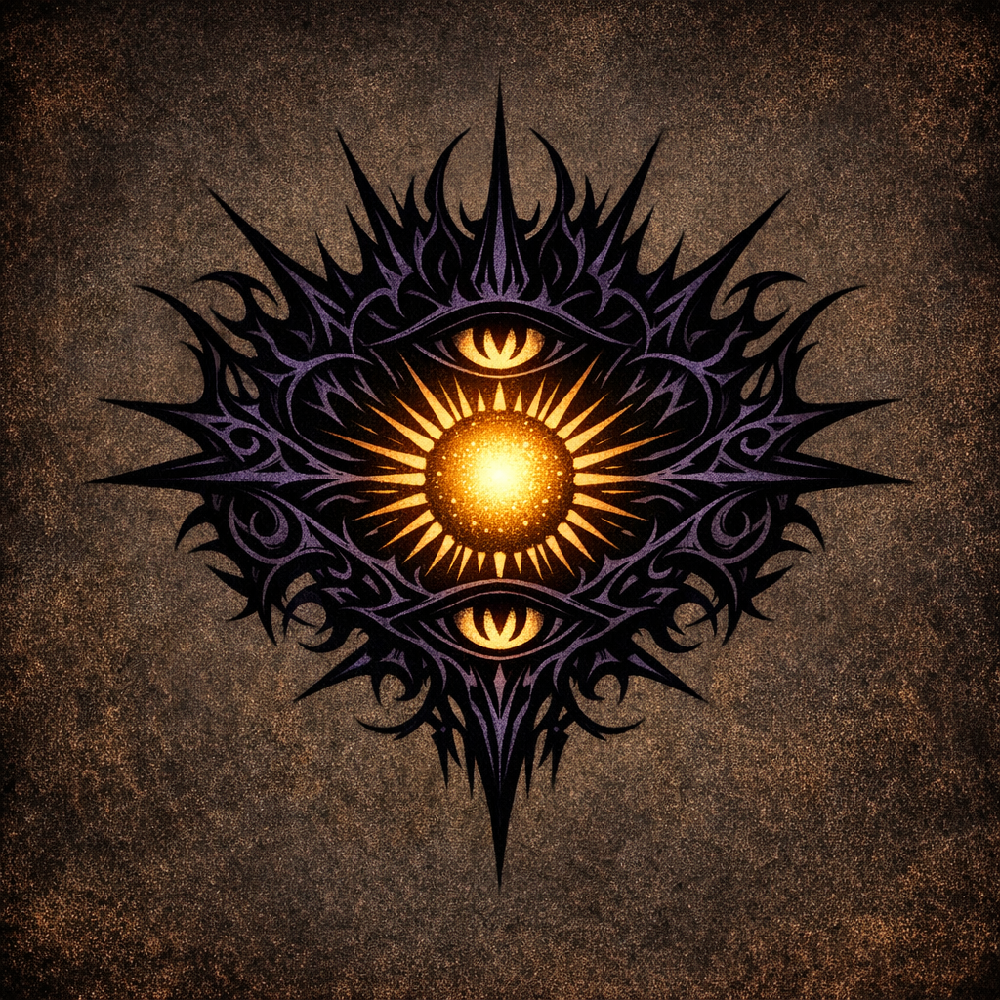

# Voltaire's Followers

#faction #cult #voltaire

## Summary

Voltaire’s growing “pantheon” of followers acquired via experiments with [[The Ink of Unbeing]] and the [[Sun Card]].

## Doctrine (as Voltaire understands it)

- Worship by independent beings increases Voltaire’s divine leverage and may raise his rank (even if Voltaire already considers himself the only god).
- “Local” allegiance (who the follower obeys day-to-day) can be separated from “spiritual” worship (who the follower believes in).

## Sigil

- Core geometry: a **triangle** that grows beyond the bounds of the **square**, forming a combined **seven-point** outline (4 square corners + 3 triangle points).
- Symbolic note (DM hint): Selûne’s “7 stars” motif may let the seven-point core read as a transformation/subversion of Shar’s opposition.
- Ink composition:
  - Light core: glowing mushroom + hellhound blood.
  - Dark filigree: shadowweave / “ink of the unknowing” (associated with [[The Ink of Unbeing]]).
- Eye motif: top/bottom eyes with **dark outer** shapes and **light inner** shapes framing the central geometry.
- Recent use: Voltaire carved the sigil into the Shadowfell aspen; the mark sank/aged into the bark as if it had always been there.

## Known Followers (confirmed in notes)

- **Two fae specimens**: had their memories of their gods replaced with memories of Voltaire (direct conversion via [[The Ink of Unbeing]]).
- **[[Shrek]]**: Cornholio’s green-furred anthropomorphic donkey; converted via “fine print” knowledge-transfer note (Ink of Unbeing).
- **[[Robin]]**: created when Voltaire fed the Sun Card to a frog/toad and the two merged (disciple).
- **[[Blink Dog (Norhan’s)]]**: converted as a “favor” request from [[Yennefer]] to make the dog a follower of Norhan; Voltaire added fine print so the Blink Dog worships Voltaire as a god.
- **Roughly twenty Shadar-kai initiates of the Feywild tower**: After Voltaire’s sermon, their leader whipped him and used Voltaire’s offered Shadow Dagger to carve V into his chest and forehead. The group admitted him into the tower, licked his blood from him, adorned/dedicated themselves to him, and became his followers/initiates.

## Notes

- Voltaire’s follower count was recorded as **four** after the Sun Card disciple event. As of 2026-06-06, add **roughly twenty Shadar-kai initiates**; the exact headcount is not confirmed.
- **2026-06-06 [Voltaire-only]**: During roughly six subjective months in the Feywild, Bloodweb spiders accepted Voltaire into their hive. He ate from their webs, performed a new bone ritual each day from victims’ remains, and realised that their territory was growing darker while fae disappeared and shadow creatures appeared.
- **[To verify]** The Bloodweb spiders are not yet confirmed worshippers. They may instead be allies, ritual partners, subjects of an emerging domain, or predators merely shaped by Voltaire’s presence.
- **2026-06-06 [Voltaire-only]**: The Shadar-kai are confirmed as followers/initiates. Their order’s name, precise count, hierarchy, capabilities, and expectations remain **[To verify]**.
- **2026-07-25 [Voltaire-only]**: The Shadar-kai led Voltaire into a chamber containing statues of Shar, Loviatar, and dethroned Mask. During the rite they fell to their knees, rose at Voltaire’s command, and beat a ritual rhythm while he destroyed Mask’s hollow statue.
- **2026-07-25 [Party/Voltaire-only]**: Before Voltaire performed his planned summit rite, his many-eye motif remotely manifested around the walls of the [[Temple of Blood]] and coalesced into V. The temple was described as cleansed in Voltaire’s name and its oppressive atmosphere diminished. **[To verify]** whether V persists there as a congregation mark, divine claim, or sigil-network anchor.
- **[Voltaire-only | Player intent]** Voltaire calls his proposed divine sphere the **Domain of Unbecoming**. Table recognition and mechanics remain **[To verify]**.
