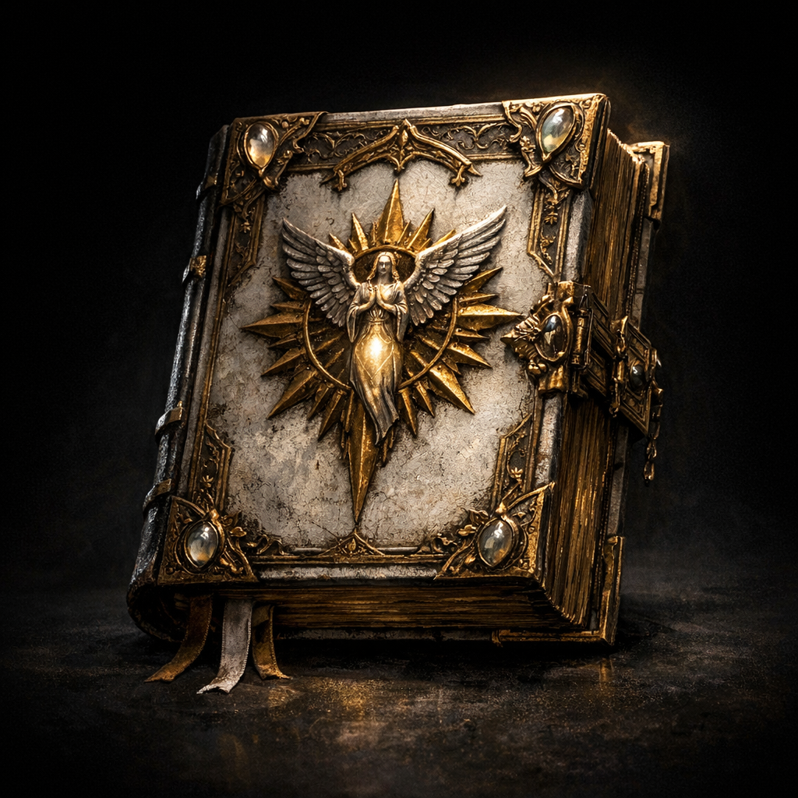

# Book of Exalted Deeds

#item #artifact #tome #good

## Summary

A legendary tome associated with ultimate good. In this campaign, [[Greg]] had access to it alongside the [[Book of Vile Darkness]] and forced/used [[Voltaire]] to read and transcribe both.

## What the Party Knows (in-play)

- **[To verify]** Whether the party knows the book’s name; Voltaire’s past with Greg suggests at least some party awareness of his translation work.

## Voltaire-Only Notes

- Voltaire read the book under coercion/acceleration and survived.
- Its “truths” are said to remain embedded within him as **indwelling knowledge** (see [[Voltaire]])—in tension with the Vile/Exalted duality.

## Open Questions

- Is the original book still extant, or does only Greg’s transcribed text remain?
- How does “exalted” knowledge manifest in Voltaire (mercy impulses, compulsions, resistance to Shar, or something stranger)?

