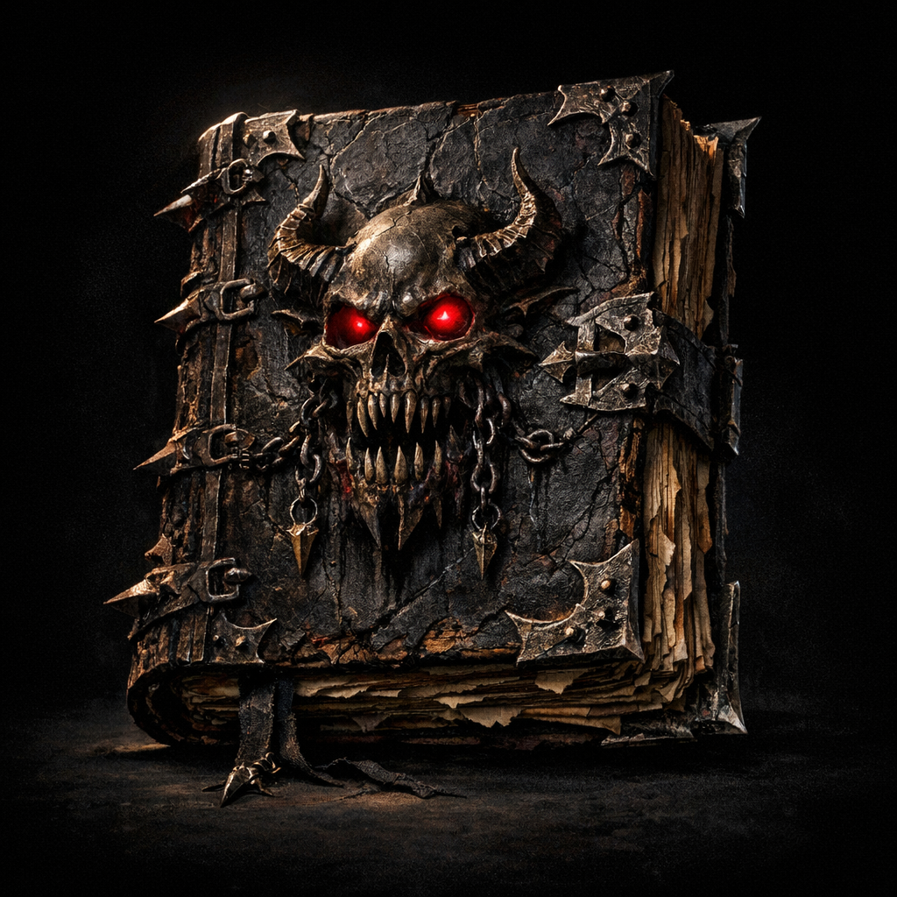

# Book of Vile Darkness

#item #artifact #tome #evil

## Summary

A legendary “cosmic tome” associated with ultimate evil. In this campaign, [[Greg]] had access to it and used [[Voltaire]] (under magical acceleration) to read and transcribe it.

## What the Party Knows (in-play)

- **[To verify]** Whether the party knows the book’s name; Voltaire’s past with Greg suggests at least some party awareness of his translation work.

## Voltaire-Only Notes

- Voltaire read the book under coercion/acceleration and survived.
- Its “truths” are said to remain embedded within him as **indwelling knowledge** (see [[Voltaire]]).

## Open Questions

- Is the original book still extant, or does only Greg’s transcribed text remain?
- Did reading the book alter Voltaire’s soul, tattoos, or his relationship to [[Shar]]?

