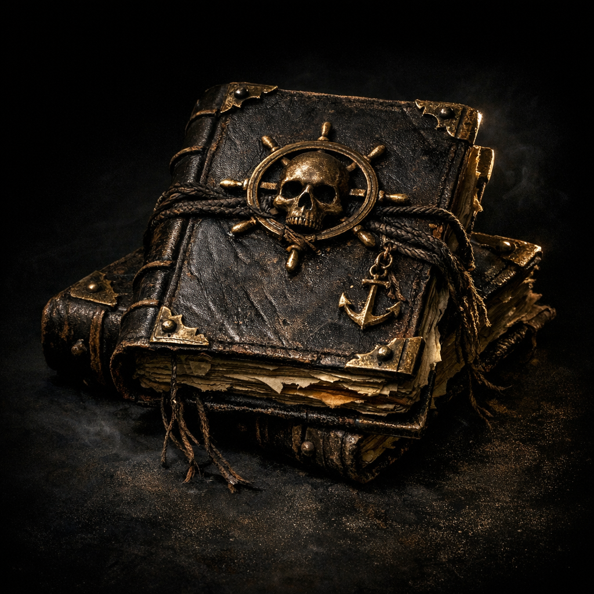

# Captain's Journals

#item #document

## Summary

Two “Captain’s Journals” are listed in Voltaire’s paper-sheet notes.

## Known Quantity (paper sheet)

- x2 journals

## Open Questions

- Which captains do these belong to?
- Do they contain coordinates, ship logs, or ritual notes?
