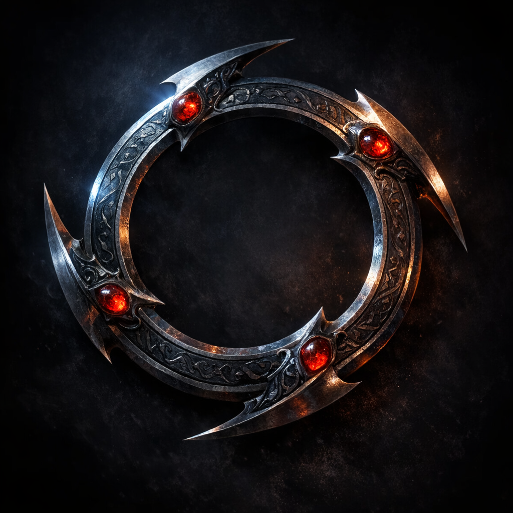

# Chakram +6 (magical)

#item #weapon #chakram

## Summary

A high-bonus chakram listed in Voltaire’s D&D Beyond inventory.

## What the Party Knows (in-play)

- Voltaire carries a **Chakram +6** (per sheet inventory).

## Open Questions

- Is the +6 strictly to hit/damage, or does it include other properties (returning, ricochet, special damage)?
- Is this chakram linked to Voltaire’s “returning dagger” theme, or a separate build path?
