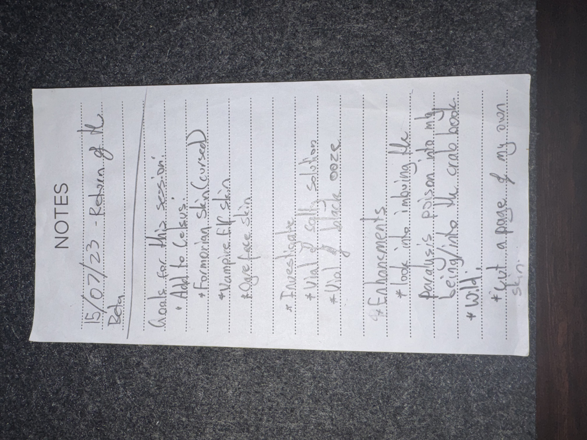

# IMG_2605 (2023-06-15)

#crab-book #paper-notes

## Transcription (best-effort)

- **[To verify]** “15/6/23 – Return of the Rehan … Bolan” (session title/extra note is unclear).
- Goals for this session:
  - Add to [[Celsus]] / [[Crab Book]]:
    - Formorian skin (**cursed**)
    - Vampire flesh
    - Ogre face skin
  - **[To verify]** “Investigation”
    - **[To verify]** “vial of … sedation”
    - **[To verify]** “vial of black ooze”
  - Enhancements:
    - “look into imbue … poison into my being like the crab book!”
    - **[To verify]** “wld!”
    - “cut a page of my own skin”

## Structured Extraction

- **[Voltaire-only]** Planned crab-book feedstock: formorian skin (cursed), vampire flesh, ogre face skin.
- **[Voltaire-only]** Concept: internalize/imprint poison into Voltaire’s body “like the crab book” (unclear if magical or crafting).
- **[Voltaire-only]** Planned self-harvest: cut a page of Voltaire’s own skin (for inscription/binding).

## Open Questions

- **[To verify]** What was “black ooze” (item, creature, ink ingredient, or spell component)?
- **[To verify]** Does “sedation vial” exist as a named item in-play?

