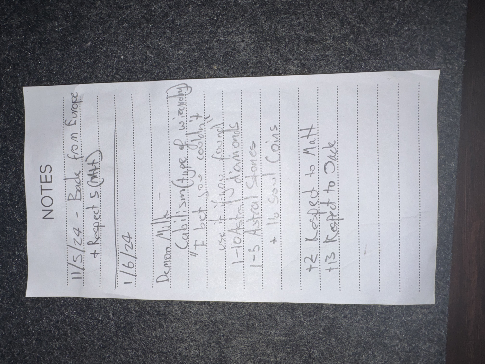

# IMG_2606 (2024-05-11)

#crab-book #paper-notes

## Transcription (best-effort)

- “11/5/24 – Blade from Shar”
  - **[To verify]** “+ Respect’s (Hitt)”
- “1/6/24”
- “Demon milk”
  - **[To verify]** “calimsi (type of wizardry)”
  - **[To verify]** “It took me to …”
  - “use it …”
  - “1–10 Astral diamonds”
  - “1–5 Astral stones”
  - “16 soul coins”
- “+2 Respected to Mat”
- “+13 Respect to Dad”

## Structured Extraction

- **[Party]** Voltaire had (or expected to acquire) a “blade from Shar”.
- **[Voltaire-only]** “Demon milk” appears to be a consumable/ritual ingredient with randomized outcomes (astral diamonds/stones, soul coins) (**[To verify]** exact mechanic).
- **[To verify]** “Respect to Mat/Dad” reads like an OOC meter, relationship tracker, or faction score.

## Open Questions

- **[To verify]** Is “Demon milk” an item, a spell effect, or a downtime craft?
- **[To verify]** Who are “Mat” and “Dad” in this context (NPCs, PCs, real-world notes)?

