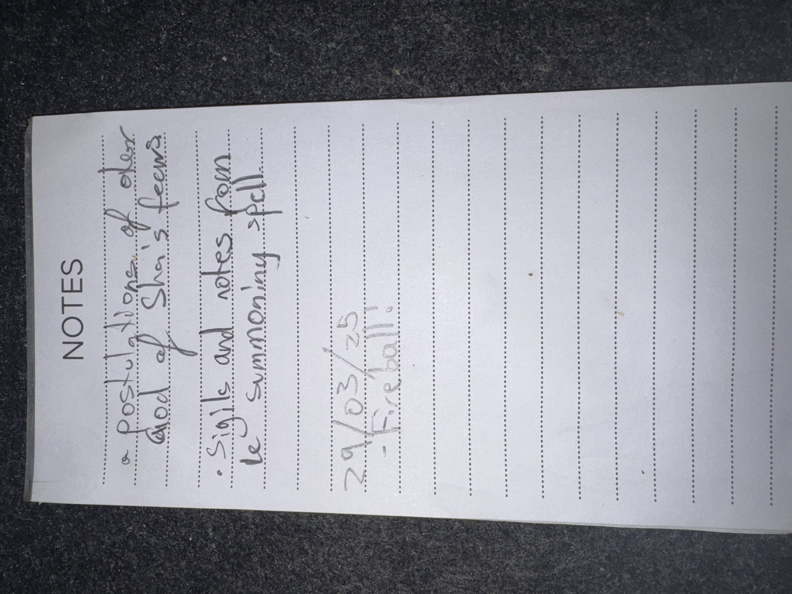

# IMG_2607 (2025-03-29)

#crab-book #paper-notes

## Transcription (best-effort)

- “a postulation of … died of Shar’s tears”
- “sigils and notes from le summoning spell”
- “29/03/25”
- “– Fireball!”

## Structured Extraction

- **[Voltaire-only]** Voltaire connected something’s death to “Shar’s tears” (**[To verify]** what “something” was).
- **[Voltaire-only]** Voltaire kept “sigils and notes” related to a summoning spell; fireball was flagged as relevant (combo, contingency, or reminder).

## Open Questions

- **[To verify]** What died, and what does “Shar’s tears” refer to (item, terrain, spell, boon, or narrative effect)?

