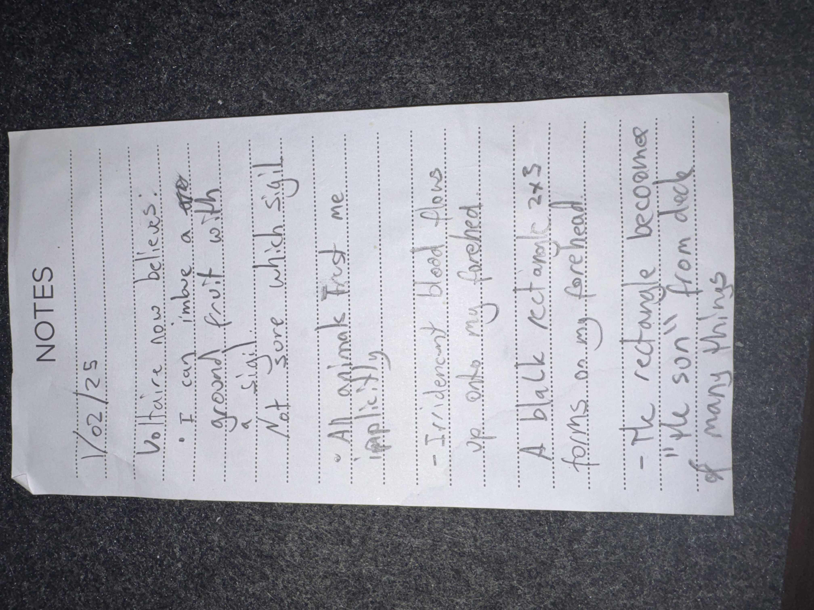

# IMG_2608 (2025-02-01)

#crab-book #paper-notes

## Transcription (best-effort)

- “1/02/25”
- **[To verify]** “Vibliare / Vibriare now believes.”
- “I can imbue a … around fruit with a ‘sigil’”
  - **[To verify]** “Not sure which sigil”
- “All animals trust me (amplified)”
- “Trident / elemental blood blows up onto my forehead”
- “A black rect and 2x forms on my forehead”
- “The rectangle become ‘the sun’ from deck of many things”

## Structured Extraction

- **[Voltaire-only]** New social hook: someone named “Vibliare/Vibriare” now believes (in Voltaire? in a claim? in a god?) (**[To verify]**).
- **[Voltaire-only]** New technique idea: inscribe/imbue fruit with a sigil (possible delivery mechanism) (**[To verify]** which sigil).
- **[Voltaire-only]** Beast affinity escalated: “all animals trust me (amplified)”.
- **[Voltaire-only]** Forehead mark event: black rectangle + “2x forms”; linked to “the Sun” card from the Deck of Many Things (**[To verify]** whether this is literal branding, a vision, or a magical feature).

## Open Questions

- **[To verify]** What was the “trident/elemental blood” source (creature, weapon, ritual)?
- **[To verify]** Are the “2x forms” triangle/square/circle motifs related to Shar’s trial symbols?

