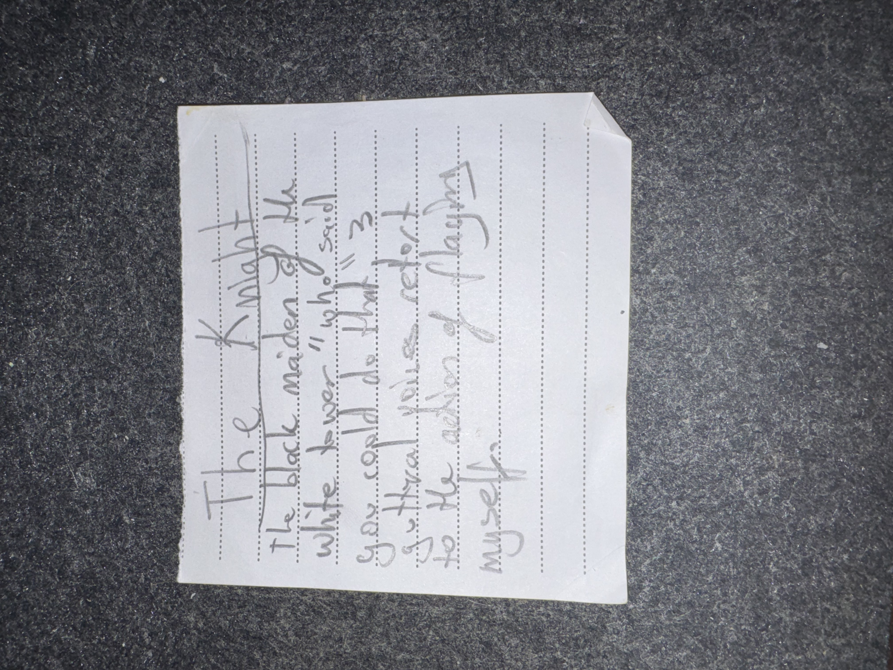

# IMG_2609 (undated)

#crab-book #paper-notes

## Transcription (best-effort)

- “The Knight”
  - “the black maiden of the white tower”
  - **[To verify]** “who said ‘who’ said …”
  - **[To verify]** “goes cold as the …”
  - **[To verify]** “… to the main of myself”

## Structured Extraction

- **[Voltaire-only]** A figure/concept labeled “The Knight”, described as “the black maiden of the white tower” (potential NPC, tarot-style archetype, or omen) (**[To verify]**).

## Open Questions

- **[To verify]** Is “The Knight” a card draw, a prophecy from [[Celsus]], or an NPC title?

