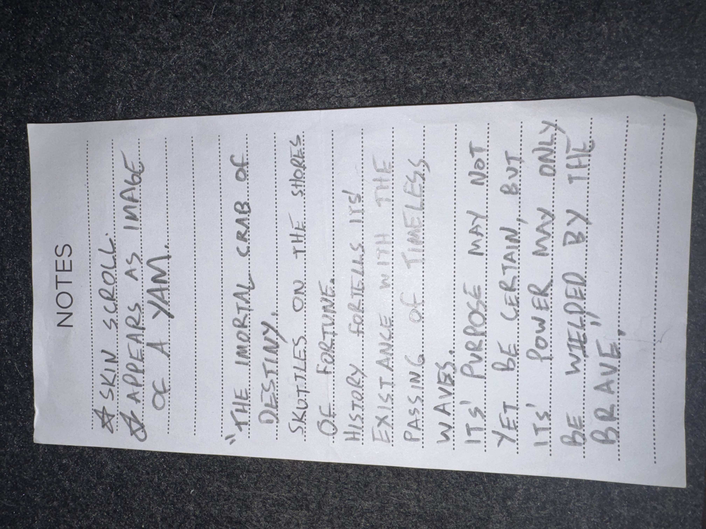

# IMG_2610 (undated)

#crab-book #paper-notes

## Transcription

- “skin scroll appears as image of a yam.”
- “the immortal crab of destiny.”
- “skuttles on the shores of fortune.”
- “history scribbles itself existence with the passing of timeless waves.”
- “It’s purpose may not yet be certain, but it’s power may only be wielded by the brave,”

## Structured Extraction

- **[Voltaire-only]** In-character micro-prophecy / flavor text about the crab-book and fate (“immortal crab of destiny”).
- **[Voltaire-only]** Physical description detail: a “skin scroll” that appears like an image of a yam (**[To verify]** what this refers to; possibly a disguised scroll or a joke-illusion).

## Open Questions

- **[To verify]** What is the “skin scroll” (loot item, a page/skin segment, or a note about the crab-book’s bindings)?

