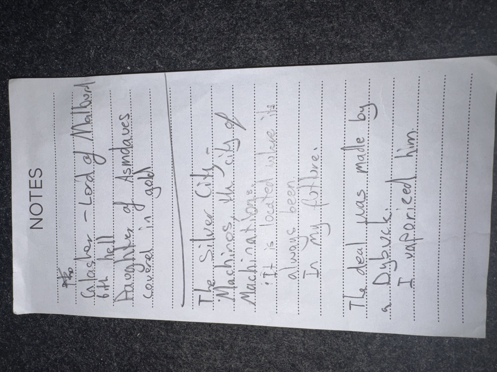

# IMG_2612 (undated)

#crab-book #paper-notes

## Transcription (best-effort)

- “Glasya – Lord of Malbol… 6th hell”
- “Daughter of Asmodeus, covered in gold.”
- “The Silver City”
  - “Machinations, the city of Machinations”
  - **[To verify]** “It is loaded in ink … always pen in my …”
- **[To verify]** “The demon was made by a dybbuk.” (handwriting unclear)
  - “I vaporized him.”

## Structured Extraction

- **[Voltaire-only]** [[Glasya]]: tied to Malbolge (Sixth Hell), daughter of Asmodeus; noted appearance detail “covered in gold.”
- **[Voltaire-only]** “The Silver City” / “city of Machinations” flagged as an important locus in Voltaire’s internal cosmology / crab-book canon (**[To verify]** if this is in-world or metaphor).
- **[Party]** Voltaire recorded vaporizing a demon (**[To verify]** whether this is the same demon tied to the 16 soul coins).

## Open Questions

- **[To verify]** Exact line about “loaded in ink … always pen …” (possibly about the crab-book’s always-ready ink/pen).

