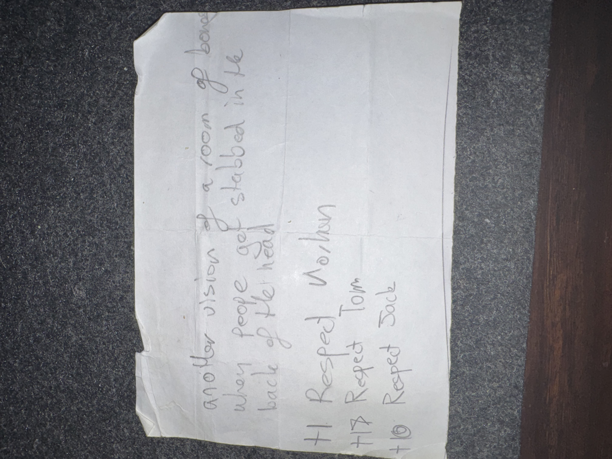

# IMG_2613 (undated)

#crab-book #paper-notes

## Transcription (best-effort)

- “another vision of a room …”
- “when people got stabbed in the back of the head”
- “+1 Respect Vol…/Volton” (**[To verify]**)
- “+7 Respect Tom”
- “+10 Respect Jack”

## Structured Extraction

- **[Voltaire-only]** Recurring vision: a room; people being stabbed in the back of the head (possible omen, memory echo, or dream sequence) (**[To verify]**).
- **[To verify]** “Respect” scoring mentions Tom and Jack (and possibly Voltaire himself).

