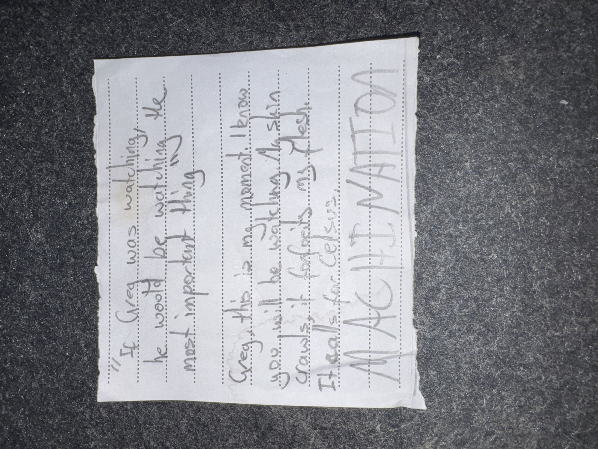

# IMG_2614 (undated)

#crab-book #paper-notes

## Transcription

> “If Greg was watching… he would be watching the most important thing”
>
> Greg this is my moment. I know you will be watching my skin crawl… because my head… is from desire… Machinations.

## Structured Extraction

- **[Voltaire-only]** Voltaire framed an event as a performative “moment” for [[Greg]]’s attention (paranoia? prophecy? theatrical oath).
- **[Voltaire-only]** “Machinations” invoked as a motive/keyword (ties to the crab-book’s later title, but may predate it).

