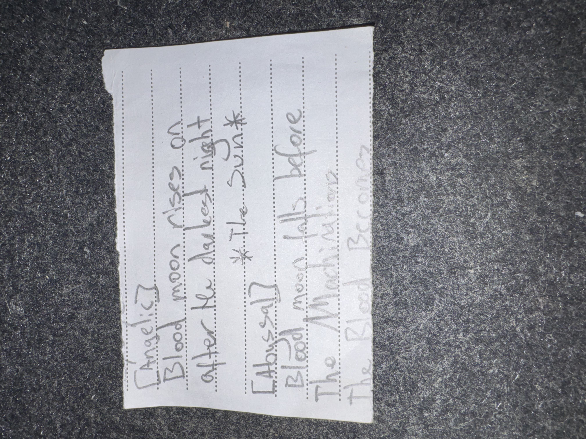

# IMG_2615 (undated)

#crab-book #paper-notes

## Transcription (best-effort)

- “[Anaki?]”
  - “Blood moon rises on … after he … night”
  - “*The Sun.*”
- “[Abyssal?]”
  - “Blood moon falls before the … Machin…”
  - “the Road becomes …” (**[To verify]**)

## Structured Extraction

- **[Voltaire-only]** Two language-tagged snippets (“Anaki?” and “Abyssal?”) that read like omens/prophecy fragments involving a blood moon and “The Sun”.
- **[Voltaire-only]** “Machin…” (Machinations?) appears in the Abyssal fragment.

## Open Questions

- **[To verify]** What is “Anaki” referring to here (Auran? Anauroch? “Anaki” as a personal cipher)?

