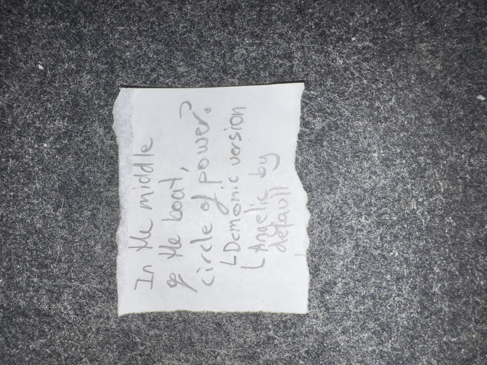

# IMG_2616 (undated)

#crab-book #paper-notes

## Transcription

- “In the middle of the book circle of power?”
- “Demonic version (Angelic?) by default”

## Structured Extraction

- **[Voltaire-only]** Hypothesis about a “circle of power” in/at the center of the book (ritual schema? sigil geometry?).
- **[Voltaire-only]** Dual-mode idea: demonic version vs angelic version; angelic might be “by default” (**[To verify]** meaning).

