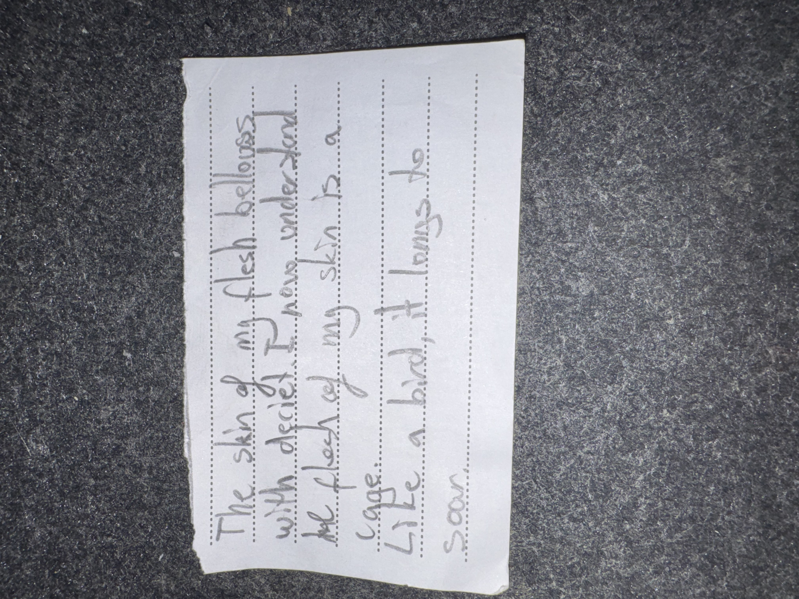

# IMG_2617 (undated)

#crab-book #paper-notes

## Transcription (best-effort)

> The skin of my flesh belongs with deceit I have under…
>
> the flesh of my skin is a cage.
>
> Like a bird, it longs to soar.

## Structured Extraction

- **[Voltaire-only]** Mood/identity fragment: Voltaire’s body/skin framed as “a cage”; desire for escape/ascension; “deceit” hinted as binding mechanism (**[To verify]** context).

