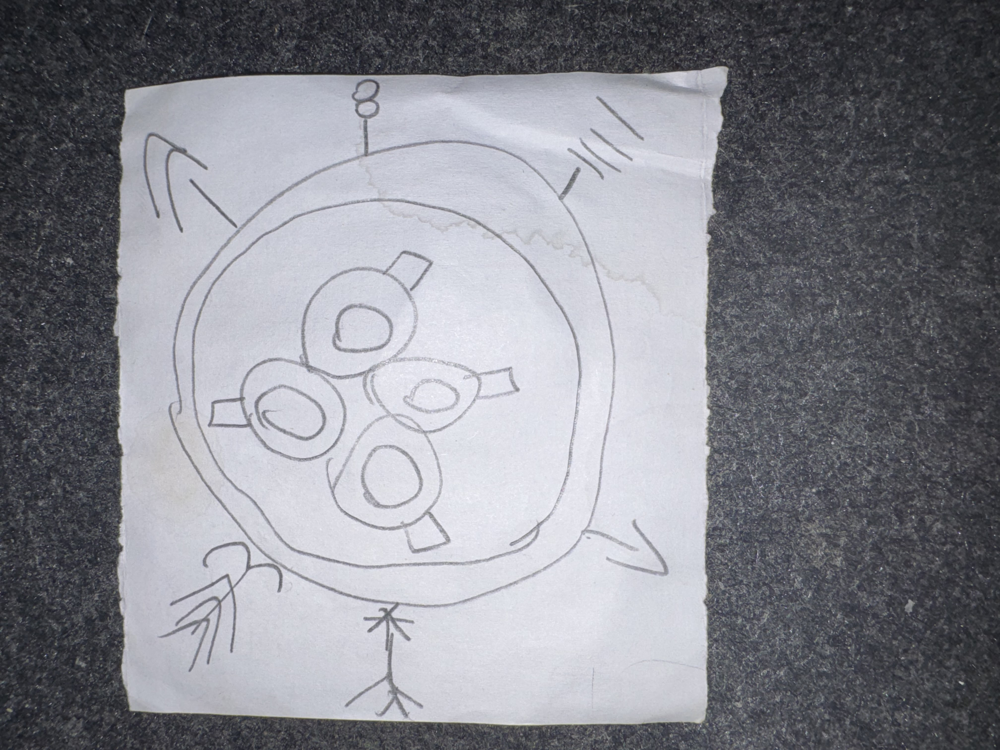

# IMG_2621 (undated)

#crab-book #paper-notes #sigil

## Description

A hand-drawn sigil: an outer ring surrounding four inner circles clustered together, each with a small “tab”/marker. Around the outside are directional marks/arrows.

## Structured Extraction

- **[Voltaire-only]** A “circle-of-power” style diagram (possibly the crab-book’s ritual geometry, a summoning array, or a motif related to Shar’s trial symbols) (**[To verify]**).

## Open Questions

- **[To verify]** Does each inner circle correspond to a participant/role (circle/square/triangle motif, party members, or planar anchors)?

