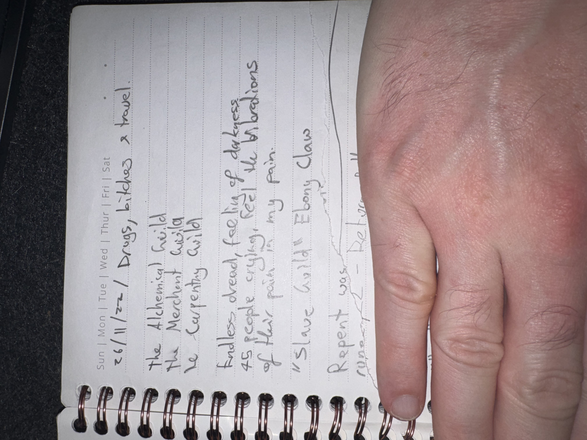

# IMG_2622 (2022-11-26)

#crab-book #paper-notes

## Transcription (best-effort)

- “26/11/22 — Drugs, bitches & travel”
- “The Alchemical Guild”
- “The Merchant Guild”
- **[To verify]** “Le Carpenthy Guild”
- “Endless dread, feels like darkness”
  - “45 people crying, feel the vibrations of their pain”
- “I have called ‘Ebony Claw’”
- **[To verify]** “Repent was …” (line cut off / blocked)

## Structured Extraction

- **[Voltaire-only]** Three guild leads: Alchemical, Merchant, and “Carpenthy” (**[To verify]** spelling/meaning).
- **[Voltaire-only]** Emotional/psychic phenomenon: “endless dread,” mass crying, “vibrations of their pain” (dream, omen, planar bleed, or scene memory).
- **[Voltaire-only]** New named thing: “Ebony Claw” (could be an item, title, pact-name, faction, or technique) (**[To verify]**).

## Open Questions

- **[To verify]** What is “Ebony Claw” in-world?

