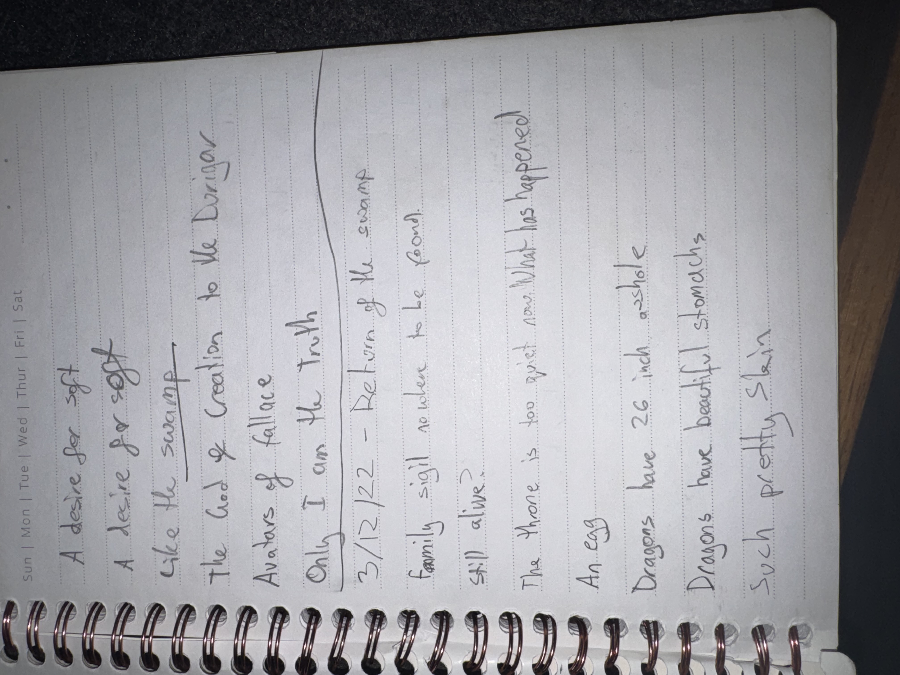

# IMG_2624 (2022-12-03)

#crab-book #paper-notes

## Transcription (best-effort; includes OOC vulgarity)

- “A desire for soft”
- “A desire for soft”
- “Like the swamp”
- **[To verify]** “the God of Creation to the …”
- **[To verify]** “Avatars of …”
- “Only I am the truth”
- “3/12/22 — Return of the swamp”
- “Family sigil no where to be found.”
- “$11 alive.” (**[To verify]** could be “still alive”)
- “The throne is too great now. What has happened”
- “An egg”
- “Dragons have 26 inch asshole”
- “Dragons have beautiful stomachs”
- “Such pretty skin”

## Structured Extraction

- **[Voltaire-only]** Repeated “desire for soft” reads like a refrain (comfort, tenderness, or longing) paired with swamp imagery.
- **[Voltaire-only]** Claim: “Only I am the truth” (ego/gnosis motif).
- **[Voltaire-only]** Loss thread: “Family sigil nowhere to be found” + “Return of the swamp” (missing heritage markers; longing for origin).
- **[To verify]** “Throne is too great now” suggests an altered seat of power (swamp court? Head-Space? consequence of the Deck?).
- **[Voltaire-only]** Crude OOC table humor preserved as-is for completeness (dragon anatomy line).

