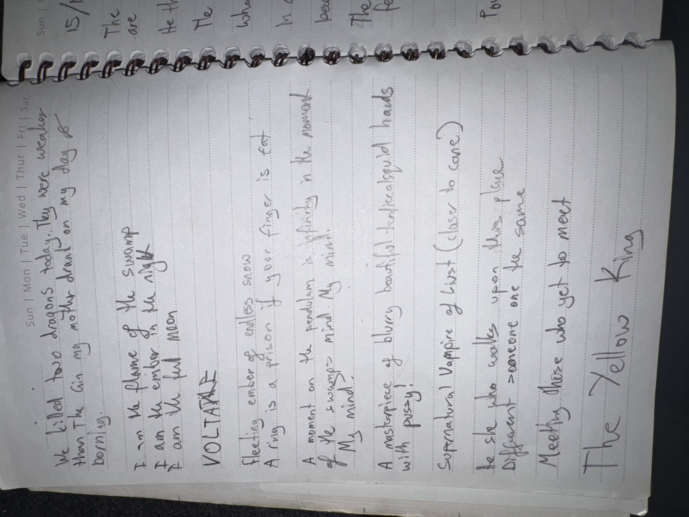

# IMG_2625 (undated)

#crab-book #paper-notes

## Transcription (best-effort)

- **[To verify]** “We killed too dragons today… they were weaker than the … in my mother’s dream on my day of …”
- “I am the flame of the swamp”
- “I am the ember in the night”
- “I am the full moon”
- “VOLTAIRE”
- “Feeling ember of endless snow”
- **[To verify]** “A ring is a prison if your finger is fat”
- “A moment on the pendulum is infinity in the moment of the swamp, mind!”
- “A masterpiece of blurring reality, laced hands with psyche”
- “Supernatural vampire of lust (closer to care?)”
- **[To verify]** “he spoke to … upon his place”
- “Different — someone one the same”
- “Meethy close who yet to meet”
- “The Yellow King”

## Structured Extraction

- **[Voltaire-only]** Identity mantra page (swamp/flame/ember/night/full moon).
- **[Voltaire-only]** Possible item/condition note: ring as prison; fat finger line might be about [[Ring of Protection]] removal/cutting.
- **[Voltaire-only]** Mentions “The Yellow King” (likely an omen/entity-reference; see existing Codex entries like [[Hastur]] / [[Nyarlathotep]]).

## Open Questions

- **[To verify]** Which “dragons” were killed, and what was “mother’s dream” referencing?

