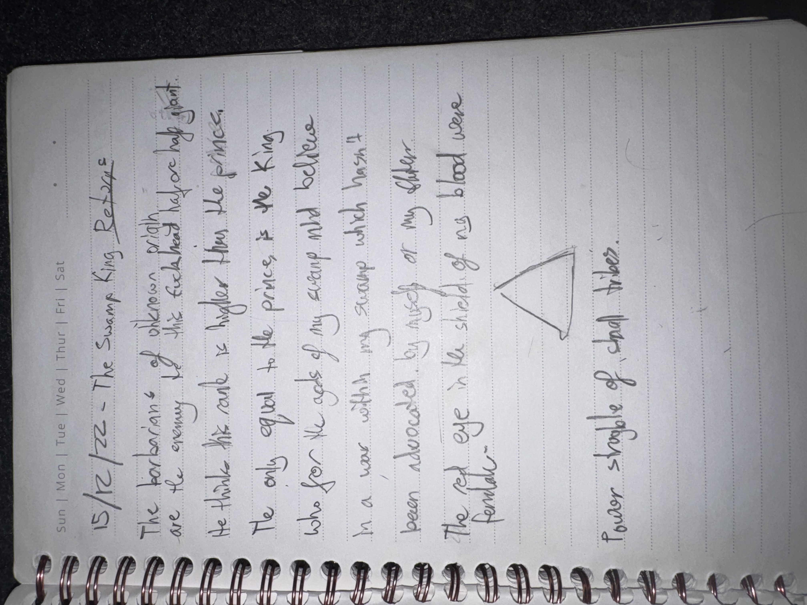

# IMG_2626 (2022-12-15)

#crab-book #paper-notes

## Transcription (best-effort)

- “15/12/22 — The Swamp King Rest?”
- “The barbarians of Okanon …”
  - “are the enemy of the … king …”
- “to take the … is higher than the prince,”
- “The only goal to be prince is the king who for the gods of my swamp … and believe”
- “In a war with my swamp which hasn’t been advocated by kings of my father…”
- “The red eye in the shade of my blood was familiar.”
- (triangle sketch)
- “Power struggle of … tribal tribes”

## Structured Extraction

- **[Voltaire-only]** “Swamp King” / swamp-court politics thread: barbarians of “Okanon” as enemies; prince/king hierarchy; war and father-kings.
- **[Voltaire-only]** “red eye … familiar” (ties to recurring “red eyes” motif in Voltaire’s notes; possible Shar surveillance or omen).
- **[Voltaire-only]** Triangle symbol appears alongside “power struggle” (potential precursor to later circle/square/triangle trial imagery).

## Open Questions

- **[To verify]** What/where is “Okanon”?

