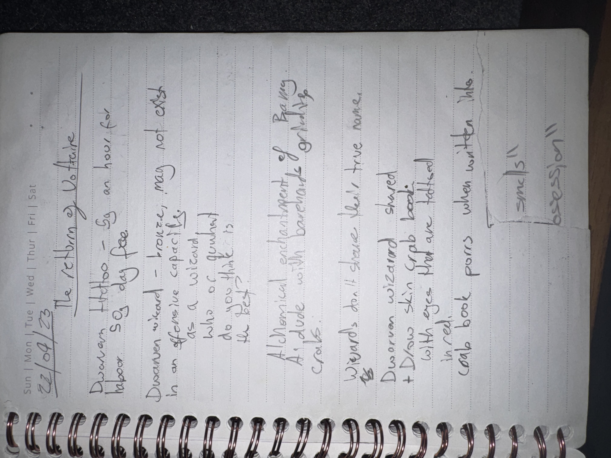

# IMG_2628 (2023-04-22)

#crab-book #paper-notes

## Transcription (best-effort)

- “22/04/23 — The “Born of Voltaire””
- “Duacan tattoo — … an hour for labor so a day fee”
- “Duacan …” (**[To verify]**): “hunter …”
- “Duacan …” (**[To verify]**): “broken, may not exist in an offensive capacity”
- “as a wildcard — who of your … do you think is?”
- “Alchemical enchantment of …”
  - “A dude with barenake [barnacle?] growth … crab”
- “Wizards don’t share their true name”
- “Dwarven wizard — shared”
  - “Drow skin crap book with eyes that are tattooed instead”
- “crab book pens when written into …”
- Box: “smell/obsession”

## Structured Extraction

- **[Voltaire-only]** “Born of Voltaire” as a titled note/theme (possibly followers or a ritual concept).
- **[Voltaire-only]** “Duacan tattoo” logistics (time/cost) + notes about Duacan as hunter / broken / possibly non-offensive (**[To verify]** what Duacan is—NPC, summon, tattoo-spirit, or feature).
- **[Voltaire-only]** New lore rule: “Wizards don’t share their true name” (true-name magic caution).
- **[Voltaire-only]** Dwarven wizard who shared (their name?) + reference to a “drow skin” crab-book variant with tattooed eyes (parallel artifact).
- **[Voltaire-only]** “smell/obsession” framed as a keyed trigger/theme (ties to existing `Book-Scent Synesthesia (Author-Sense)`).

## Open Questions

- **[To verify]** What/Who is “Duacan” and how does it relate to tattoos and the crab-book?

