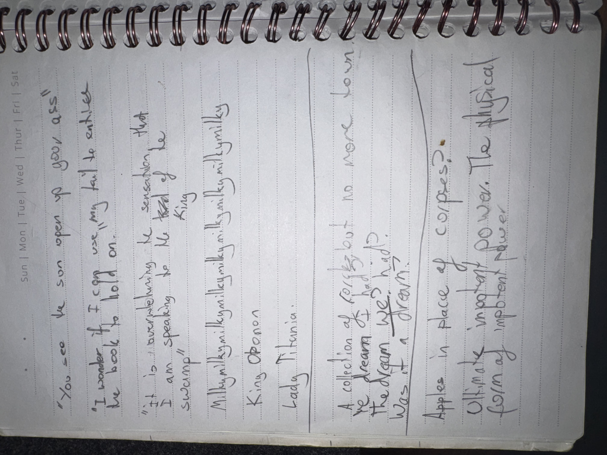

# IMG_2629 (undated)

#crab-book #paper-notes

## Transcription (best-effort)

- “You … the sun upon you ass”
- “I wonder if I can use my soul to enter the book to help on …”
- “It is perceivable the sensation that I’m speaking to the real king ‘swamp’”
- “Mimimimimimimimimimimimimimimimimimimimimimimimim…”
- “King Oponon”
- “Lady Titrania”
- “A collection of coins but no magic to …”
  - “the dream of rolling but no …”
  - “the dragon welp hid?”
  - “was it a dream?”
- “Apples in place of corpses?”
- “Ultimate … power. The physical form of impotent power”

## Structured Extraction

- **[Voltaire-only]** Desire to “enter the book” using Voltaire’s soul (astral projection into the crab-book? Head-Space technique?).
- **[Voltaire-only]** Names flagged: “King Oponon” and “Lady Titrania” (likely swamp-court figures; not yet in Codex).
- **[Voltaire-only]** Dream fragments: coins/rolling; dragon whelp hiding; apples replacing corpses (surreal omen or prior scene memory).

## Open Questions

- **[To verify]** Are “King Oponon” and “Lady Titrania” NPCs from the swamp past, or purely symbolic titles?

